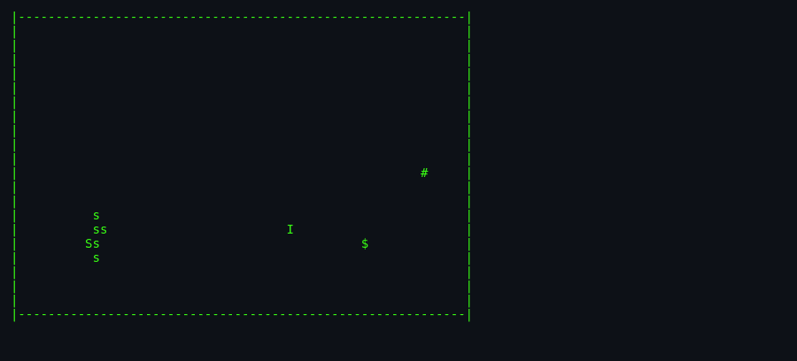
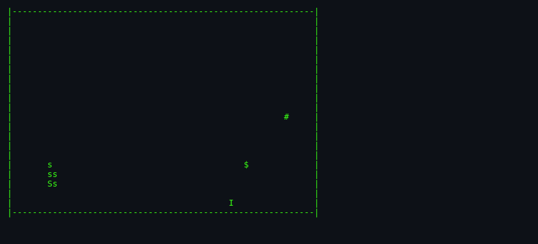

# About `snake`

> A CRT-era chase game. You are `I`. There is money (`$`) and an
> exit (`#`). There is also a six-square snake, and it is *hungry*.
> The more money you take, the hungrier it gets. Escape.

---

## What Is `snake`?

This is **not** the Nokia-phone snake-eats-food-to-grow-longer
game. This is the **1980 BSD `snake`** — an entirely different
concept, and older by fifteen years.

You are the human (`I`). You wander a rectangular screen looking
for money (`$`). Every time you touch a dollar, you bank it and a
new `$` appears elsewhere. Meanwhile, a six-segment snake (`S` head
+ five `s` tail) chases you around the screen — closing the gap
one square per turn. When you have enough money and are ready to
cash out, you can leave via the exit (`#`).

If the snake catches you, you die and score zero. If you leave via
the exit, your score depends on how much money you banked (and
some other tricks).

## Screenshots


*The field just after launch — you (`I`), the six-segment snake
(`S`+`sssss`), the exit (`#`), and the first `$` waiting to be
collected.*


*The player has stepped east and south; the snake trails behind — one
step closer with every move.*

## Authors & Publisher

- **Author:** Berkeley staff / students; the sccs tag reads
  `@(#)snake.c 8.2 (Berkeley) 1/7/94` for the last significant
  revision. Original copyright `1980, 1993 The Regents of the
  University of California`. Individual author is not credited
  in the source I read; likely a student contribution to the
  BSD game suite of that era.
- **Publisher / distributor:** 4.1BSD onward. Ken Arnold's `curses`
  library is a dependency and shared heritage.
- **First shipped:** approximately 1980. One of the earliest BSD
  games.
- **Language:** C using `curses`.
- **Companion tool:** `snscore` in the same folder — a small
  utility to list high scores.

## The Era

`snake` was written for VT100-class terminals wired to shared VAX
machines. Screen sizes were configurable but small — 24×80 was
the default and best-supported. That's important: this game uses
the *actual screen dimensions* to scale its economy. Small screen
= more money per `$` (fair, less room to manoeuvre). Big screen =
smaller `$` values (fair, more room). See the wonderful comment
in `snake.c:216-223`:

> This formula is a hyperbola which includes the following points:
> (24, $25) (original scoring algorithm),
> (12, $40) (experimentally derived by the "feel"),
> (48, $15) (a guess).

That "experimentally derived by the feel" is a whole design
philosophy in one line.

## Why It's Fun

- **Constant tension.** The snake is always one step behind you.
  Every move is a small negotiation with your own death.
- **Money creates the game.** No money would mean no reason to
  move; too much money too close to the exit would trivialise
  it. The RNG placement rules make sure the money is always
  slightly awkward.
- **The spacewarp is a real dilemma.** You can teleport out of
  danger for a 10% penalty on your score. Perfect risk-reward.
- **The bonus digit** at the end — matching the last digit of
  your score to a random one for a bonus — is a beautiful *slot
  machine* touch that says "this is a 1980s game" more clearly
  than any UI element.
- **`snscore`** — a separate command to see who's been wasting
  time on `snake`. Very Unix, very meta.

## Difficulty & Progression

`snake` has **no levels and no explicit difficulty ramp**. One
game, one field, one snake, one exit. You play until you win (reach
the exit) or lose (get eaten).

What *is* variable:

- **Field size** via `-w` and `-l` flags. Smaller field = tighter
  chase = harder. Larger field = more room but also lower
  `chunk`-per-`$` (scoring compensates).
- **Score per `$` (chunk)** is a hyperbolic function of the smaller
  screen edge. See
  [`architecture.md`](./architecture.md) §Scoring — The Chunk
  Formula.

What *feels* like progression during a game:

- **Rising stakes** — the more money you're holding, the more you
  stand to lose to a death or a spacewarp. This is *psychological*
  difficulty, not mechanical.
- **Snake's positional advantage** — as you collect money in
  various spots, you inevitably leave your safe corner. The snake
  never leaves your trail. So *positionally* the game gets harder
  even though the rules don't.

The man page flavour text says "as you get richer, the snake gets
hungrier." This is **not implemented** as a mechanical change —
the snake always moves one square per turn. It is atmosphere, not
code.

## Making-Of Notes

- The scoring formula (`chunk = 675/(i+6) + 2.5`) is calibrated to
  three real data points. This kind of hand-tuned game economy is
  characteristic of the era: no A/B testing, just years of dorm
  playtesting.
- The `chase()` function does double duty: initialising the snake
  segments (each follows the previous) and running the snake AI
  (head follows player). Nice reuse.
- The `spacewarp()` function has some of the game's most
  charmingly-named identifiers. See `snake.c:84`:
  ```c
  #define PENALTY  10  /* % penalty for invoking spacewarp */
  ```

## Cultural Impact

The BSD `snake` predates the Nokia snake by fifteen years and has
different mechanics. However, they share the same *design DNA*:

- Constrained board.
- A snake-shaped adversary (or player, in Nokia's case).
- Continuous movement (Nokia) or per-move (BSD).
- Simple state, hard mastery.

Both descend from an even earlier game — *Blockade* (Gremlin,
1976) — the true ancestor of the "snake" genre. See
[`lineage.md`](./lineage.md).

## Known Bugs (Historical)

From the man page:

- **On small screens, it's hard to tell when you hit the edge.** (True.)
- **The scoring function takes into account screen size, and no
  perfect function exists.** (Also true. The 3-point calibration
  above is the best they could do.)

## See Also

- [`how-to-play.md`](./how-to-play.md).
- [`architecture.md`](./architecture.md).
- [`lineage.md`](./lineage.md).
