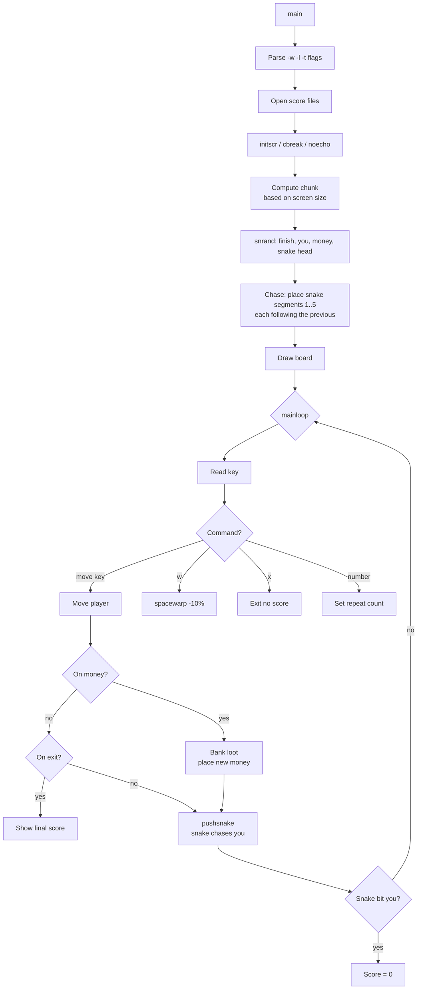
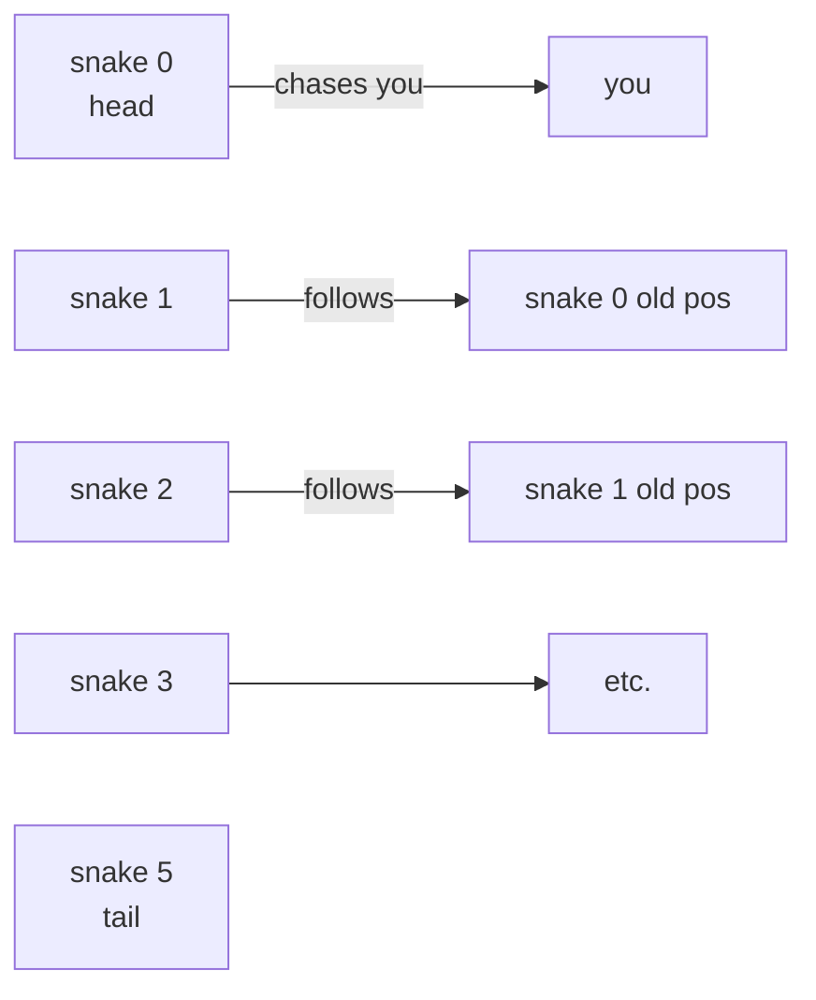

# `snake` — Original Architecture

> Analysis of the original C source — snake AI, RNG placement,
> dynamic scoring.

Upstream source (not redistributed in this repo):
<https://github.com/vattam/BSDGames/tree/master/snake>

Contains `snake/` (the game) and `snscore/` (the score-listing
utility).

---

## Files & Roles

| File | Purpose | Approx. LoC |
|---|---|---:|
| `snake/snake.c` | The entire game — everything | ~1000 |
| `snake/pathnames.h.in` | Score-file paths | — |
| `snake/snake.6.in` | Man page | — |
| `snscore/snscore.c` | Score-listing utility | ~150 |

The main `snake` game is a single-file program. Everything —
game loop, snake AI, rendering, scoring, spacewarp — is in
`snake.c`.

## High-Level Flow



Reference: `snake.c:141-248, 260-445`.

## Data Structures

```c
// snake.c:78-80
struct point {
    int col, line;
};

// snake.c:103-106
struct point you;
struct point money;
struct point finish;
struct point snake[6];   // 6 segments; [0]=head
```

Global state includes `loot`, `penalty`, `moves`, `fast`, `lcnt`,
`ccnt`, `chunk`. All held in file-scope globals.

## Game Loop

Turn-based, driven by user input. The snake moves *after* each
player command (with numeric repeat) via `pushsnake()`. See
`snake.c:441` where each iteration of the inner loop calls
`pushsnake()`.

## AI Logic — Snake Movement

The snake is a **chain of 6 segments**. The head chases the
player; each subsequent segment follows the segment in front of
it.

### `chase()` — Follow-the-leader

`chase(follower, target)` moves `follower` one square toward
`target`. It's the same primitive used for:

1. Initial placement (`snake.c:242-243`): each segment starts
   adjacent to the previous.
2. Snake movement (in `pushsnake()`): each segment steps to where
   the previous one *was*, but the head uses `chase()` toward the
   player.



### `pushsnake()`

Reference: `snake.c` (name search: `pushsnake`). Full listing not
included above but the pattern is:

1. For i from 5 down to 1: `snake[i] = snake[i-1]` (tail follows).
2. `chase(&snake[0], &you)` — head steps toward player.
3. Check every segment against `you.line, you.col`. If any
   segment is on the player, `return TRUE` (player is eaten).

## Random Events

Randomness in `snake` is used for **placement** and for the
**end-game bonus digit**.

### The `snrand()` Primitive

```c
// snake.c (name search: snrand)
void snrand(struct point *sp)
{
    // pick a random empty cell inside the field
    // retry if it collides with existing entities
    do {
        sp->col = random() % ccnt;
        sp->line = random() % lcnt;
    } while (/* collides with any of: you, money, finish, snake */);
}
```

The retry loop is the same pattern as `robots`' `rnd_pos()`, but
tuned: `snake` collides against a small set of known entities, not
a whole occupancy grid.

### Seed

```c
// snake.c:192
srandom((int) tv);   // tv = time(NULL)
```

### Where Randomness Affects Gameplay

| Site | Distribution | Effect |
|---|---|---|
| Initial placement of `finish`, `you`, `money`, `snake[0]` | Uniform in field | Every game starts differently |
| New money after collection (`snake.c:418-426`) | Uniform in field with collision-avoidance loop | Money placed such that it does NOT overlap `finish`, top-left-5-chars status area, or `you` |
| End-of-game bonus digit | Uniform 0..9 | If digit == score % 10 → bonus |

### Placement Rules

The money-placement loop (`snake.c:418-425`) is elegant:

```c
do {
    snrand(&money);
} while ((money.col == finish.col && money.line == finish.line) ||
         (money.col < 5 && money.line == 0) ||           // status area
         (money.col == you.col && money.line == you.line));
```

Rejection-sampling with three forbidden zones: on the exit, in
the score display, or on you. The score display exclusion is a
nice UI detail — the score is drawn at (0, 0..4) so money there
would overlap.

## Scoring — The Chunk Formula

```c
// snake.c:224-233
if (i < 12) i = 12;    // clamp minimum edge
i += 2;                // compensate for border
chunk = (675.0 / (i + 6)) + 2.5;
```

Where `i = min(lcnt, ccnt)` — the smaller of the two field
dimensions.

**Cash value per game:**

```c
// snake.c:76
#define cashvalue  chunk * (loot - penalty) / 25
```

- `loot` — total money collected (in `chunk` units? or raw
  counts? Reading the code: `loot` is incremented by `chunk` per
  `$` collected, so it's in dollars).
- `penalty` — deducted by `spacewarp()`.

**Spacewarp penalty:**

```c
// snake.c:84
#define PENALTY  10  /* % penalty for invoking spacewarp */
```

Every spacewarp deducts 10% of *current loot* to `penalty`. So
each warp is less costly in absolute terms as loot grows.

## Difficulty Progression Logic

**No level system exists.** One `main()` invocation, one game, one
end (win or die). The game loop `mainloop()` (`snake.c:260+`) has
no level counter, no phase transitions, no state variables that
change during play *except* for `loot`, `penalty`, `moves`, and
entity positions.

The three "difficulty knobs" are all set at startup and do not
change during a game:

1. **Field dimensions** (`snake.c:200-204`) — from `-w`/`-l` or
   terminal size. Smaller field = harder to evade.
2. **`chunk`** (`snake.c:224-233`) — scoring rate per `$`. Inverse
   function of `min(lcnt, ccnt)`. Meant to balance small vs. large
   field scoring.
3. **`fast`** (`snake.c:110, 179-180`) — controls `flushi()`
   between moves. `-t` turns off `fast`, adding delay between
   frames on slow terminals.

### What Scales — Nothing (Within a Session)

- Snake speed: **constant** (1 sq/turn, always).
- Snake AI: **constant** (chase-toward-player via `chase()` in
  `pushsnake()`).
- Score per `$`: **constant** (equal to `chunk`, set at startup).
- Money placement: **random each spawn** but same distribution.
- Player commands: **constant** (same key-set).

### Implicit "Difficulty" Rise

As `loot` grows:

- **Spacewarp penalty (10% of loot)** grows in absolute terms.
  Each spacewarp costs more.
- **Motivation to exit** grows — dying wastes more money.

This is *player-facing* pressure, not code-side scaling. The game
never accelerates or throws harder challenges. It merely lets your
own accumulated success become your enemy.

### Session Randomness

The only per-run variation is **initial placement**
(`snake.c:237-240`). Two runs with the same seed will play
identically given the same inputs.

### Design Consequence

`snake` is essentially **arcade-style single-difficulty**. A modern
port that wants a difficulty ramp must design one — the original
did not. See [`port-ideas.md`](./port-ideas.md) §1 for possibilities
(predictive snake, multi-snake, adaptive speed).

## What Was Clever for Its Era

- **`chase()` as a shared primitive** for both initial placement
  and AI. Beautiful reuse.
- **Dynamic scoring hyperbola.** Three data points, one formula,
  fair across screen sizes.
- **Rejection sampling with explicit exclusion zones** — a small
  but focused version of the pattern used more broadly by `robots`.
- **`snake` is one file.** ~1000 LoC for the entire game
  including UI, AI, RNG, scoring, spacewarp, save. Modern
  equivalents rarely fit that budget.
- **Long-move keys.** `HJKL` and edge-jump keys turn hand-cramp
  into a solved problem. Excellent UX for a keyboard game.
- **`snscore` as a separate binary.** Unix philosophy in action —
  small tools that do one thing.

## Constraints Handled

- **Terminal size:** the whole game adapts. Score scales with
  screen. Minimum 4×4 enforced (`snake.c:207-210`); actually
  bumped to 12×12 for scoring purposes (`snake.c:225`).
- **Screen redraw speed:** `-t` "slow terminal" flag suppresses
  intermediate redraws. Also, `delay(t)` macro (`snake.c:101`) is
  `usleep(t * 50000)`.
- **Memory:** trivial. 6 snake segments + 3 other points + score
  globals. <200 bytes of gameplay state.
- **CPU:** turn-based; no per-frame budget.

## What This Code Would Look Like Today

- **Real-time mode:** the snake auto-moves on a timer, not on
  player input. Fundamentally changes the game — closer to the
  Nokia snake or agar.io style. Whether to include it is a
  design choice for the port.
- **Structured state:** replace globals with a `GameState` struct.
- **Score system:** SQLite + optional cloud sync.
- **Rendering:** modern TUI or full graphics, but keep the ASCII
  aesthetic as an option.
- **Snake segment growth:** the original snake is always 6 long.
  A modern variant might grow the snake as you collect money —
  merging BSD-snake with Nokia-snake. Debatable whether that's
  fun or a betrayal.

See [`port-ideas.md`](./port-ideas.md).

## See Also

- [`lessons.md`](./lessons.md).
- [`spec.md`](./spec.md).
- [`references.md`](./references.md).
