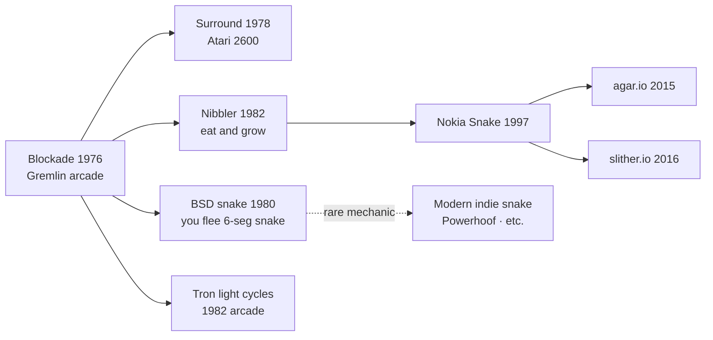

# `snake` — Lineage

Where BSD `snake` sits in the snake-game family — and why it's
older and different than what most people mean by "snake" today.

---

## Direct Ancestors

- **Blockade** (Gremlin, 1976) — the arcade original. Two players,
  each controlling a snake, try to survive as opponents block
  them in with their own tails. The DNA of every snake game.
- **Surround** (Atari 2600, 1978) — home console derivative of
  Blockade.
- **Chase-genre BSD games** — likely direct inspiration alongside
  `robots`.

## Sibling and Descendants

### The BSD `snake` line

- `xsnake`, `nsnake`, `nibbles` — various curses/X11 clones
  through the 1990s.

### The Nokia line (different mechanic)

- **`Nibbler`** (Rock-Ola, 1982) — arcade. First "snake eats food
  and grows longer" game.
- **`Snake`** on Nokia 6110 (1997) — global cultural phenomenon.
  Different mechanic from BSD `snake`: the snake IS the player
  and grows.
- **Everything post-Nokia** — endless Flash/JS/mobile clones,
  most Nokia-style.

### Modern descendants

- **`agar.io`** (2015), **`slither.io`** (2016) — massive
  multiplayer web games. `slither.io` is essentially Nokia-snake
  scaled to hundreds of concurrent players.
- **Various indie roguelike-snake mashups**.

## Genre Family

## If You Like BSD `snake`, Try…

Modern games that share the "flee a pursuer, collect goals" DNA:

- **Pac-Man** — the definitive predator-and-prey game. `snake`'s
  cousin.
- **Mr. Do!** (1982 arcade) — collect items, dodge enemies.
- **Loco-Motion** (1982 arcade) — plan routes while under
  pressure.
- **Steamworld Dig** — mining puzzle with time pressure; same
  greed/risk balance.

## Communities

- **`nibbles`/`nsnake`** clone communities on the various Linux
  distributions.
- Retro arcade communities (Blockade fans).

## References

See [`references.md`](./references.md).
