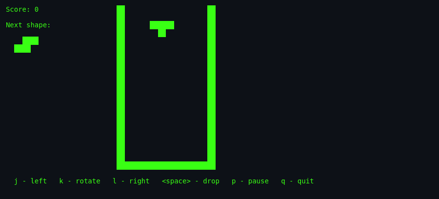
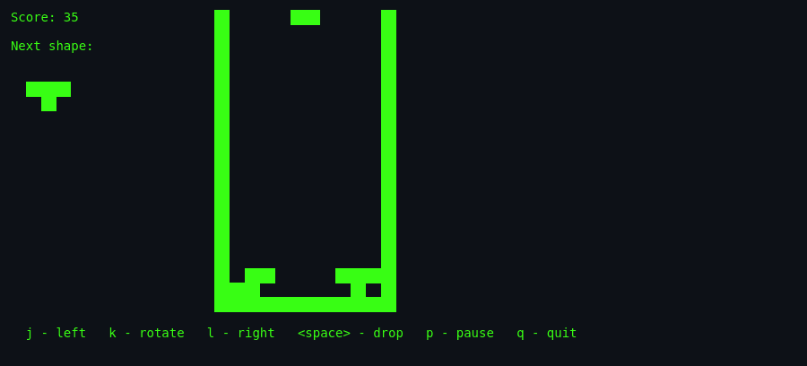
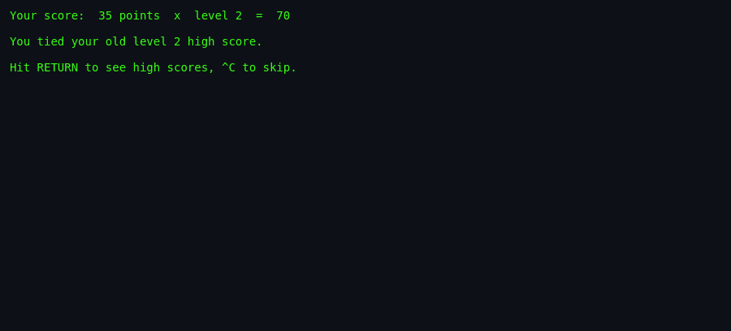

# About `tetris`

> **Brochure.** History, authors, cultural notes, and why this version
> of Tetris is worth your time.

---

## What Is `tetris`?

This is the **BSD Tetris**: a lean, terminal-native falling-block game that shipped with 4.4BSD and NetBSD. There are no neon menus, no hold queues, no ghost pieces, and no hand-holding. Just you, a 10×20 well, seven shapes, and a speed that slowly but relentlessly accelerates until the stack wins. It is the distilled essence of Tetris as a reflex puzzle — the version your sysadmin probably played while waiting for a compile to finish.

## Screenshots

*The opening screen: empty well, next piece preview area (if `-p` is enabled), and the control key reminder at the bottom.*

*A typical mid-game stack: a nearly complete row waits for the right piece, while the falling tetromino descends at the current level speed.*

*The final screen: the score is reported and the game prompts to show the high-score list.*

## Authors & Publisher

- **Author(s):** **Chris Torek** and **Darren F. Provine**. The program was adapted from their 1989 International Obfuscated C Code Contest (IOCCC) entry and later cleaned up for BSD.
- **Manual author:** **Nancy L. Tinkham**, working with Darren F. Provine.
- **Later contributor:** **Hubert Feyrer** added the next-piece preview flag (`-p`) in 1999.
- **Publisher / distributor:** The Regents of the University of California (BSD) and later the NetBSD project.
- **Release year:** 1989 (IOCCC origin); integrated into 4.4BSD by 1993 (`tetris.6.in:35`, `@(#)tetris.6 8.1 (Berkeley) 5/31/93`).
- **Language:** C.

## The Era

In the late 1980s and early 1990s, "video games" on Unix systems were usually text-mode programs running on CRT terminals connected over serial lines. Memory was measured in megabytes at best, and every byte sent to the screen counted. Tetris fit that world perfectly: its state is tiny, its rendering is just blocks of standout whitespace, and its controls are a handful of single keystrokes. The man page even warns that the higher levels are unplayable without a fast terminal connection — a reminder that network latency and baud rate were real constraints on gameplay.

## Why It's Interesting

- **It is a literal code artifact.** The BSD version traces back to an IOCCC entry, a contest whose entire point was writing code so clever it was almost unreadable. Seeing it cleaned up and shipped in a major operating system is a small piece of hacker folklore made real.
- **It proves minimalism works.** Seven pieces, three offsets each, a 1-D byte array, and a termcap renderer are all it takes to deliver the classic Tetris experience.
- **It has a quirky difficulty curve.** The game does not simply scale by level; it also speeds up continuously via `faster()`, so even a level-1 game eventually becomes a war of reflexes.
- **It is a museum piece of Unix privilege handling.** The setgid-games score file, the `flock()` locking, and the privilege drop/elevate dance are small but historically important security patterns.

## Difficulty & Progression

There are **nine starting levels** (1–9), but the game has only one implicit form of progression: the fall interval shrinks. At level start, `fallrate = 1,000,000 / level` microseconds per row. Then, on every gravity tick, `fallrate -= fallrate / 3000`. The speed therefore accelerates forever, regardless of the initial level. There are no stage transitions, no new enemies, and no unlocks — just a smooth curve from calm to impossible. The level only changes the starting steepness and the final score multiplier (`final score = raw score × level`).

## Making-Of / Anecdotes

- **IOCCC lineage.** The man page explicitly says the program was "adapted from a 1989 International Obfuscated C Code Contest winner." IOCCC winners are intentionally compact and tricky; the BSD cleanup kept the cleverness but made it maintainable.
- **Preview added later.** The `-p` next-piece option was not in the original contest entry. Hubert Feyrer added it in 1999, a full decade after the game first appeared, showing how even a minimalist game accretes small conveniences over time.
- **The `/dev/null` check.** At startup the program opens `/dev/null` and exits if the returned file descriptor is less than 3. This sanity-checks that stdin, stdout, and stderr are open before it enters raw terminal mode.

## Cultural Impact

Tetris is one of the most ported and studied games in history. The BSD version is not the most famous — that title belongs to the 1984 Soviet original by Alexey Pajitnov and the later Game Boy, NES, and TGM (Tetris: The Grand Master) iterations — but it is a direct ancestor of the Unix/Linux open-source Tetris tradition. Its descendants include graphical clones, browser versions, mobile apps, and the modern competitive Tetris community that optimizes piece placement down to individual frames.

For the wider family tree, see [`lineage.md`](./lineage.md).

## Known Bugs (Historical)

- **The higher levels are unplayable without a fast terminal connection.** The man page admits this openly (`tetris.6.in:149`). On a slow serial link, the game can send updates faster than the terminal can draw them.
- **No wall kicks.** If a rotation would overlap a wall or stack, it simply fails. This is by design but feels strict to modern players.
- **Continuous acceleration can outpace input.** Eventually `fallrate` becomes so small that human reaction time is no longer sufficient — the game is guaranteed to end, which the source comments describe as "utterly impossible."
- **Row-clear animation is sequential.** Each full row is cleared and shifted one at a time, which can look odd on very fast terminals.

## See Also

- [`how-to-play.md`](./how-to-play.md) — for actually playing.
- [`architecture.md`](./architecture.md) — for the code side.
- [`lineage.md`](./lineage.md) — for descendants.
- [`references.md`](./references.md) — for source citations.
