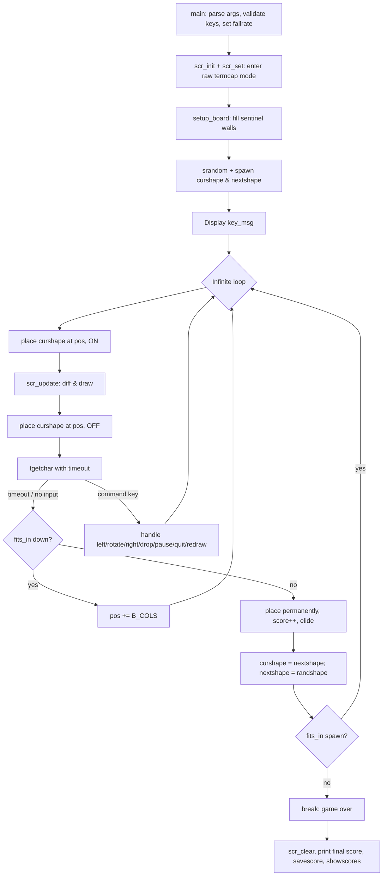
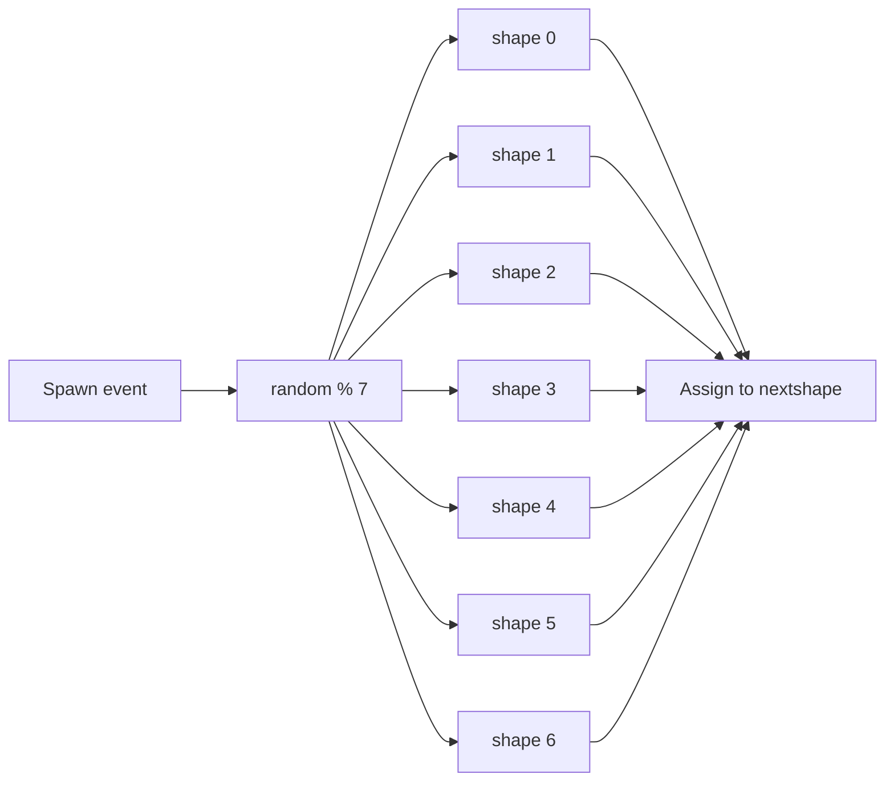

# `tetris` — Original Architecture

> Deep analysis of the original C source. What did the programmers
> build, and how? Focus on what is *clever*, *era-specific*, or
> *transferable*.
>
> Cite upstream file:line references only (never local paths). Upstream
> tree: <https://github.com/vattam/BSDGames/tree/master/tetris>.

---

## Files & Roles

| File | Purpose | Approx. LoC |
|---|---|---:|
| `tetris.c` | Entry point, argument parsing, main loop, board setup, game-over logic | 337 |
| `tetris.h` | Shared constants, macros, data structures, globals | 174 |
| `input.c` / `input.h` | Raw terminal input with variable timeout | 161 + 39 |
| `screen.c` / `screen.h` | Termcap-based rendering, frame differencing, preview | 506 + 54 |
| `shapes.c` / `shapes.h` | Tetromino shape table and collision/place helpers | 109 + 52 |
| `scores.c` / `scores.h` | High-score file I/O, locking, expiration | 469 + 52 |
| `pathnames.h.in` | Build-time path template for the score file | 39 |
| `tetris.6.in` | Man page source | 157 |

## High-Level Flow



## Game Loop Detail

The loop in `tetris.c` is the heart of the game. It is not turn-based; it is a real-time loop driven by a terminal timeout:

```c
for (;;) {
    place(curshape, pos, 1);
    scr_update();
    place(curshape, pos, 0);
    c = tgetchar();
    if (c < 0) {            /* timeout -> gravity tick */
        if (fits_in(curshape, pos + B_COLS)) {
            pos += B_COLS;
            continue;
        }
        place(curshape, pos, 1);
        score++;
        elide();
        curshape = nextshape;
        nextshape = randshape();
        pos = A_FIRST * B_COLS + (B_COLS / 2) - 1;
        if (!fits_in(curshape, pos))
            break;
        continue;
    }
    /* command handling ... */
}
```

`main` loop: `tetris.c:214-303`.

Key observations:

- The piece is **drawn, the screen is updated, then the piece is erased** before reading input. This means the piece is never left in `board[]` while waiting for the player; it exists only transiently during `scr_update()`.
- On a timeout, the piece tries to fall. If it cannot fall, it is placed permanently, score increments, completed rows are elided, and a new piece is spawned.
- On a command, the game mutates `pos` or `curshape` and loops again; the screen is redrawn on the next iteration.

## Data Structures

### Board representation

```c
#define B_COLS  12
#define B_ROWS  23
#define B_SIZE  (B_ROWS * B_COLS)
typedef unsigned char cell;
extern cell board[B_SIZE];
```

`board[]`: `tetris.h:54-59`.

The board is a one-dimensional byte array. The visible playfield is a 10×20 window embedded in a 12×23 logical grid. The extra rows and columns are sentinel walls that are pre-filled at startup:

```c
void setup_board(void) {
    int i;
    cell *p;

    p = board;
    for (i = 0; i < B_SIZE; i++)
        *p++ = i < (B_COLS * 2) || i >= (B_SIZE - (B_COLS * 2)) ||
            i % B_COLS == 0 || i % B_COLS == B_COLS - 1;
}
```

`setup_board`: `tetris.c:88-97`.

Because the walls are part of the same array, `fits_in()` needs no explicit bounds checks: it simply tests whether all four cells of a piece are empty.

### Shape representation

```c
struct shape {
    int rot;        /* index of rotated version of this shape */
    int off[3];     /* offsets to other blots if center is at (0,0) */
};
```

`struct shape`: `tetris.h:125-128`.

A piece is always four cells: a center plus three offsets. The offsets are expressed in board-index deltas using macros that encode neighbours in the 1-D array:

```c
#define TL  -B_COLS-1
#define TC  -B_COLS
#define TR  -B_COLS+1
#define ML  -1
#define MR  1
#define BL  B_COLS-1
#define BC  B_COLS
#define BR  B_COLS+1
```

Direction macros: `shapes.c:46-53`.

The 19-entry shape table encodes each tetromino and its rotation chain:

```c
const struct shape shapes[] = {
    /* 0*/ { 7,  { TL, TC, MR, } },
    /* 1*/ { 8,  { TC, TR, ML, } },
    /* 2*/ { 9,  { ML, MR, BC, } },
    /* 3*/ { 3,  { TL, TC, ML, } },   /* square: self-rotating */
    ...
    /* 6*/ { 18, { ML, MR, 2    } },  /* I-piece */
    ...
    /*18*/ { 6,  { TC, BC, 2 * B_COLS } }
};
```

Shape table: `shapes.c:55-75`.

Collision and drawing use the same structure:

```c
int fits_in(const struct shape *shape, int pos) {
    ...
    if (board[pos] || board[pos + shape->off[0]] ||
        board[pos + shape->off[1]] || board[pos + shape->off[2]])
        return 0;
    return 1;
}
```

`fits_in`: `shapes.c:81-92`.

```c
void place(const struct shape *shape, int pos, int onoff) {
    board[pos] = onoff;
    board[pos + shape->off[0]] = onoff;
    board[pos + shape->off[1]] = onoff;
    board[pos + shape->off[2]] = onoff;
}
```

`place`: `shapes.c:98-109`.

### Screen state

```c
static cell curscreen[B_SIZE];
static int curscore;
static int isset;
static struct termios oldtt;
```

`screen.c:60-63`.

`curscreen` stores the previous frame so `scr_update()` can redraw only changed cells. `oldtt` saves the original terminal settings for restoration on exit.

## AI Logic

Not applicable. `tetris` has no computer opponent. The only autonomous behavior is gravity and the continuous speed-up in `faster()`.

## Random Events

### RNG source & seeding

```c
srandom(getpid());
```

`main`: `tetris.c:205`.

The random number generator is seeded once with the process ID, giving a different sequence per run.

### Piece selection

```c
#define randshape() (&shapes[random() % 7])
```

`randshape`: `tetris.h:131`.

Each new piece is chosen uniformly from the first seven entries of the shape table (the base orientations). The distribution is flat: every tetromino has probability 1/7.

### Consequence flow



There are no other random events: no item drops, no random hazards, no board generation beyond the empty playfield.

## Difficulty Progression Logic

Difficulty is represented by a single integer `level` in the range 1–9.

### Initial speed

```c
fallrate = 1000000 / level;
```

`main`: `tetris.c:180`.

Level 1 gives 1,000,000 µs (1 second) per row; level 9 gives ~111,111 µs (~111 ms) per row.

### Continuous acceleration

```c
#define faster() (fallrate -= fallrate / 3000)
```

`faster`: `tetris.h:147`.

`faster()` is invoked inside `tgetchar()` on every tick:

```c
#define faster() (fallrate -= fallrate / 3000)
...
faster();
```

`tgetchar` timeout path: `input.c:152`.

This slowly reduces `fallrate` by 0.033% each tick. The effect is initially imperceptible but compounds over time until the game becomes, as the source comments note, "utterly impossible":

```c
/*
 * Make the game faster as the score increases.  It gets unbearably
 * fast pretty quickly.
 */
```

`tetris.h:143-144`.

### Score multiplier

```c
(void)printf("Your score: %d\n", score * level);
```

`main`: `tetris.c:308-309`.

The final score scales linearly with level. There is no discrete stage transition; the game is one continuous session with a single implicit difficulty ramp.

## What Was Clever for Its Era

1. **1-D board with sentinel walls.** `setup_board()` pre-fills the border so collision detection needs no branches for bounds. `tetris.c:88-97`.

2. **Rotation as a lookup table.** Instead of rotating a matrix at runtime, the shape table stores the index of the next rotation. This turns rotation into a single array lookup. `shapes.c:55-75`, `tetris.c:279`.

3. **Termcap without curses.** The renderer uses raw termcap strings (`cl`, `cm`, `so`, `ce`, etc.) rather than pulling in the curses library. `screen.c:73-120`.

4. **Frame-differencing renderer.** `scr_update()` keeps `curscreen[]` and only redraws cells that changed, minimizing cursor motion on slow terminals. `screen.c:374-481`.

5. **Timeout carry-over.** `tgetchar()` accumulates leftover microseconds in a static `timeleft` so player inputs do not reset the fall timer, making the rhythm fair. `input.c:139-155`.

6. **Setgid privilege dance.** The binary starts setgid-games, stores real/effective GIDs, drops privileges, and re-elevates only around score-file operations. `tetris.c:139-141`, `scores.c:113`, `scores.c:128`.

7. **Process-ID random seed.** `srandom(getpid())` is a cheap, portable way to get a varying seed without opening `/dev/urandom`. `tetris.c:205`.

## Constraints the Original Had To Handle

- **Memory.** The entire game state fits in a few kilobytes: two 276-byte boards, a small shape table, and a few dozen integers. There are no heap allocations in the core loop.
- **Terminal speed.** The code assumes a CRT terminal and uses termcap directly. The man page warns that higher levels require a fast connection.
- **CPU.** Collision detection is O(1) per candidate move because the board is a flat array and pieces have only four cells.
- **Persistence.** High scores live in a shared file protected by `flock()` and setgid privileges, not per-user files.

## What This Code Would Look Like Today

A modern port would likely:

- Use a 2-D grid with explicit bounds rather than a 1-D sentinel array.
- Implement full SRS rotation with wall kicks.
- Add a hold queue, ghost piece, and 7-bag randomizer.
- Replace termcap with a terminal UI library or HTML5 canvas/WebGL.
- Persist scores in a user profile or leaderboard API rather than a setgid file.
- Support DAS/ARR (delayed auto-shift and auto-repeat rate) for modern feel.

See [`port-ideas.md`](./port-ideas.md) for the full modernization plan.

## See Also

- [`lessons.md`](./lessons.md) — beginner-friendly extraction of techniques from this architecture.
- [`spec.md`](./spec.md) — implementation-independent specification.
- [`references.md`](./references.md) — sources & citations.
