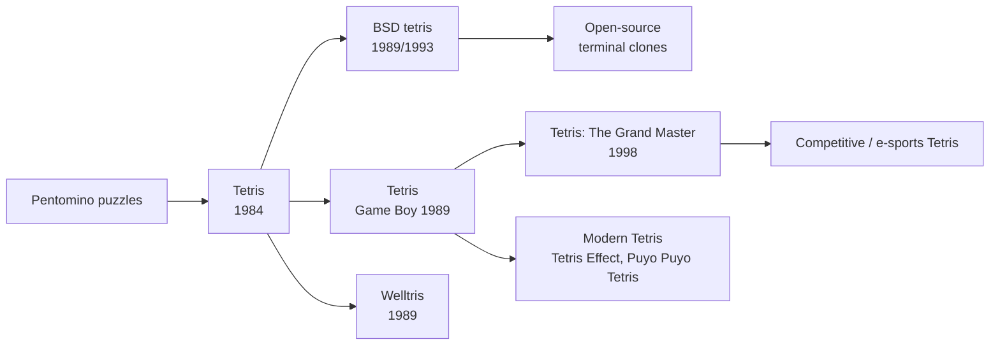

# `tetris` — Lineage

> Genre siblings and modern descendants. Where does `tetris` sit in
> the wider history of games in its style?

---

## Direct Ancestors

- **Pentomino puzzles** (ancient / recreational mathematics) — fitting geometric shapes into a rectangle is the conceptual ancestor of all falling-block games.
- **Tetris (original)** (1984, Alexey Pajitnov) — the Soviet original created on an Electronika 60. The BSD version is a descendant/parallel port of the same idea, not a direct code descendant.
- **IBM PC Tetris versions** (mid-1980s) — helped standardize the 10×20 well and seven tetromino shapes.

## Direct Descendants

- **Welltris** (1989, Alexey Pajitnov) — Tetris moved into a 3-D well.
- **Super Tetris** (1991) — added new pieces and two-player modes.
- **Tetris Battle Gaiden** (1993) — introduced competitive garbage-line mechanics.
- **Tetris: The Grand Master** (1998, Arika) — pushed speed and precision to an extreme, inspiring the modern competitive scene.

## Genre Family

## If You Like `tetris`, Try…

- **Tetris Effect** — audiovisual, meditative modern Tetris with many modes.
- **Puyo Puyo Tetris** — combines Tetris with Puyo Puyo; great for multiplayer.
- **TETR.IO** — free browser-based competitive Tetris with ranked matchmaking.
- **Jstris** — free, fast, customizable browser Tetris; popular for practice.
- **Nullpomino** — open-source desktop Tetris clone with deep customization.

## Communities

- **r/Tetris** — Reddit community for competitive and casual Tetris.
- **Hard Drop** — forum and wiki for competitive Tetris strategy.
- **Classic Tetris World Championship** — annual live tournament for NES Tetris.

## References

See [`references.md`](./references.md) for primary sources and citations.
