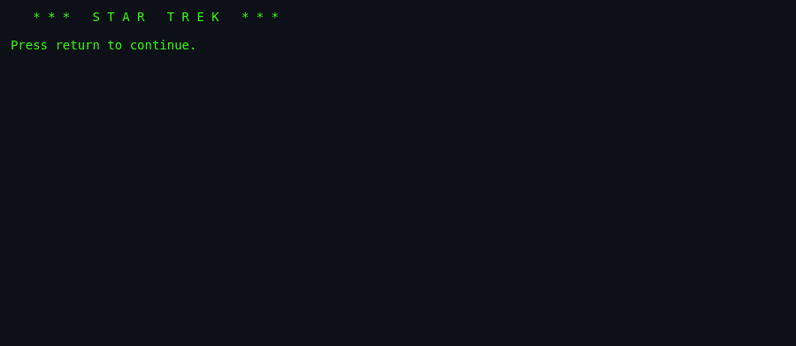
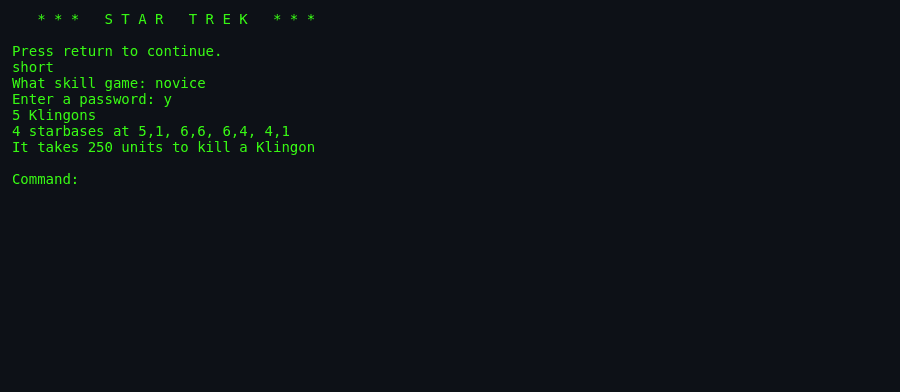
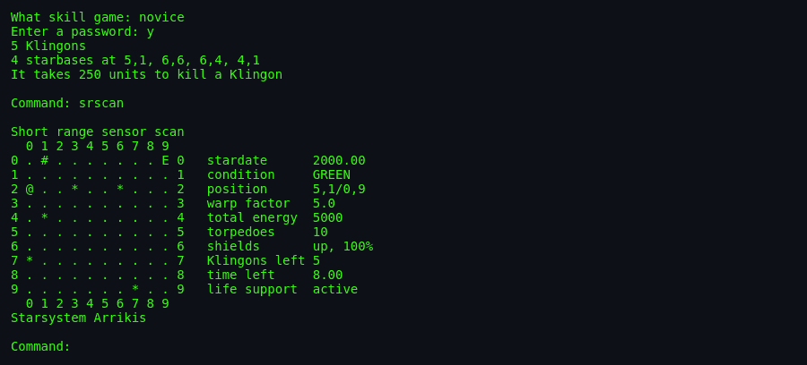
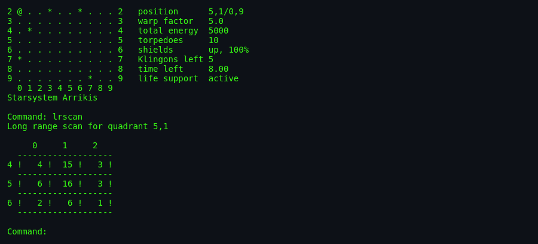
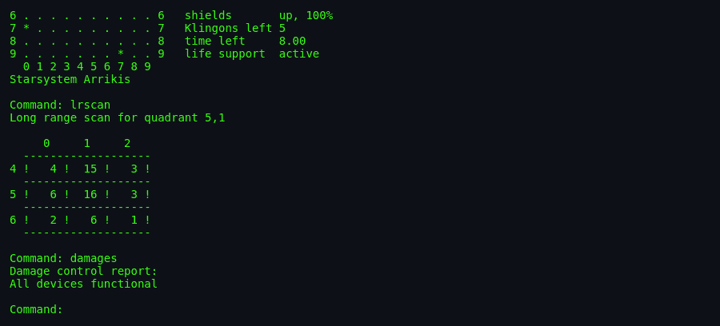

# About `trek`

> The stardate is 2000.00. You have 5 Klingons to kill and 8.00
> units of time in which to do it. You have 5,000 units of energy,
> 10 photon torpedoes, and 14 devices any one of which could break
> at any moment. Somewhere out there in the 8×8 galaxy is Arrikis,
> Rigel, Ceti Alpha, Vulcan, and dozens more inhabited systems
> depending on you. **You are the captain. Set your warp factor.**

---

## What Is `trek`?

`trek` is a full-featured Star Trek starship command simulation.
You control the Federation starship (Enterprise or another, depending
on prior game state) navigating an 8×8 galaxy of quadrants. Each
quadrant contains a 10×10 sector grid populated with Klingon
warships, starbases, stars, black holes, and inhabited planets.

Your goal: destroy all Klingons in the galaxy before your time runs
out. Depending on skill and length settings, you have 5–30 Klingons
to hunt and 8–40 stardate units to do it in.

Every move has consequences. Warp travel consumes energy. Firing
phasers consumes energy. Photon torpedoes are limited. Devices
break under enemy fire and need docking to repair. Stars go
supernova, wiping quadrants. Starbases get attacked. Klingons
migrate, breed, capture inhabited systems as slaves. The Federation
has finite resources; run them dry and you lose.

## Screenshots


*The classic banner: `* * * S T A R T R E K * * *`. Simple.
Iconic.*


*After picking short/novice difficulty and a password, you learn
your mission parameters: 5 Klingons to kill, 4 starbases at listed
coordinates, 250 units of phaser energy per kill.*


*`srscan` shows the 10×10 sector map for your current quadrant.
Enterprise (`E`), inhabited system Arrikis (`@`), stars (`*`),
starbase (`#`), empty (`.`). Right pane: full status — stardate,
condition GREEN, position 5,1/0,9, warp 5.0, energy 5000,
torpedoes 10, shields 100%, Klingons left 5, time left 8.00, life
support active.*


*`lrscan` shows the 3×3 grid of surrounding quadrants — how many
Klingons, starbases, stars each contains. Your galactic
reconnaissance.*


*`damages` lists the status of all 14 devices — warp engines, short
range scanners, phasers, torpedo control, shield generators,
computer, subspace radio, life support, SINS, cloak, transporter,
shuttlecraft. Repair estimates for each.*

---

## Authors & Publisher

- **Author (C, 1976):** **Eric P. Allman**, UC Berkeley. Later
  famous as the creator of **`sendmail`** (1983) — the mail
  transfer agent that once handled the majority of the world's
  email. `trek` is his early Berkeley work, and the ambition
  shows: elaborate state, hand-tuned parametric difficulty, an
  event scheduler, and a snapshot-based time-warp system. Contact
  info from the era: `Eric P. Allman, Project INGRES, Cory Hall,
  UC Berkeley`.

- **C version acknowledged helpers:** Jeff Poskanzer, Pete
  Rubinstein, Nick Whyte, and others at Berkeley "crazy enough to
  play the undebugged game."

- **FORTRAN provenance:**
  - Kay R. Fisher (DEC) — "FORTRASH version"
  - Mike Mayfield (Centerline Engineering) — original BASIC program
  - David Matuszek & Paul Reynolds — Lawrence Berkeley Lab FORTRAN
    (LBL); the "major inspiration" for Allman's version
  - Battelle Version 7A by Joe Miller & Ross Pavlac
    (December 1974, revised June 1975), itself adapted from a
    Ron Williams (CDC Sunnyvale) FTN port, itself from DEC's
    BASIC distribution.

Allman writes in the source header: *"In all fairness, this
[Matuszek/Reynolds LBL] version was the major inspiration for this
version of the game (translation: I ripped off a whole lot of
code)."* The candour is characteristic.

- **Publisher / distributor:** BSD Unix (4BSD onwards, ~1980).
  Then NetBSD, `bsdgames`.
- **Language:** C, using stdio and math libraries. No `curses`.
- **First BSD ship:** ~1980 in 4BSD.

## The Provenance Chain

```
1971  Star Trek by Mike Mayfield (BASIC on SDS Sigma 7)
      ↓
1972+ Ported to BASIC on HP time-sharing systems
      ↓
1974  DEC BASIC version (widely redistributed)
      ↓
1974  Battelle Version 7A (FORTRAN)
      ↓
1975  Matuszek & Reynolds FORTRAN at Lawrence Berkeley Lab
      ↓
1976  Eric Allman's C port at UC Berkeley — **this version**
      ↓
1980  Shipped in 4BSD
      ↓
Today Still runs unmodified via bsdgames package
```

## The Era

Trek was written in an era when a "graphics" was ASCII characters
on a Teletype ASR-33 or DECwriter or (if lucky) a VT52. Eric had
to *simulate* the entire Star Trek universe with printf's. And he
did — planet names ("Arrikis"), status displays, battle animations
described in prose, distress calls from starbases *by name*.

Trek was one of the first computer games to feel genuinely
inhabited. When Uhura says *"I'm not getting any response from
starbase"* in [`help.c:91`](../help.c), you feel it.

## Why It's Fun

- **Genuine 4D state management.** Position in quadrant × sector,
  time, energy, torpedoes, shields, cloak, and 14 devices' health.
  Managing all this simultaneously is the game.
- **Story emerges from systems.** No cutscenes. Klingons hunt you
  in real-simulated-time. Supernovas wipe quadrants. Starbases
  send distress calls. You choose priorities. A story emerges.
- **Command language depth.** 23 commands, most with subcommands.
  Learning `phasers manual amt1 course1 spread1` is like learning
  a small language.
- **Character depth via minor NPCs.** Uhura speaks. Scotty fixes
  things. Sulu drives. Every device has a "person who fixes it."
- **Cerebral difficulty.** Not reflexes — strategy, resource
  management, risk assessment.
- **Star Trek fantasy.** Being the captain. Making the calls.

## Difficulty & Progression

`trek` has **no episodic level system**. Difficulty is set at
launch via two orthogonal knobs, and reflected implicitly in
Federation resources and Klingon behaviour.

### Length (game duration + fleet size)

Chosen at startup: **short**, **medium**, or **long**.

- **Short:** ~5 Klingons, ~8 stardate units, tight.
- **Medium:** ~15 Klingons, ~20 stardate units.
- **Long:** ~25–30 Klingons, ~30–40 stardate units. Epic.

Length affects `Param.time` (total time), Klingon count, and
Federation resource pool.

### Skill (parametric difficulty)

Chosen at startup: **novice**, **fair**, **good**, **expert**,
**commodore**, **impossible**.

Skill affects `damfac` (repair time), Klingon power, event
probabilities, hit factors, and dozens of other tunables (see
[`architecture.md`](./architecture.md) §Difficulty Progression
Logic and `setup.c` for the parameter table).

- **Novice:** 250 energy units to kill a Klingon. Slow Klingon
  attacks. Long repair times but forgiving.
- **Impossible:** Klingons hit harder, move faster, breed more.
  Not survivable in practice — a "you're being clever, prove it"
  mode.

### Implicit Escalation

Even on constant skill/length:

- **Klingons regenerate.** `E_REPRO` (Klingon reproduction event)
  spawns new ones over time.
- **Klingons capture inhabited systems.** `E_ENSLV` (enslavement)
  reduces Federation resources.
- **Klingons attack starbases.** `E_KATSB`. If they win
  (`E_KDESB`), you lose a base.
- **Supernovas wipe quadrants.** `E_SNOVA`. If Enterprise is in
  the quadrant → instant death.
- **Devices break.** With probability governed by skill.

So even a *steady game state* deteriorates. The clock is always
ticking against you.

### Restart / Save

The `dump` command writes the game to a file. The `restart` menu
option at startup can load it back. Combined with `terminate`, this
gives quasi-save-scumming — but the game notes at scoring who used
help and dumps.

## Making-Of Notes

- Eric Allman writes in the source: *"There is a compilation option
  xTRACE which must be set for any trace information to be
  generated."* A debug trace system, built in.

- The famous portable-C-library digression: *"The portable C
  library released by Bell Labs has more bugs than you would
  believe, so I ended up rewriting the whole blessed thing."* — a
  glimpse of the state of Unix libraries in 1976.

- Eric on his own memory pressure: *"I compile with the -f and -O
  flags. I am constrained to running with non-separated I/D space,
  since we don't have doubleing point hardware here…"* — trek was
  tuned for the PDP-11 without an FP unit.

- The Nick Whyte joke: *"Why, I'll never forget the time he
  suggested the name for the 'capture' command."* — Eric's dry
  humour, preserved for eternity.

- **Every command in its own file.** 55 C files. Extreme modularity
  for 1976. Compare to `robots` (one file per module) or `snake`
  (one file total).

## Cultural Impact

`trek` is one of the **canonical** BSD games. Alongside `hack` and
`adventure`, it's what many Berkeley CS students remember most
vividly.

It sits in a long tradition of Star Trek strategy games:
- **Star Trek 3D** (many platforms)
- **Star Fleet I & II** (Interstel, 1985)
- **Star Trek: 25th Anniversary** and later Interplay games
- **Elite** (1984) — arguably influenced by trek's galaxy model
- **X-COM** and other UFO series — same event scheduler pattern
- **EVE Online** — trek scaled to persistent multi-player universe

See [`lineage.md`](./lineage.md) for the full tree.

## Known Bugs (Historical)

- **Cloaking device** has some edge cases per source comments —
  works but not perfectly.
- **`dump`/`restart`** — save file format is version-fragile. Not
  portable across trek versions.
- **`shell`** — man page mentions it; source doesn't actually seem
  to implement it in the version I read. Historical drift.
- **The Battelle Version 7A** comment ("was not as readable as it
  could have been") suggests the FORTRAN heritage occasionally
  leaks into logic that's harder to follow than necessary.

## See Also

- [`how-to-play.md`](./how-to-play.md) — actually playing.
- [`architecture.md`](./architecture.md) — code deep-dive.
- [`lineage.md`](./lineage.md) — the 55-year descent chain.
- [`references.md`](./references.md) — source citations.
