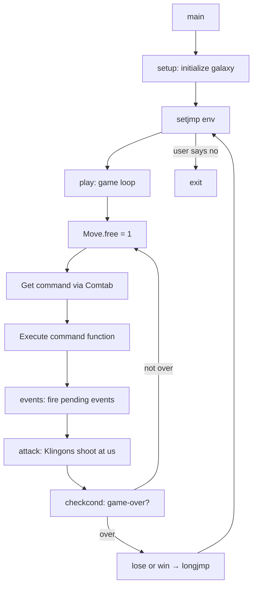
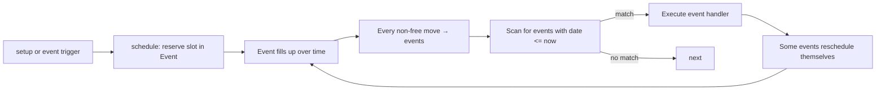
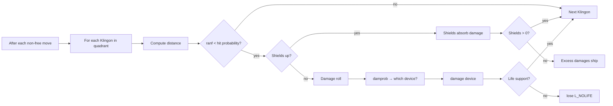

# `trek` — Original Architecture

> Eric Allman's 1976 codebase — 55 C files, an event scheduler, a
> command dispatch table, snapshot-based time-warp, and enough
> global state to make a modern language cry.

Upstream source (not redistributed):
<https://github.com/vattam/BSDGames/tree/master/trek>

---

## Files & Roles

**Grouped by concern.** Total 55 files, ~5,000 LoC.

### Core Loop & Dispatch

| File | Purpose |
|---|---|
| `main.c` | Entry, arg parsing, setjmp, top-level `Another game?` loop |
| `play.c` | Per-turn main loop + command dispatch table (`Comtab`) |
| `getpar.c` | Command / arg parsing utilities — parses `cvntab` prefix matches |
| `cgetc.c` | Character-getter with terminal-mode handling |

### Setup & Data

| File | Purpose |
|---|---|
| `setup.c` | Fresh game setup — populate galaxy, place Klingons, seed events |
| `initquad.c` | Populate a quadrant's sector map on entry |
| `externs.c` | Global tables — device names, difficulty parameters |
| `trek.h` | Every struct definition and prototype |
| `getpar.h` | `cvntab` struct + parser prototypes |
| `systemname.c` | Named starsystem lookup (Arrikis, Vulcan, etc.) |

### Ship / Command Files (One File Per Command)

| File | Command |
|---|---|
| `abandon.c` | `abandon` |
| `attack.c` | Klingon-attacks-you resolver (called after every non-free move) |
| `capture.c` | `capture` — Klingon surrender |
| `computer.c` | `computer` — onboard AI queries |
| `dcrept.c` | `damages` |
| `destruct.c` | `destruct` |
| `dock.c` | `dock` / `undock` |
| `dumpgame.c` | `dump` / `restart` |
| `impulse.c` | `impulse` engines |
| `lrscan.c` | `lrscan` |
| `phaser.c` | `phasers` auto and manual |
| `ram.c` | `ram` |
| `rest.c` | `rest` |
| `shield.c` | `shield` / `cloak` (shared code) |
| `srscan.c` | `srscan` / `status` |
| `torped.c` | `torpedo` |
| `visual.c` | `visual` |
| `warp.c` | `warp` / `move` (via `dowarp`) |
| `setwarp.c` | Warp factor setter |
| `help.c` | `help` — starbase transporter emergency |

### Event & AI

| File | Purpose |
|---|---|
| `events.c` | Event queue processor — fires pending events by stardate |
| `schedule.c` | Event scheduling: schedule/reschedule/unschedule |
| `klmove.c` | Klingon movement AI |
| `compkl.c` | Recompute Klingon distances after Enterprise moves |
| `nova.c` | Star nova (star explodes when torpedoed) |
| `snova.c` | Supernova — random quadrant-destroying event |
| `autover.c` | Auto-override for combat |

### Support

| File | Purpose |
|---|---|
| `check_out.c` | Checkout a device (mark used) |
| `checkcond.c` | Post-move state check — condition, life support, game-over |
| `damage.c` | Apply damage to a device |
| `damaged.c` | Check if device is damaged |
| `dumpme.c` | Debug dump of ship state |
| `dumpssradio.c` | Fake-empty SSradio for hidden events |
| `getcodi.c` | Get course + distance from user |
| `kill.c` | Kill Klingon/base/star/inhabitant |
| `lose.c` | Game over — invokes `longjmp` to main |
| `move.c` | Physics of movement (returns distance actually moved) |
| `out.c` | "Device is out" message |
| `ranf.c` | RNG helpers (`ranf(n)`, `franf()`) |
| `score.c` | Compute final score |
| `win.c` | Victory sequence |

## High-Level Architecture



References: `main.c:245-249`, `play.c:97-115`.

## The Command Dispatch Table

The heart of the game loop is a single 23-entry table at
`play.c:59-85`:

```c
const struct cvntab Comtab[] = {
    { "abandon",   "",        abandon,  0 },
    { "ca",        "pture",   capture,  0 },
    { "cl",        "oak",     shield,   -1 },
    { "c",         "omputer", computer, 0 },
    { "da",        "mages",   dcrept,   0 },
    { "destruct",  "",        destruct, 0 },
    { "do",        "ck",      dock,     0 },
    { "help",      "",        help,     0 },
    { "i",         "mpulse",  impulse,  0 },
    { "l",         "rscan",   lrscan,   0 },
    { "m",         "ove",     dowarp,   0 },
    { "p",         "hasers",  phaser,   0 },
    { "ram",       "",        dowarp,   1 },
    { "dump",      "",        dumpgame, 0 },
    { "r",         "est",     rest,     0 },
    { "sh",        "ield",    shield,   0 },
    { "s",         "rscan",   srscan,   0 },
    { "st",        "atus",    srscan,   -1 },
    { "terminate", "",        myreset,  0 },
    { "t",         "orpedo",  torped,   0 },
    { "u",         "ndock",   undock,   0 },
    { "v",         "isual",   visual,   0 },
    { "w",         "arp",     setwarp,  0 },
    { NULL, NULL, NULL, 0 }
};
```

Each entry is `{prefix, suffix, function_ptr, value}`:

- **Prefix**: minimum text user must type to invoke the command.
- **Suffix**: continuation text (game auto-completes).
- **Function**: the C function to call.
- **Value**: extra int argument to differentiate reuses (e.g.
  `shield` handles both `shields` (0) and `cloak` (-1); `srscan`
  handles both `srscan` (0) and `status` (-1)).

The parser (`getpar.c`) matches user input as a prefix against
each entry's prefix + suffix. Ambiguous → prompt for
disambiguation. Complete → auto-fill suffix.

## The Per-Turn Loop

```c
// play.c:97-115
void play() {
    while (1) {
        Move.free = 1;      // this move is "free" (no time cost)
        Move.time = 0.0;
        Move.shldchg = 0;
        Move.newquad = 0;
        Move.resting = 0;
        skiptonl(0);
        r = getcodpar("\nCommand", Comtab);
        (*r->value)(r->value2);
        events(0);       // fire scheduled events
        attack(0);       // Klingons attack (if move not free)
        checkcond();     // check condition + game-over
    }
}
```

`Move.free = 1` at start; individual commands like `srscan` don't
touch it. Commands like `move` set `Move.free = 0` and consume
time (`Move.time > 0`). `attack(0)` only fires if move was not
free; `events(0)` always fires but only advances stardate by
`Move.time`.

## The Event Scheduler

Reference: `events.c`, `schedule.c`, `trek.h:132-170`.

`trek` maintains a queue of up to 25 scheduled events. Each has a
type (12 types like `E_LRTB`, `E_KATSB`, `E_SNOVA`), a stardate
(when it fires), and a location.

```c
struct event {
    unsigned char x, y;      // quadrant coords
    double date;             // stardate when it fires
    char evcode;             // event type + flags (E_HIDDEN, E_GHOST)
    unsigned char systemname;
};

# define MAXEVENTS 25
extern struct event Event[MAXEVENTS];
```

### Event Lifecycle



### Event Types (from `trek.h:136-146`)

| Code | Event | Description |
|---|---|---|
| `E_LRTB` | Long range tractor beam | Klingons pull you into their quadrant |
| `E_KATSB` | Klingon attacks starbase | Base under fire |
| `E_KDESB` | Klingon destroys starbase | Base lost |
| `E_ISSUE` | Distress call | Inhabited system asking for help |
| `E_ENSLV` | Klingons enslave a quadrant | Federation loses resource |
| `E_REPRO` | A Klingon is reproduced | Total goes up |
| `E_FIXDV` | Fix a device | Device auto-repaired |
| `E_ATTACK` | Klingon attack during rest | If you `rest`, you can be hit |
| `E_SNAP` | Take snapshot for time warp | Game auto-saves state |
| `E_SNOVA` | Supernova | Random quadrant destroyed |

Special flags:

- `E_HIDDEN` = event unreportable because subspace radio broken.
- `E_GHOST` = actually-expired distress call.

## Snapshot-Based Time Warp

Reference: `Etc.snapshot` in `trek.h:334`.

`trek` has a legitimate **time-warp mechanic**: `E_SNAP` schedules
periodic snapshots of the entire game state. If you fire the
right torpedo or trigger the right event, the game can revert to
a previous snapshot.

The snapshot is a raw `memcpy` of `Quad + Event + Now` into a
`char[]` buffer. Simple, brutal, effective.

```c
// trek.h:334
char snapshot[sizeof Quad + sizeof Event + sizeof Now];
```

This is one of the earliest examples of serialization for
game-state rollback. Modern equivalents: game replays, undo
stacks, rollback netcode in fighting games. Trek got there in
1976 with 3 struct sizes.

## Klingon AI

Reference: `klmove.c`.

Klingon behaviour is a **finite state machine** driven by 6
states, each with a probability that the Klingon moves and a
distance multiplier:

```c
// trek.h:344-350
# define KM_OB  0  // Old quadrant, Before attack
# define KM_OA  1  // Old quadrant, After attack
# define KM_EB  2  // Enter quadrant, Before attack
# define KM_EA  3  // Enter quadrant, After attack
# define KM_LB  4  // Leave quadrant, Before attack
# define KM_LA  5  // Leave quadrant, After attack
```

Combined with `Param.moveprob[6]` and `Param.movefac[6]` — arrays
of tunable probabilities and distance multipliers per state — this
lets skill level dial Klingon aggression by adjusting arrays.

Each Klingon (`struct kling` in `trek.h:174-181`) tracks:

- Position (x, y)
- Power remaining
- Distance to Enterprise
- Average distance this move
- Surrender-requested flag

Attack resolution (`attack.c`) iterates each Klingon in the
quadrant, computes hit probability based on distance and skill,
and applies damage to shields (first) then devices (probabilistic
per-device via `damprob[]`).

## Random Event System

RNG lives in `ranf.c`:

```c
int ranf(int max);       // uniform [0, max)
double franf(void);      // uniform [0.0, 1.0)
```

Seed: `srand(time(NULL))` in `main.c:183`.

### Where Randomness Affects Gameplay

| Site | Distribution | Effect |
|---|---|---|
| `setup.c` initial placement | Uniform | Klingons, starbases, stars, systems positioned |
| `events.c` event scheduling | Poisson-like via `eventdly[]` | Distress calls, novas, reproductions |
| `attack.c` hit probability | `franf() < hit_prob` | Klingon hits Enterprise |
| `damage.c` device damage | Weighted by `damprob[NDEV]` | Which device takes the hit |
| `klmove.c` Klingon moves | `moveprob[6]` per state | Whether Klingon moves this turn |
| `help.c` rematerialization | `franf() > x` (distance-based) | Whether transporter works |
| `nova.c`, `snova.c` | Chained probabilities | Stars going supernova |
| `capture.c` surrender | `Param.srndrprob` | Whether Klingon surrenders |

### Consequence Flow (Klingon Attack)



## Difficulty Progression Logic

**No level system.** Difficulty is set once at startup via `length`
and `skill`, both stored in `Game.length` and `Game.skill`.

### `Param` — The Difficulty Table

`Param` (`trek.h:275-308`) is the master parameter block:

```c
struct Param_struct {
    unsigned char bases;      // number of starbases
    char klings;              // number of Klingons
    double date;              // starting stardate
    double time;              // time budget
    double resource;          // Federation resources
    int energy, shield, ...;
    char torped;
    double damfac[NDEV];      // damage factor per device
    double dockfac;           // repair time factor when docked
    double regenfac;
    int stopengy, shupengy;
    int klingpwr;             // Klingon initial power
    int warptime;
    double phasfac;
    char moveprob[6];         // per-state Klingon move probability
    double movefac[6];        // per-state Klingon move distance
    double eventdly[NEVENTS]; // event time multipliers
    double navigcrud[2];      // navigation crudup factor
    int cloakenergy;          // cloaking energy cost per stardate
    double damprob[NDEV];     // per-device damage probability
    double hitfac;            // Klingon attack factor
    int klingcrew;
    double srndrprob;         // Klingon surrender probability
    int energylow;            // YELLOW threshold
};
```

**Skill and length select values for every field** via a lookup
table in `setup.c`. Novice → forgiving values. Impossible →
punishing ones.

### What Scales with Skill

- **Klingon power** (`klingpwr`) — 200 (novice) → 400+ (impossible).
- **Klingon hit factor** (`hitfac`) — how hard they hit.
- **Damage probability** (`damprob[]`) — likelihood devices break.
- **Event multipliers** (`eventdly[]`) — how often bad things
  happen.
- **Surrender probability** (`srndrprob`) — rare on hard skills.
- **Repair time factors** — slower on hard.

### What Scales with Length

- **Number of Klingons** (`klings`) — 5 (short) → 25+ (long).
- **Time budget** (`time`) — 8 (short) → 40 (long).
- **Federation resources** (`resource`) — starting pool.
- **Number of starbases** — more with longer games.

### Implicit Escalation

Even at constant skill/length, the game gets harder:

- `E_REPRO` events add Klingons.
- `E_ENSLV` shrinks Federation resources.
- `E_KDESB` destroys starbases.
- Device damage accumulates until docked.

## Clever Era Techniques

1. **Command table with function pointers.** `Comtab[]` +
   dispatch = ~2 lines of code to run any command. Extensible
   without touching `play.c`.
2. **Snapshot-based rollback.** `Etc.snapshot` as a plain
   `char[]` = time-warp mechanic implemented in one memcpy.
3. **Parametric difficulty tables.** Every difficulty knob is a
   number in `Param`. Adding a new skill level = filling a row.
4. **Per-device damage probability array.** `damprob[NDEV]`
   summing to 1000. Deterministic-frequency-weighted RNG.
5. **`setjmp`/`longjmp` for game-over.** From any command, calling
   `lose()` jumps back to main's `Another game?` prompt.
   Cleaner than manually unwinding return values.
6. **Every command in its own file.** Extreme modularity for its
   era. Made maintenance and porting easier.
7. **`ranf(n)` and `franf()`** — clean RNG primitives. Same
   pattern I later saw in Elite and X-COM.
8. **Named starsystems** (`Systemname[NINHAB]`) — 32 hand-picked
   names giving the galaxy character.
9. **6-state Klingon FSM** — simple but expressive. Compare to
   modern behaviour trees.
10. **Reentrant code** — Eric mentions in comments he made it
    reentrant to fit multiple concurrent games in shared memory
    on the PDP-11.

## Constraints Handled

- **PDP-11 without FP hardware.** Eric compiles with `-f -O` for
  soft float. Fixed-point where possible.
- **Non-separated I/D space.** Code and data share address space.
  Reentrant to fit multiple users.
- **No `curses`.** `printf` only. Screen redraws by scrolling.
- **Portable-C-library bugs.** Eric wrote his own I/O to bypass
  Bell Labs' buggy library.
- **Terminal speed detection** (`main.c:187-191`) — under 1200
  baud triggers "fast mode" (fewer animation frames).

## What This Code Would Look Like Today

- **Command dispatch** → enum + match, or hashmap of closures.
- **Time-warp** → immutable snapshots via structural sharing
  (Rust `Arc`, Clojure persistent data structures).
- **`Param`** → JSON/TOML config file with schema validation.
- **`longjmp`** → `Result<()>` or `panic!` with proper unwinding.
- **Klingon AI** → behaviour tree, or simple FSM class.
- **Event scheduler** → priority queue with proper heap.
- **Save format** → serde JSON, with version tag.
- **RNG** → seedable PRNG explicit; state per-game for
  deterministic replay.

See [`port-ideas.md`](./port-ideas.md).

## See Also

- [`lessons.md`](./lessons.md) — technique extracts.
- [`spec.md`](./spec.md) — mechanical contract.
- [`references.md`](./references.md) — sources.
