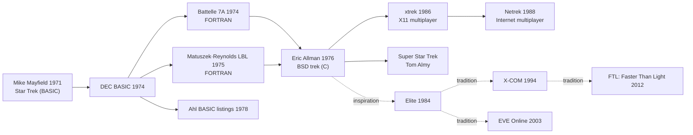

# `trek` — Lineage

> The 55-year descent chain of Star Trek strategy games, and
> where BSD `trek` sits in it.

---

## Direct Ancestors

The provenance chain (documented in `trek/main.c:92-117`):

- **1971:** *Star Trek* by **Mike Mayfield** (BASIC on SDS Sigma 7).
  Written while a high school student. First public version.
- **1972–1973:** Ported to BASIC on HP time-sharing systems;
  spread widely.
- **1974:** DEC BASIC version distributed. Multiple derivatives.
- **December 1974 – June 1975:** *Battelle Version 7A* (FORTRAN)
  by **Joe Miller** (Graphics Systems Group, Battelle-Columbus
  Labs) and **Ross Pavlac** (Battelle Memorial Institute),
  adapted from FTN version by **Ron Williams** (CDC Sunnyvale),
  itself from the DEC BASIC. "Neat stuff swiped" from T. T. Terry,
  Jim Korp (U. Texas), Hicks (U. Penn), Rick Maus (Georgia Tech).
- **1975:** FORTRAN version by **David Matuszek & Paul Reynolds**
  at Lawrence Berkeley Lab (LBL); described by Eric Allman as
  *"the major inspiration for this version of the game
  (translation: I ripped off a whole lot of code)."*
- **Kay R. Fisher (DEC):** FORTRASH version, in the chain.
- **1976:** **Eric Allman's** C port at UC Berkeley. **This is the
  BSD trek.**
- **1980:** Shipped in 4BSD.
- **Today:** Still runs unmodified via `bsdgames` package.

## Direct Descendants

- **Various later BSD forks** — minor tweaks over the decades.
- **`xtrek`** (1980s) — X11 multiplayer real-time descendant, its
  own major genre (led to *Netrek*).
- **`sst` (Super Star Trek, Tom Almy)** — spiritual continuation.
- **Countless BASIC Star Trek listings** in Ahl's *BASIC Computer
  Games* (1978) and derivatives.

## Genre Family

## If You Like `trek`, Try…

**Direct spiritual descendants:**

- **Super Star Trek (sst)** by Tom Almy — modernised BSD trek,
  same commands, more polish.
- **`xtrek` / Netrek** — real-time multiplayer descendant.
  Legendary in 1990s university networks.
- **Star Fleet I & II** (Interstel, 1985–1989) — commercial games
  in the same tradition.

**Same-era Star Trek strategy:**

- **Star Trek: The Kobayashi Alternative** (Simon & Schuster,
  1985).
- **Star Trek: The Rebel Universe** (1988).
- **Star Trek 25th Anniversary** (Interplay, 1992) — adventure
  descendant.

**Modern spiritual successors:**

- **FTL: Faster Than Light** (2012) — real-time roguelike ship
  management. Same ship-in-jeopardy tension.
- **Star Traders: Frontiers** (Trese Brothers, 2018).
- **Starfleet Command series** — real-time tactical descendants.
- **EVE Online** — persistent MMO taking trek's "single ship in
  vast galaxy" to millions of concurrent players.
- **Kerbal Space Program** — different subject, same
  emergent-story-from-systems appeal.

**Broader lineage (management sims):**

- **Elite** (Braben & Bell, 1984) — space trading + combat.
- **X-COM** series — turn-based tactical + strategic layer.
- **SimCity, SimAnt, SimEarth** — emergent narrative from
  systems.

## Communities

- **SDF PubNIX** — retro Unix community still plays trek.
- **VATSIM's Star Trek analogues** — persistent-universe fans.
- **classic-computing.org** — historical preservation.
- **`comp.games` archives** on Usenet (Google Groups archive) —
  1990s discussions.
- **Trek Wiki** communities.

## References

See [`references.md`](./references.md) for citations.
