# trek · procedural-web — *Deep Space — Procedural*

> BSD `trek(6)` (Eric Allman, 1976; 4BSD 1980) as a turn-based space
> command sim where **every pixel and every sound is generated by code**:
> no images, no sprites, no audio files. Same game, turn for turn, as the
> painted [`fancy-web`](../fancy-web/) port — built to compare the two
> approaches head to head.

[](../../../../docs/progress.md)
[](./docs/notes.md#port-style-name)
[](./docs/decisions/002-zero-raster-assets.md)
[](../../../../LICENSE)

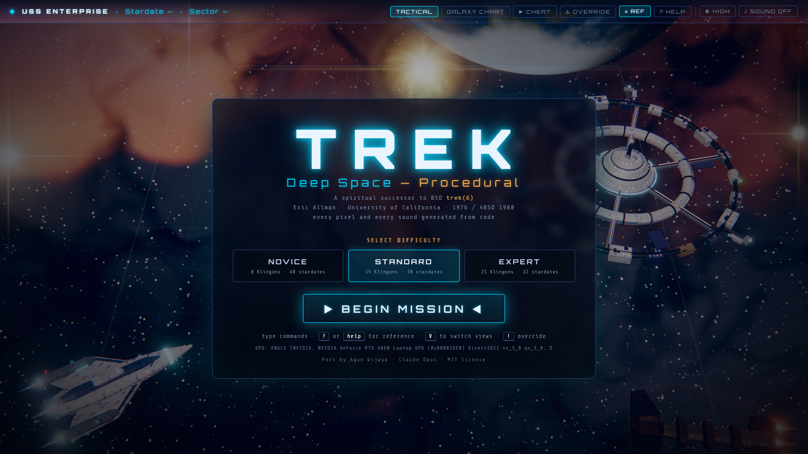
*The title screen floats over a live scene: the player cruiser, a ring
starbase, a terran world and a nebula, all generated at load.*

## Play

```sh
cd bsdgames/trek/ports/procedural-web
node scripts/serve.mjs          # or: npm run serve
# open http://localhost:8765/
```

Any static server works; browsers refuse ES modules from `file://`, so
double-clicking `index.html` is not enough. No `npm install` is needed
to play (Playwright is only a dev dependency for the screenshot and
smoke scripts). Pick a difficulty, press **Enter**, type commands.

| Difficulty | Klingons | Stardates |
|---|---:|---:|
| Novice | 8 | 40 |
| Standard | 15 | 30 |
| Expert | 25 | 22 |

URL options: `?seed=428` (a fixed galaxy), `&difficulty=novice`,
`&quality=high|low|lite`, `&reduced=1` (reduced motion), `&sound=1`.

### Commands

Type at the `Command >` prompt and press **Enter** — the same grammar as
fancy-web:

| Command | Meaning |
|---|---|
| `phaser 500` | Fire 500 units of phaser energy, split across every Klingon here |
| `torpedo 3.5` | Photon torpedo at clock bearing 3.5 (0 = E, 3 = N, 6 = W, 9 = S) |
| `move 3 4` | Course 3, warp 4 — jumps between quadrants (warp < 1 = impulse) |
| `impulse 3` | Short impulse move inside the quadrant |
| `srscan` / `lrscan` | Short / long-range scan (lrscan lifts the fog next door) |
| `damages` | Damage report (also printed in the hint line) |
| `dock` | Dock at an adjacent starbase: refuel, rearm, repair |
| `shields up` / `down` / `300` | Raise, lower, or transfer energy into shields |
| `computer` | Course read-out from the tactical computer |
| `help` · `quit` | Command list · end the mission |

Aliases: `p` `t` `m` `sr` `lr` `d` `s` `c` `q`.

Combat follows BSD trek's rhythm: one command is one volley each way.
`phaser` fires up to six hull banks **at once**, one per Klingon (as the
original's automatic phasers do), then every Klingon answers once. The
torpedo tube is in the bow, so `torpedo`, `impulse` and `move` wait for
the cruiser to come about before it acts.

| Key | Action |
|---|---|
| **V** | Tactical ↔ Galaxy Chart (only when the command line is empty) |
| **?** | Tutorial |
| **\\** | Command reference panel |
| **`** | Dynamic cheat panel (what to type next) |
| **!** | Captain's Override panel |
| **Enter / Backspace / Esc** | Run · delete · clear |

### Cheats

Two layers, both marked in the game:

1. **Dynamic cheat** (**`** key) — the fancy-web hint panel, unchanged:
   priority-sorted suggestions (shields, phaser amount, torpedo bearing,
   route to the nearest Klingon or starbase…). An autoplay test follows
   it blindly and wins 90 % of Novice games.
2. **Captain's Override** (**!** key or type `override`) — god-mode
   switches implemented as explicit engine flags:

| Override | Typed | Effect |
|---|---|---|
| Reveal galaxy map | `override map` | The chart shows every quadrant (no fog of war) |
| Infinite energy | `override energy` | Nothing spends energy; running dry no longer loses |
| Infinite torpedoes | `override torps` | Torpedo count never drops |
| Invulnerable shields | `override shields` | Fire never touches shields, hull or systems (gold bubble) |
| Freeze stardate clock | `override clock` | Commands stop advancing the stardate (❄ in the bezel) |
| One-shot kills | `override oneshot` | Any phaser hit destroys its target |
| Instant warp | `override warp` | Click any quadrant on the Galaxy Chart to jump there, free |
| Warp to a quadrant | `override warp 3-5` | Engage instant warp and jump to quadrant 3-5 |
| Full repair / resupply | `override resupply` | Energy, torpedoes, shields, hull, systems — now, anywhere |
| Release all | `override off` | Turn every override off |

Add `on`/`off` to set a flag, omit it to toggle. While any override is
engaged the bezel shows a pulsing **OVERRIDE ACTIVE** badge. Once one has
been used, the mission is marked **CHEATED** for good: a tag on the
bridge log, gold log entries, `[CHEATED]` on the final log line and a
stamp on the end screen. Full guide: [`docs/how-to-cheat.md`](./docs/how-to-cheat.md).

With every override off the engine is **byte-identical** to fancy-web's —
proved by `tests/baseline-regression.test.js` (see below).

## What you are looking at

| | |
|:---:|:---:|
| 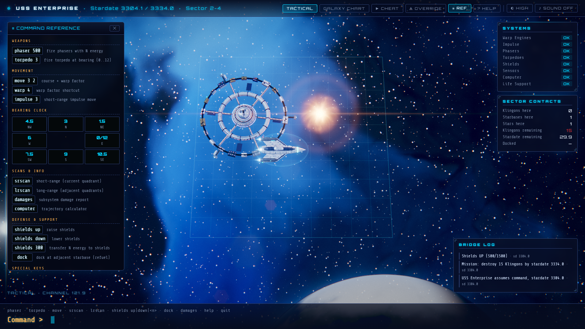 | 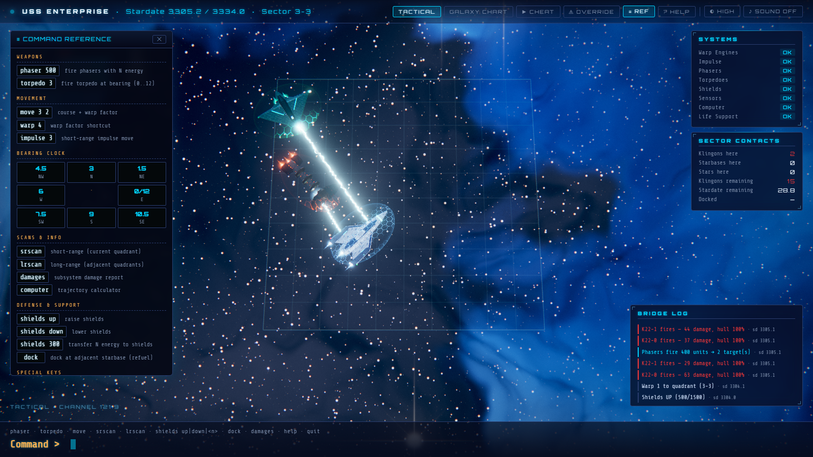 |
| *Quadrant 2-4: a 5.6-cell ring starbase, a star with corona, limb darkening and lens flare, the cruiser in its shield bubble, a terran world on the horizon.* | *Phasers: as in BSD trek, six hull banks fire at once, one per Klingon, each from the bank that faces its target — white-hot core, heat shimmer, hexagons lit on the target's shield.* |
| 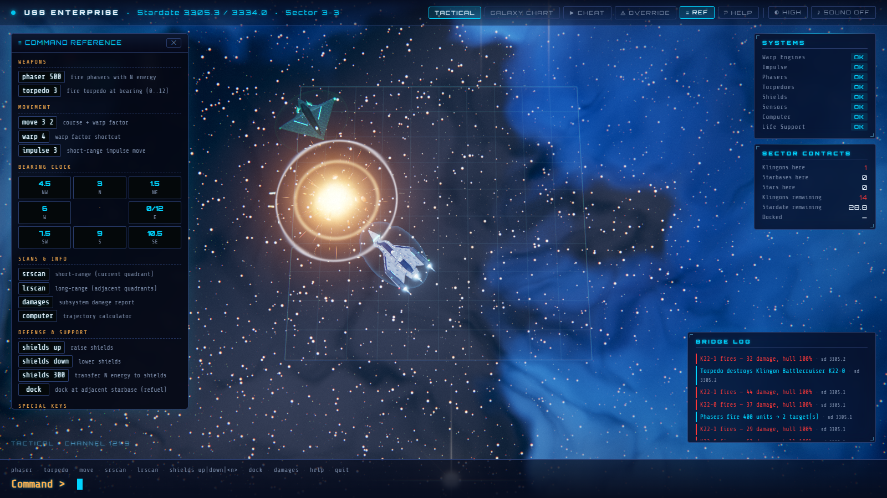 | 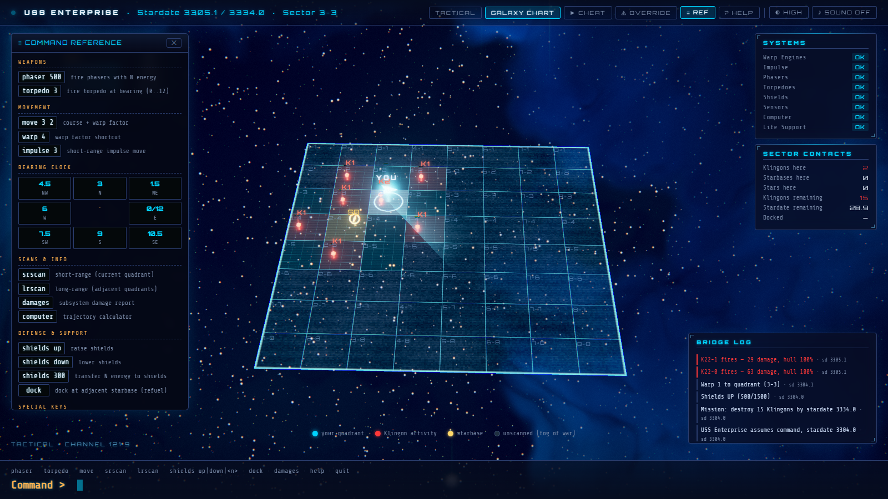 |
| *A torpedo kill: flash, refracting shockwave, fireball, sparks, tumbling hull debris, then embers and smoke.* | *The holographic chart: fog-of-war static, Klingon columns, starbase gizmos, a scan wave rolling out from your beacon.* |
| 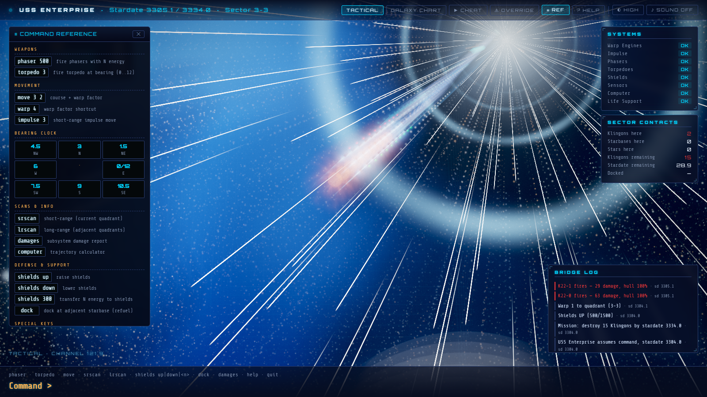 | 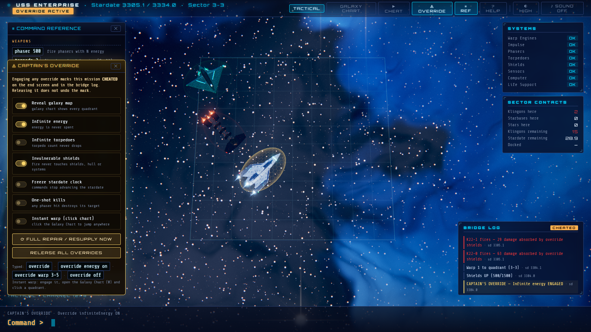 |
| *Warp: the ship stretches, streaks and dives into a tunnel; the new quadrant's sky is baked while the screen is covered.* | *Captain's Override: panel, OVERRIDE ACTIVE badge, gold invulnerable shield, CHEATED log.* |
| 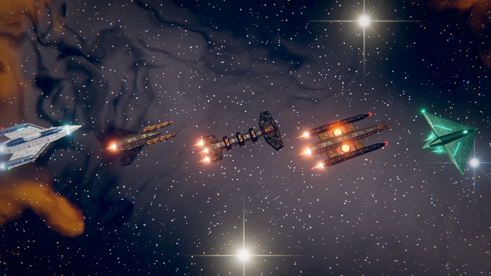 | 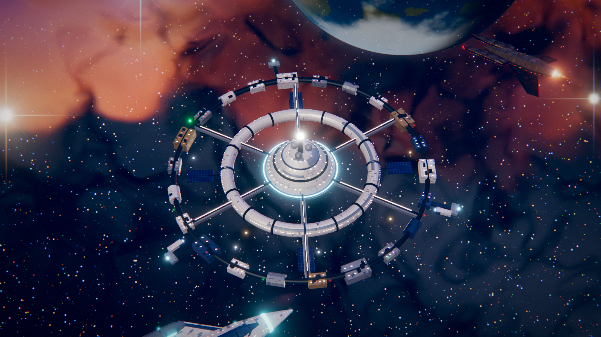 |
| *Original designs, lofted and panelled in code: Vanguard (player), Talon, Hammer, Trident, Stingray.* | *The "Bastion" ring station: counter-rotating rings, 600+ lit windows, beacons, docked tenders, shuttle traffic.* |

Every quadrant's sky is generated from its coordinates: 64 distinct,
stable skies (fancy-web cycles seven paintings). Half of them also get a
planet: a banded gas giant (some ringed), a terran world with continents
and clouds, or a barren moon, lit by the quadrant's key star and kept
off the play grid.

## Versus fancy-web

Same engine, same seed, same keystrokes — the only variable is how the
pictures are made. `npm run compare` renders both ports in seven
states; the pairs and an honest verdict are in
[`docs/comparison.md`](./docs/comparison.md). In short: procedural wins
on motion, light, effects, variety and consistency; the painted port
still wins on the single, hand-composed backdrop and on raw
cost (it runs anywhere at full quality).

| | fancy-web | procedural-web |
|---|---|---|
| Pictures | 7 painted backdrops, 6 PNG ships, 3 SVGs | geometry + GLSL + runtime canvas |
| Skies | 7, `hash(qx,qy) mod 7` | 64, generated from `(qx, qy)` |
| Ships | flat sprites rotated to face you | lit 3D hulls, windows, engines, idle motion |
| Effects | beam lines, sprite blasts | beams with shimmer, hex shields, multi-stage explosions, warp tunnel |
| Sound | none | procedural Web Audio (muted by default) |
| Cheats | dynamic hints | dynamic hints + Captain's Override |
| Page weight | ≈ 16.6 MB of images + ≈ 140 KB code | ≈ 2.1 MB vendored Three.js (≈ 420 KB gzipped) + ≈ 370 KB own code, no images |

## Requirements & running without a GPU

The renderer picks a profile at start and steps down on its own if the
frame rate stays low (the ◐ button in the bezel overrides it):

| Profile | Used when | What changes |
|---|---|---|
| **High** | a GPU is present | MSAA, 6-level bloom, heat shimmer, reflections, full-res sky bake |
| **Low** | High drops below 28 fps for 3 s | no MSAA / shimmer / reflections, lighter bake, 4 bloom levels |
| **Lite** | software WebGL (no GPU), or Low below 18 fps | half-resolution render, stars baked into the sky, no point lights, 12 fps when idle |
| **2D fallback** | no WebGL at all | Canvas 2D top-down view, same game |

Measured at 1600 × 900 with a fresh browser profile (no shader cache),
`node scripts/perf.mjs`:

| Machine | Profile | First frame | Idle | Phaser combat | Explosion |
|---|---|---:|---:|---:|---:|
| RTX 4060 Laptop (D3D11) | High | 3.4–3.7 s | 60 fps | 61 fps | 57 fps |
| RTX 4060 Laptop (D3D11) | Low | 2.7 s | 60 fps | 61 fps | 58 fps |
| CPU only (SwiftShader) | Lite (auto) | 1.5 s | 12 fps (idle cap) | 19 fps | 18 fps |
| WebGL disabled | 2D fallback | 0.5 s | 60 fps | 60 fps | 60 fps |

The first frame on a fresh browser includes compiling every shader; later
visits reuse the browser's shader cache. Each warp re-bakes the new sky
(≈ 80–180 ms on the RTX 4060) while the warp tunnel covers the screen.
The game is turn-based, so the CPU-only frame rates are playable.

| | |
|:---:|:---:|
| 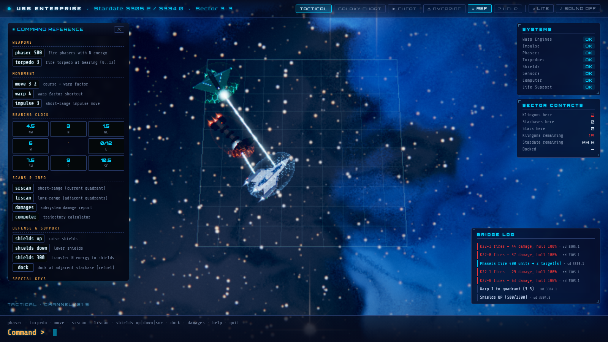 | 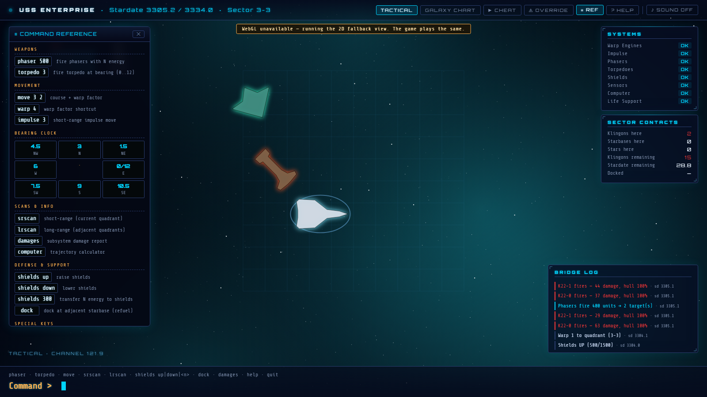 |
| *CPU-only WebGL (SwiftShader): Lite profile.* | *WebGL disabled: the 2D fallback.* |

`prefers-reduced-motion` (or `?reduced=1`) turns off camera drift, idle
bobbing, screen shake and the warp tunnel (a fade instead) and slows
the ambient animation.

## Tech stack

- **Vanilla ES modules, zero build** — like fancy-web
  ([ADR 001](./docs/decisions/001-tech-stack.md)).
- **Engine:** `galaxy.js`, `parser.js`, `hints.js` copied byte-for-byte
  from fancy-web; `engine.js` copied and extended only with the
  default-off Captain's Override flags.
- **Renderer:** [Three.js r186](https://threejs.org/) vendored as an ES
  module (`src/vendor/`, MIT) + hand-written GLSL: volumetric nebula
  bake, star surface and corona, shield hex ripple, beams, fire,
  holographic chart, and a custom post chain (bloom, heat shimmer, lens
  flares, warp tunnel, ACES tone map). No Three.js addons.
- **Zero raster assets** ([ADR 002](./docs/decisions/002-zero-raster-assets.md)),
  enforced by `tests/no-raster.test.js`. Hull panelling is drawn on a
  runtime `<canvas>`; every sound is Web Audio synthesis.
- **Fonts:** Orbitron + Share Tech Mono (Google Fonts), as fancy-web.

## Tests

```sh
npm test                    # node --test: 77 tests
node scripts/ui-smoke.mjs   # 23 browser checks (GPU); GPU=cpu / GPU=nogl for the other tiers
npm run check:raster        # ADR 002 scan
npm run compare             # re-capture the fancy-web vs procedural pairs
npm run shots               # re-capture the screenshots above
```

- The 45 copied fancy-web tests pass **unchanged** (engine, parser,
  hints, autoplay stress, shortcut guards).
- `baseline-regression.test.js` replays 120 seeded games (hint-driven
  and random commands) through a frozen copy of the fancy-web engine and
  through this engine with every override off, and requires identical
  results, state and RNG after every step. It also pins the SHA-256 of
  the three untouched engine files.
- `override.test.js` covers each flag, the typed grammar and the
  CHEATED marking; the shortcut guard is extended with `override` and
  the `!` key.

## Documentation

- [`docs/diff-log.md`](./docs/diff-log.md) — what was kept, changed, added and why
- [`docs/architecture.md`](./docs/architecture.md) — modules, render pipeline, effect choreography
- [`docs/comparison.md`](./docs/comparison.md) — painted vs procedural, state by state
- [`docs/how-to-cheat.md`](./docs/how-to-cheat.md) — both cheat layers
- [`docs/test-scenarios.md`](./docs/test-scenarios.md) — manual checks, canonical coverage
- [`docs/notes.md`](./docs/notes.md) — gotchas, fancy-web bugs found, port-style note
- [`docs/decisions/`](./docs/decisions/) — ADR 001 tech stack, ADR 002 zero raster
- Canonical game docs: [`../../docs/`](../../docs/)

## Attribution

- **Original BSD `trek(6)`** © Eric P. Allman, UC Berkeley (1976 C
  version; 4BSD 1980), BSD licence, descended from Mike Mayfield's 1971
  BASIC *Star Trek*. Upstream:
  <https://github.com/vattam/BSDGames/tree/master/trek>.
- **Game engine** shared with [`trek/fancy-web`](../fancy-web/).
- **Three.js** © three.js authors, MIT (`src/vendor/THREE-LICENSE`).
- Not a Star Trek product. Like BSD trek, the game uses generic terms
  (Enterprise, Federation, Klingons); every ship, station and marking is
  an original design.
- **Port:** Agun Wijaya + Claude Opus.

## Status & licence

**Released** 2026-09-24 (comparison port), still active. MIT, matching
the repository. Live URL: not deployed yet.
