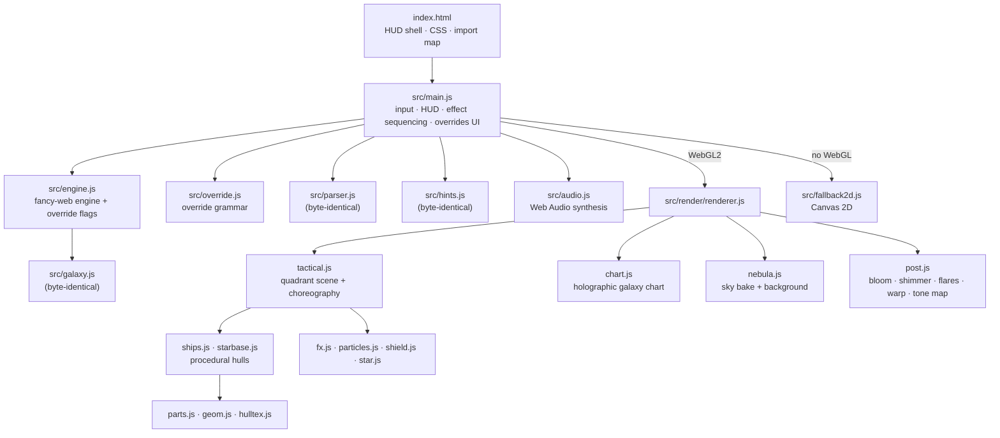
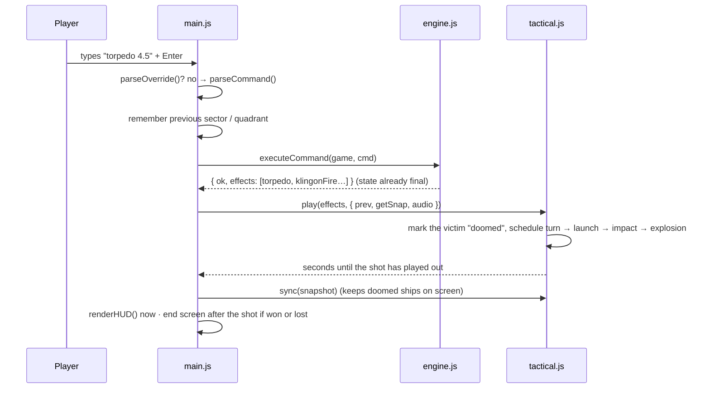
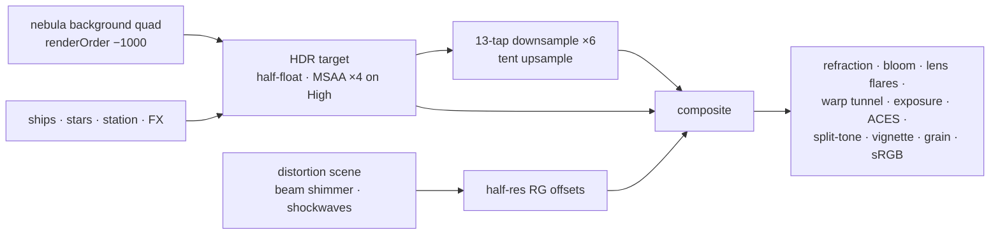

# Architecture — `trek / procedural-web`

How the port is put together. Companions:
[`diff-log.md`](./diff-log.md) (what changed and why),
[ADR 001](./decisions/001-tech-stack.md) (stack),
[ADR 002](./decisions/002-zero-raster-assets.md) (zero raster), and the
canonical [`spec.md`](../../../docs/spec.md).

---

## Layers

The engine layer has no DOM and no Three.js; `node --test` imports it
directly. `main.js` talks to the renderer through one small adapter
(`glAdapter` or `Fallback2D`) with the same methods, so the game plays
the same with or without WebGL.

## A turn, end to end

The engine is turn-based and instantaneous, so the pictures run behind
the rules on purpose. `play()` returns a duration. `main.js` uses it to
delay the end screen and to pace scripted command sequences.

## Effect choreography (`Tactical.play`)

| Effect | Shot |
|---|---|
| `phaser` | as in BSD trek's automatic mode (`phaser.c`): **six phaser banks fire simultaneously, one bank per Klingon, nearest first**. Each target gets the bank that faces it best (bow, forward port/starboard, aft port/starboard, dorsal aft), so there is no turn: emitters flash (0.12 s) → every beam at once (0.8 s) → hex ripples + sparks → killed targets heat and explode as their beams land |
| `torpedo` | turn onto the bearing, **then** launch along the engine's own `trail` points → on arrival: explosion (Klingon), flare + small blast (star), capital explosion (starbase), fizzle (miss) |
| `impulseMove` | turn onto the course, **then** glide from the previous sector (recorded by `main.js`; the engine's `from` field is wrong) |
| `warpMove` | turn onto the course, then 1.8 s: stretch, streak out → tunnel covers the screen → **rebuild the quadrant and bake its sky at 50 %** → decelerate in |
| `klingonFire` | after the player's shot: each ship fires two bolts, 0.24 s apart; `hullDamage < damage` → shield ripple, `hullDamage > 0` → hull sparks + shake |
| `dock`, `lrscan`, `srscan`, `resupply`, `shield` | beams, sensor pings, power sweeps |

**Manoeuvre before acting.** Turns run at a constant, eased rate
(`_turnTo`: ≈ 0.22 s + 0.7 s per 180°) with small thruster puffs. The
torpedo tube is in the bow, so torpedoes, impulse moves and warps wait
until the bow is on its mark. Phasers don't need a turn — they fire
from whichever bank faces the target — and every beam's origin follows
its emitter every frame.

All timings live on the FX clock (`fx.after(delay, fn)`), so a fake
browser clock replays them exactly (the comparison and screenshot
scripts rely on this).

## Rendering

### World and camera

One sector cell = one world unit; sector `(sx, sy)` → `x = sx − 4.5`,
`z = sy − 4.5`, `y` up. North (`sy − 1`) is `−z`. A 30° perspective
camera tilted 20° from vertical looks at the grid. `Tactical.resize()`
iterates the camera distance, then applies a view offset, so the 10 × 10
grid lands on **the same screen rectangle fancy-web uses**:
`cell = min(W − 200, H − 400) / 10`, centred, 40 px above the middle.
Clock bearings (0 = east, 3 = north) therefore read the same in both
ports.

### Frame

### Sky (`nebula.js`)

- `skyParams(qx, qy)` is a pure function of the quadrant. It picks one
  of ten palettes and sets the cloud coverage, density, dust, filaments,
  warp, a galactic band and 1–3 embedded stars. The embedded stars are
  kept out of the central play area so they can't be mistaken for
  in-sector stars.
- **Bake** (on quadrant entry, 2048 × 1280 half-float on High). For each
  pixel: a 2D domain warp and a cloud envelope, then a front-to-back
  march of 6–18 steps through 3D gradient noise. Each step computes a
  cloud body eroded by high-frequency detail, rims at the cloud edges,
  ridged filaments, clustered dust lanes, and light from the embedded
  stars. Colour accumulates, and transmittance goes to alpha.
- **Auto-exposure.** A 32 × 20 probe measures the bake's mean luminance
  and scales the sky towards 0.05 (capped at 1.5×).
- **Per frame.** A cover-fit with slow drift. Three layers of analytic,
  anti-aliased stars are dimmed by the transmittance, so stars vanish
  behind dust. Embedded star cores get diffraction spikes. (Lite bakes
  the stars into the texture instead.)
- **Planets** (`planetParams`, separate RNG stream). Half the skies get
  one, composited over the march inside the bake:
  - gas giant: turbulent bands and storms, optional ring with grooves
    and a gap;
  - terran: continents, ice caps and clouds;
  - barren: mottling and ridged craters.

  Each gets limb darkening, a warm terminator lit from the key embedded
  star, an atmosphere rim and halo, and zero transmittance, so stars
  vanish behind it. Planets sit on a horizon arc at the top or bottom
  edge, or in the free band beside the grid.
- A 256 × 128 equirect of the same palette goes through PMREM and
  becomes the hulls' environment map on High.

### Ships (`ships.js`, `starbase.js`)

Built in a local frame (bow +X) from `loft()` (hull skinned over
cross-sections), `plate()` (plan outlines extruded with a bevel) and
`bell()` (lathed nozzles). Materials are `MeshStandardMaterial` over
per-faction plating drawn on a runtime canvas (`hulltex.js`): albedo,
roughness/metal, a normal map derived from a height field, and glowing
seams. Windows are instanced emissive quads placed with `loftPoint()`.
Engines combine a nozzle, an HDR throat, crossed plume quads and a glow
billboard. Shields and explosions are sized from `hullBox()` (lit hull
meshes only).

### Effects (`fx.js`, `particles.js`, `shield.js`, `star.js`)

- **Particles**: GPU ballistic. Each particle is written once into a
  ring buffer; the vertex shader integrates `p0 + v0·(1 − e^(−kt))/k`.
  Four looks: glow, spark (velocity-stretched), fire (noise + heat
  ramp), smoke (normal blend).
- **Lights**: fixed pools (3 star lights, 3 FX lights). A constant light
  count means no shader recompiles in combat.
- **Shield**: ellipsoid; hex grid projected from above; up to 4 ripples
  by angular distance from the hit direction.

### Galaxy chart (`chart.js`)

A separate scene sharing the sky material (dimmed). The floor shader
reads an 8 × 8 state texture (visible, Klingons, starbase, stars) and
draws the grid, fog-of-war static, your cell, a scan wave, a radar
wedge and the hover highlight. Markers are rebuilt only when the
visible galaxy changes. Labels are DOM elements projected from 3D each
frame. `pick()` raycasts the floor for instant warp.

## Quality tiers

| | High | Low | Lite | 2D |
|---|---|---|---|---|
| Resolution | DPR ≤ 2 | DPR 1 | DPR 1 × 0.5 | native |
| MSAA / bloom levels | 4× / 6 | – / 4 | – / 2 | – |
| Sky bake | 2048², 18 steps, 5 oct | 1024², 9 / 4 | 768², 6 / 3, stars baked | gradients |
| Env map · shimmer · point lights | ✓ ✓ ✓ | – – ✓ | – – – | – |
| Frame cap | – | – | 30, 12 when idle | – |

Chosen by `createRenderer()` (software rasteriser → Lite), stepped down
by `main.js` when the frame rate stays low, overridden by the bezel
button (remembered in `localStorage`).

## Persistence

| `localStorage` key | Purpose |
|---|---|
| `trek-procweb-help-seen` | tutorial shown once |
| `trek-procweb-ref-visible` | reference panel |
| `trek-procweb-cheat-visible` | dynamic cheat panel |
| `trek-procweb-sound` | last sound choice (sound still starts muted) |
| `trek-procweb-quality` | pinned quality profile |

The game itself is per-session, as in fancy-web.

## Testing map

| Suite | Guards |
|---|---|
| `engine`, `parser`, `hints`, `autoplay` (copied) | fancy-web behaviour, winnability |
| `baseline-regression` | overrides off ⇒ identical to the frozen fancy-web engine; SHA-256 pins |
| `override` | each flag, grammar, CHEATED marking |
| `shortcut-conflict` (extended) | `!` and `override` words vs commands and buffer; `main.js` wiring |
| `no-raster` | ADR 002 |
| `scripts/ui-smoke.mjs` | real browser on GPU / CPU / no-WebGL |
