# Painted vs Procedural — `trek` head to head

**Question:** can a renderer that draws everything from code — no images,
no sprites, no audio files — equal or beat a port built on painted
assets, for the same game?

**Method.** Both ports run the same engine ([`diff-log.md`](./diff-log.md) §1).
`scripts/compare.mjs` opens each at 1600 × 900 under Playwright's fake
clock. fancy-web has no seed option, so its first `Math.random()` is
stubbed to return the same seed (428, Standard). Both then receive
identical keystrokes:

```
Enter · shields up · move 1.5 1 · phaser 400 · torpedo 4.5 ·
shields down · phaser 60 · phaser 60 · V · V · damages
```

Captures are taken at matching moments of each port's own animation
(beam mid-flight, torpedo at impact, blast at its peak). The pairs are
in [`../media/compare/`](../media/compare/) as `NN-state-painted.png` /
`NN-state-procedural.png`. Stardates, sectors, HUD values and bridge-log
lines match in every pair: it is the same game, drawn two ways.

Fair-play notes:
- The painted assets were curated by hand. The procedural side had a
  few days of art direction in code. That is part of the comparison.
- fancy-web renders on Canvas 2D. procedural-web needs WebGL2 for its
  full look (it degrades to Low, Lite and a 2D fallback;
  [README](../README.md#requirements--running-without-a-gpu)).
- Screenshots are stills. Much of the procedural side's advantage is
  motion, which stills can't show (§ Motion, sound).

---

## 01 — Title

| Painted | Procedural |
|:---:|:---:|
| 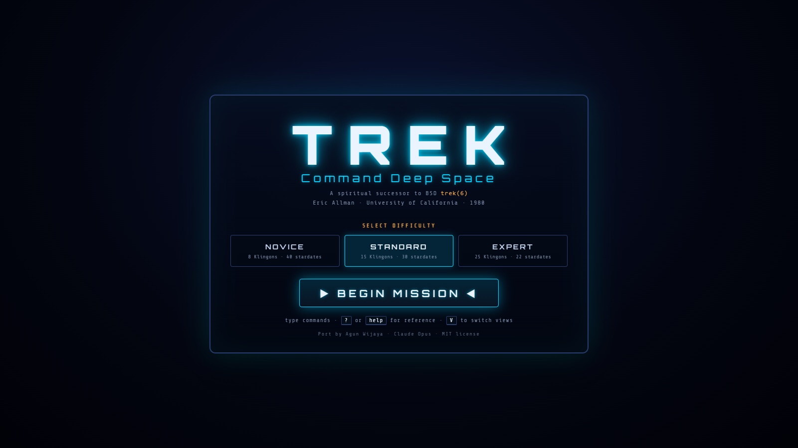 | 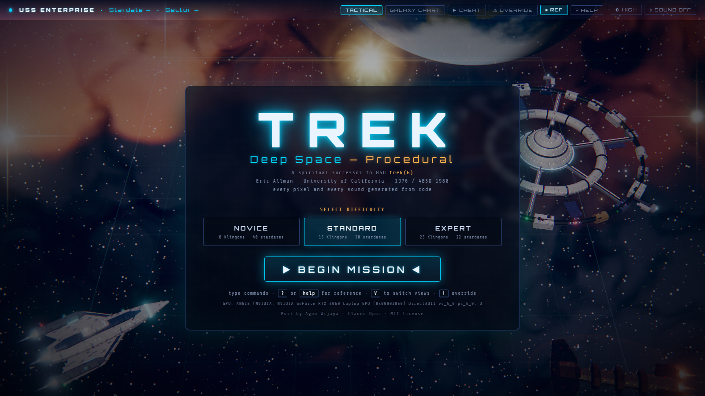 |

The painted title is a centred panel on a flat dark gradient. The
procedural title floats a translucent panel over a live scene: the
cruiser at lower left with its engines lit, the ring station turning on
the right, a warm nebula.

**Verdict: procedural wins.** Not a fair fight: the painted port never
shows its art on the title screen.

## 02 — Quadrant with a star and a starbase

| Painted | Procedural |
|:---:|:---:|
| 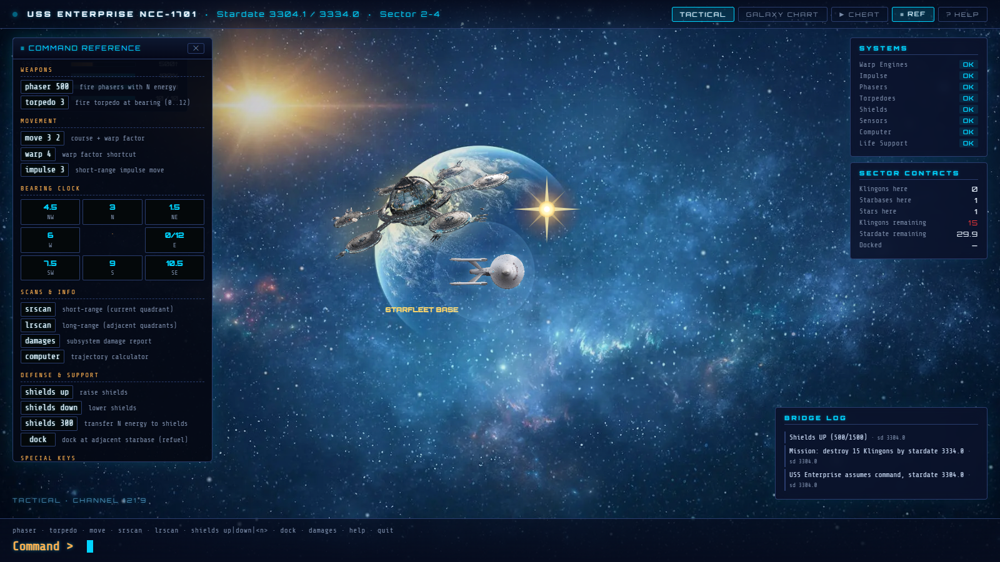 | 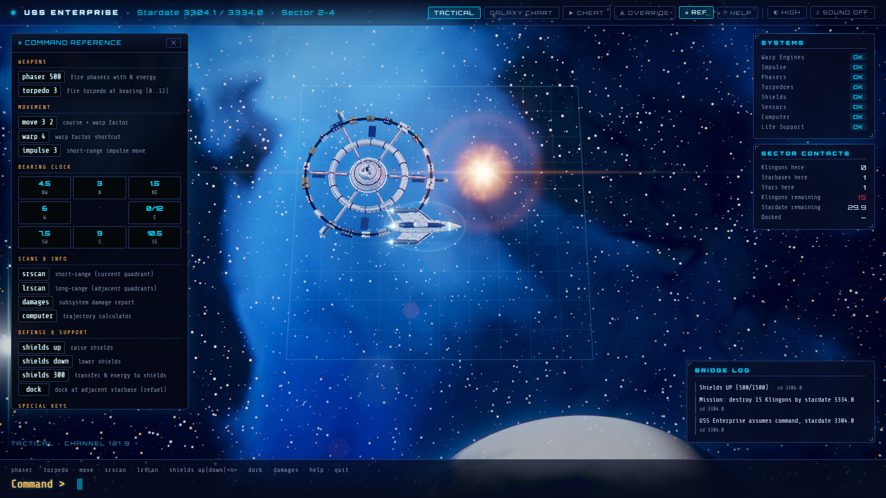 |

**Painted still wins on composition.**
- The backdrop is a hand-made picture with a focal point: a glowing blue
  planet right behind the station. It reads as a *place*.
- The station sprite is dense with detail, and the star is a clean,
  crisp sparkle.
- The procedural sky here does have a hero object: a cloud-streaked
  terran world rising at the bottom edge (about half the quadrants get a
  planet: gas giants, some ringed, terran worlds, barren moons). But it
  is placed by a rule (off the play grid), not framed by an artist.

**Procedural wins on coherence and scale.**
- The station is a real 5.6-cell object that turns, with 600+ windows,
  beacons and shuttle traffic.
- The star is a shaded sphere with a darker limb, a corona and a lens
  flare, and its orange light falls on the station and the cruiser.
  Every ship is lit from the same directions as the sky.
- In the painted scene each sprite has its own baked light, and the
  planet is lit from a different side than the ships. The station also
  floats *in front of* a planet many times its size, a scale cue that
  fights the "top-down tactical grid" reading.

**Verdict: draw.** Painted wins the still frame on art direction;
procedural wins on physical coherence, and once it moves.

## 03 — Phaser combat

| Painted | Procedural |
|:---:|:---:|
|  | 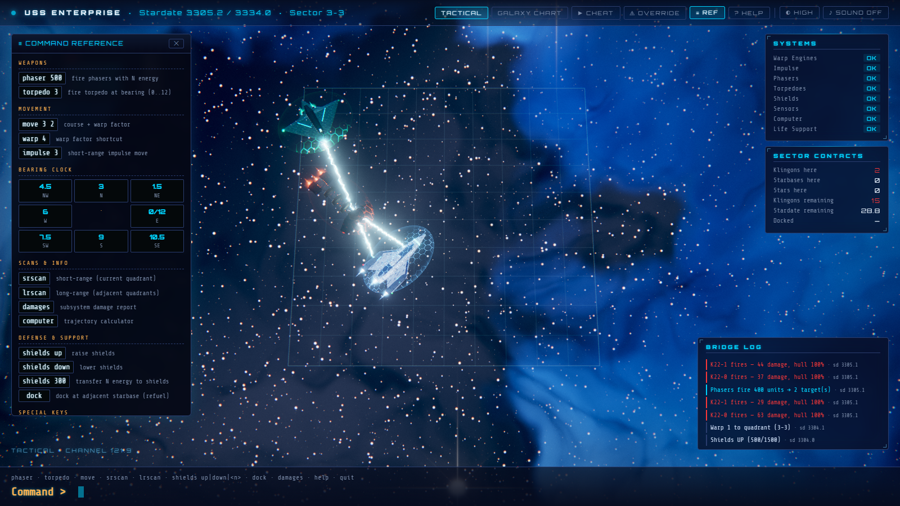 |

The painted backdrop is the strongest single image in either port: a
spiral galaxy across the frame. Its phasers are thin cyan lines, and the
enemy shields are faint discs.

The procedural cruiser fires as BSD trek's automatic phasers do: one
bank per Klingon, all at once, each beam leaving from the hull bank
that faces its target. Here two beams leave together, one for the
warbird and one for the battlecruiser. Each phaser is a bright ribbon
with a white-hot core and a flowing glow. It bends the image behind it
(heat shimmer) and throws sparks and light where it lands. Each
target's shield lights up in hexagons at the impact point.

**Verdict: procedural wins the effect, painted wins the backdrop.** Two
honest weak spots on the procedural side:
- The dark bronze hulls are harder to pick out against a dark sky than
  the saturated green painted sprites.
- This quadrant's pale-blue sky is less dramatic than the painted
  galaxy.

## 04 — Torpedo hit

| Painted | Procedural |
|:---:|:---:|
| 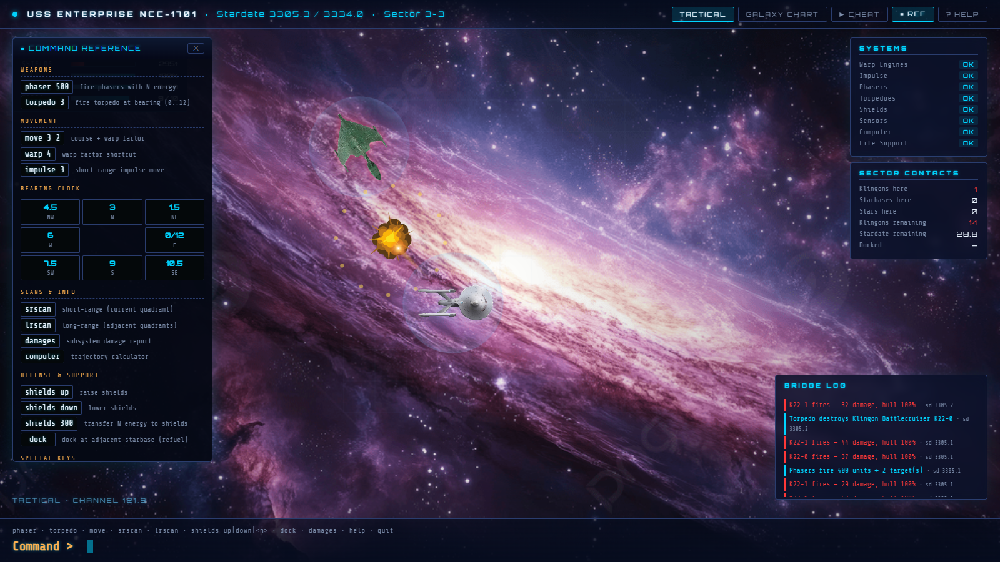 | 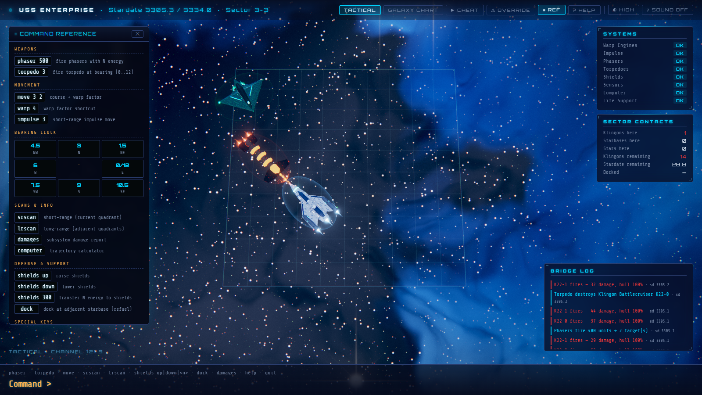 |

In the painted port the blast sprite is already playing before the
torpedo arrives: the explosion starts at frame 15 of a 40-frame flight
(bug logged in [`notes.md`](./notes.md#bugs-found-in-fancy-web), #7).

In the procedural port the cruiser first comes about onto the torpedo
bearing (the tube is in the bow). The torpedo, a spiky pulsing head
with an ember trail on the engine's actual trajectory, reaches the
battlecruiser, and the hull glows orange-hot section by section as it
starts to break up. The blast follows in 05.

**Verdict: procedural wins.** Timing and cause-and-effect are right.

## 05 — Explosion

| Painted | Procedural |
|:---:|:---:|
|  | 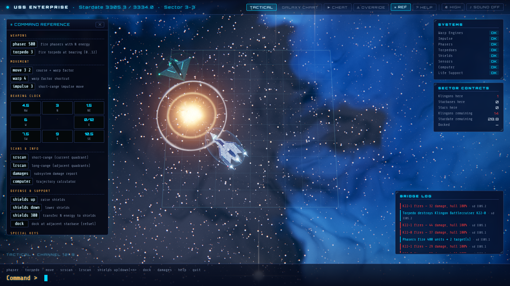 |

The painted explosion is one SVG blast, scaled and spun, over a fading
sprite. It is legible and cartoon-like, and every kill looks the same.

The procedural explosion runs in stages:
1. flash and a point light;
2. a thin shockwave ring that also refracts the background;
3. a noise-shaded fireball cooling from white to red;
4. streaking sparks;
5. tumbling hull debris with ember trails;
6. a cooling ember cloud and smoke.

A super-commander gets a bigger, longer blast with secondary explosions
and a second ring. **Verdict: procedural wins clearly.** A still shows
only one of the six stages.

## 06 — Galaxy chart

| Painted | Procedural |
|:---:|:---:|
| 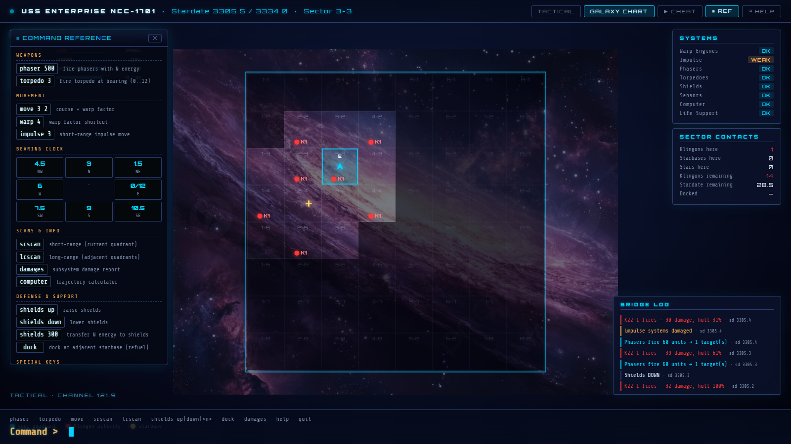 | 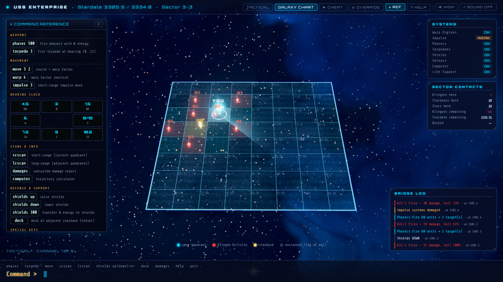 |

The painted chart is a flat 8 × 8 grid over the backdrop, with fog of
war as darker cells. It is the **more legible** of the two:
- every cell is the same size;
- coordinates are easy to read;
- nothing moves.

The procedural chart is a tilted hologram:
- fog-of-war static;
- red columns with stacked diamonds for Klingons;
- rotating gold gizmos for starbases and amber pips for stars;
- your beacon, with a scan wave and a radar sweep;
- instant-warp hover and click.

Perspective makes the far rows smaller. (Its legend is also visible;
the painted legend sits hidden under the command panel.)

**Verdict: procedural wins on spectacle and information, painted on
glanceability.**

## 07 — Damage report

| Painted | Procedural |
|:---:|:---:|
| 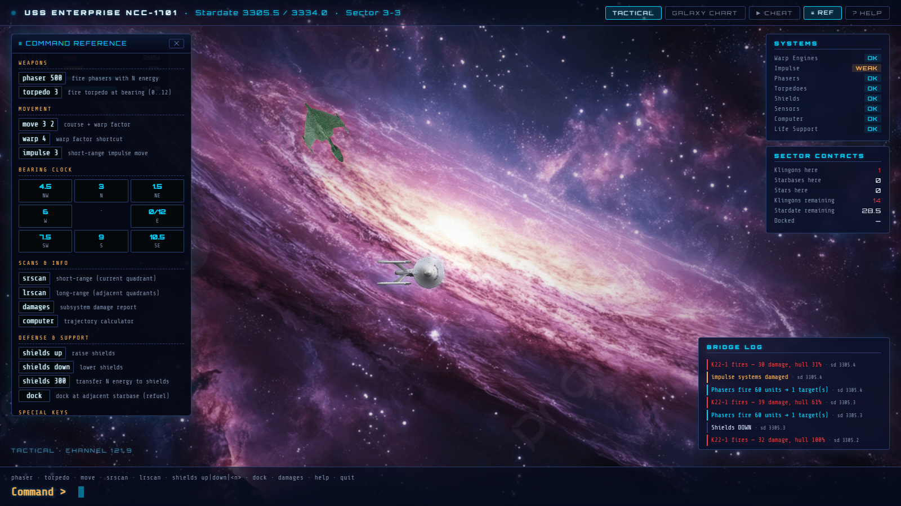 | 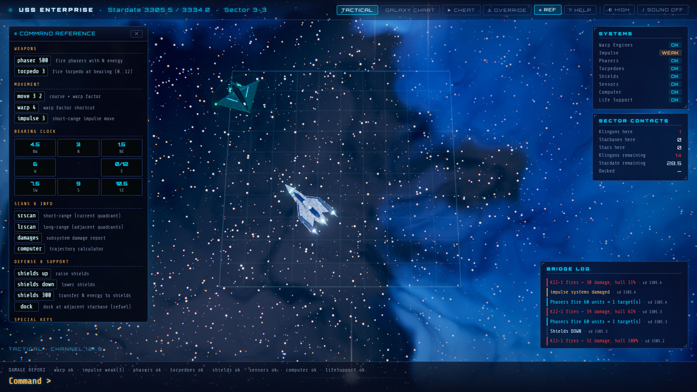 |

The HUD is the same in both: *Impulse WEAK*, hull 31 %. The painted
`damages` command shows nothing. The procedural one prints a report in
the hint line. At 31 % hull, the procedural cruiser trails smoke and
occasional sparks (motion, visible live).

**Verdict: procedural wins narrowly.** It is mostly the same HUD.

---

## Where procedural wins, and why

1. **Everything is lit by one world.** The ships, the station and the
   stars share key, rim, sky and star lights (plus reflections of the
   quadrant's own palette on High). Painted sprites each carry baked
   light from wherever they were painted.
2. **Effects are simulations, not stamps.** Beams, shields,
   explosions, debris and the warp tunnel respond to the actual event:
   where the shot came from, how big the ship was, whether it hit shield
   or hull.
3. **Motion.** Idle roll and bob, engine flicker, turning rings,
   beacons, twinkling stars, shuttle traffic, ships that turn to track
   you, a cruiser that comes about before a torpedo or a move, a glide
   on impulse, a warp sequence. The painted port's only
   motion is a slow backdrop drift and the weapon overlays.
4. **Variety.** 64 distinct, stable skies, one per quadrant (half with
   a planet); star colours by spectral class. The painted port cycles
   seven pictures.
5. **Resolution independence.** Nothing pixelates at 4K or high DPR.
   The palette, proportions and density are numbers in code: reviewable,
   diffable, tunable.
6. **Weight.** ≈ 2.5 MB of code (≈ 420 KB of it Three.js gzipped)
   against ≈ 16.6 MB of images.
7. **Sound** exists at all, and it is synthesised too.

## Where the painted port still wins, and why

1. **Composition.** A painter decides where the eye goes: a planet, a
   galaxy core, a hero angle. Procedural skies place their planets and
   bright stars by rules, so they have subjects but no *framing*. The
   best painted frame (the spiral galaxy in 03) still beats the best
   procedural frame as a *picture*.
2. **Silhouette readability at small size.** The painted sprites are
   high-contrast and saturated. The procedural enemy hulls are
   physically plausible dark metal and lose some pop against dark skies,
   even with rim light.
3. **Detail density per pixel.** A painted station has thousands of
   hand-placed details. The procedural station is built from primitives
   and reads as cleaner and more "modelled".
4. **Cost and reach.** Canvas 2D sprites run anywhere at full quality.
   The procedural port needs a GPU for its full look: SwiftShader gets
   the Lite profile at ~18 fps in combat, and no-WebGL gets a simple 2D
   fallback.
5. **Glanceable chart.** Flat beats holographic for reading coordinates.

## Why it comes out this way

Painting front-loads the art direction: every frame shows a finished
composition, but nothing in it reacts. Procedural generation front-loads
*rules*: every frame is consistent and alive, but composition has to
come from constraints (which palettes, where bright stars may sit, how
big the station is), and taste has to be written as code. Where this
game spends its time — the typed turn, the shot, the hit, the kill — the
reactive side matters more, so procedural wins most of these states. The
painted port keeps the "wow" of its best still.

## What would close the gap

- **More kinds of hero object:** planets are in (half the quadrants);
  a galactic-core or spiral-galaxy backdrop, and composition rules that
  frame a subject rather than merely avoid the grid, would close most
  of what is left.
- **Faction colour accents** on enemy hulls (painted-on stripes, glowing
  trim) for more pop at game scale.
- **A flat chart mode** as an option for glanceability.
- **More authored greebling** on the station.
