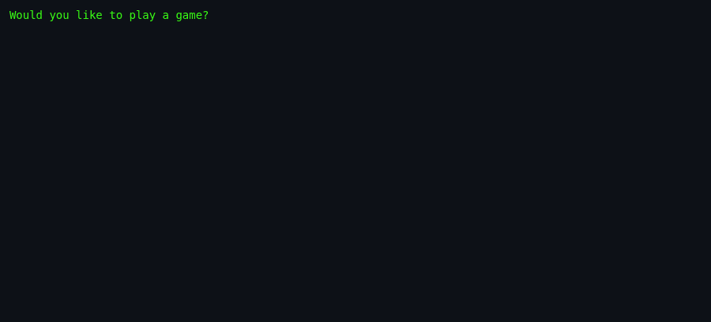
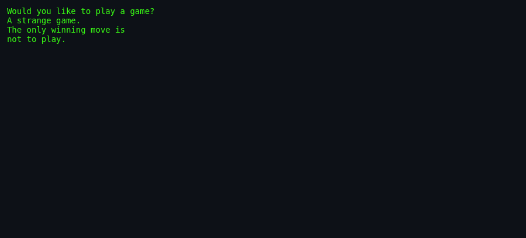

# About `wargames`

> **The original movie-reference Easter egg. Type a game name, or learn
> that the only winning move is not to play.**

---

## What Is `wargames`?

`wargames` is not really a game — it is a one-joke shell-script
Easter egg. Run it and the computer asks the famous line from the
1983 film *WarGames*: "Would you like to play a game?" If you name a
game that is installed under `/usr/games/`, the script clears the
screen and launches it. If you name something that does not exist, it
replies with the film's closing observation:

> A strange game.  
> The only winning move is  
> not to play.

It takes about five seconds to experience, but it has survived for
decades because the joke lands perfectly for anyone who knows the
movie.

## Screenshots

*Screenshots captured via
[`docs/scripts/capture-screenshots.sh`](../../../docs/scripts/capture-screenshots.sh).*

*The script greets you with the classic question.*

*Name a game that is not installed and the movie quote appears.*

## Authors & Publisher

- **Author(s):** University of California, Berkeley (original shell
  script); Joey Hess (manual page, 1998).
- **Publisher / distributor:** University of California, Berkeley;
  later NetBSD.
- **Release year:** 1993 for the shell script; 1998 for the `.6` man
  page.
- **Language:** POSIX shell.

## The Era

`wargames` shipped in the early 1990s, when Unix workstations were the
dominant developer machines and shell scripts were the everyday glue
of the operating system. Easter eggs like this travelled with the BSD
games distribution and were discovered by students exploring
`/usr/games` between compile jobs.

## Why It's Interesting

- **Cultural callback:** It quotes the climax of *WarGames* (1983),
  one of the best-known hacker movies of the era.
- **Minimal launcher:** In just a few lines of shell it can start any
  other installed BSD game.
- **Process replacement:** It uses `exec` to hand control to the
  launched game, leaving no parent process behind.
- **Unix humour:** The man page reassures the reader that "the
  likelihood of Global Thermonuclear Warfare resulting is much
  smaller."

## Difficulty & Progression

There is no difficulty, scoring, or progression. The entire
"experience" is a single prompt and a single response.

## Making-Of / Anecdotes

The script's closing quote mirrors the moment in *WarGames* when the
WOPR computer learns that nuclear war is unwinnable. The manual page,
written later by Joey Hess, leans into the reference by listing the
movie itself in the `SEE ALSO` section — a rare case of a man page
recommending a Hollywood film.

## Cultural Impact

`wargames` is a tiny piece of Unix folklore. It appears in
collections of classic BSD Easter eggs and is often the first program
new users run when they notice a command named after the movie. Its
line "the only winning move is not to play" has been reused in essays
about cybersecurity, disarmament, and even social media.

## Known Bugs (Historical)

- **Hard-coded path:** The lookup is always `/usr/games/$x`, so the
  script fails to find games installed elsewhere.
- **Silent `tput` failure:** If the terminal lacks `clear`
  capability, the screen-clear before launching a game may produce an
  error message.
- **Recursive self-launch:** If `/usr/games/wargames` exists and the
  user answers `wargames`, the script `exec`s itself and asks again.
- **Aggressive input sanitisation:** `sed 's/[^-a-z0-9]//g'` strips
  spaces and punctuation, so "global thermonuclear war" becomes
  `globalthermonuclearwar`.

## See Also

- [`how-to-play.md`](./how-to-play.md) — for actually using the program.
- [`architecture.md`](./architecture.md) — for the code side.
- [`lineage.md`](./lineage.md) — for descendants.
- [`references.md`](./references.md) — for source citations.
