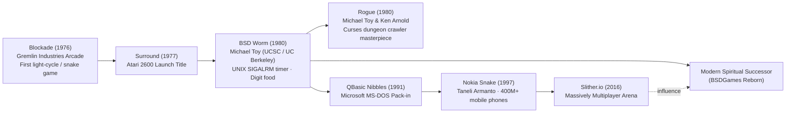

# About Worm

> *"Before Michael Toy descended into the Dungeons of Doom to create Rogue,
> he built a humble hungry worm that taught UNIX terminals how to play real-time arcade games."*

---

## 1. Game Overview

**Worm** is a classic real-time arcade game for character terminals, authored in **1980** by
**Michael Toy** at the University of California, Santa Cruz and UC Berkeley.

In `worm`, the player pilots a hungry worm through an enclosed rectangular terminal arena bounded by
asterisks (`*`). The worm's head is designated by an at-sign (`@`) and its trailing body by a chain
of lowercase `o` characters. Unlike standard static Snake games where food has a constant length of 1,
`worm` features numbered food prizes from **`1` through `9`**. Eating a digit triggers dynamic
growth: the worm elongates by that exact number of body segments, while the score increases in
proportion to the newly acquired length. The challenge is classic arcade survival: eat as many digits
as possible without colliding with the perimeter walls or looping back into your own expanding body.

---

## 2. Historical Context & Michael Toy's Legacy



### The Creator of Rogue
In 1980, Michael Toy was an undergraduate at UC Santa Cruz before transferring to UC Berkeley.
While experimenting with Ken Arnold's revolutionary `curses` library and UNIX process signals,
Toy engineered `worm`. Shortly thereafter, Toy paired with Glenn Wichman and Ken Arnold to design
**`rogue`**, the legendary procedural dungeon crawler that fathered the entire "Roguelike" genre.
The programming patterns Toy tested in `worm`—asynchronous single-character input, coordinate-based
screen buffers, and curses window partitioning—directly informed the architecture of `rogue`.

### The Arcade Heritage of Snake
The growing snake genre traces its lineage to **`Blockade`** (1976), a monochrome arcade game
developed by Gremlin Industries, which inspired Atari's **`Surround`** (1977) and the iconic
light-cycle sequence in Disney's *TRON* (1982). Michael Toy's `worm` introduced several distinct
innovations to the genre:
1. **Digit-Based Growth Mechanics:** Food items are integers ($1 \dots 9$), causing sudden,
   dramatic growth spurts rather than uniform 1-block increments.
2. **Capital Letter Sprint Dashes:** Pressing `H`, `J`, `K`, or `L` initiates an automated multi-step
   dash that stops instantly when a food digit is encountered, adding high-speed tactical maneuvering.
3. **Pure UNIX Signal Loop:** Driven entirely by `SIGALRM` and `alarm(1)` interval timers, proving
   that time-sharing PDP-11 and VAX systems could deliver smooth, continuous arcade action.

---

## 3. Visual Tour

Below are text captures of BSD Worm running in its native terminal environment.

### Starting Arena Setup
The arena initializes with the worm at length 7 and the first random digit prize spawned on the field:


*Figure 1: Initial state showing the score header, perimeter walls, length-7 worm (`oooooo@`), and target digit 7.*

### Mid-Game Expansion
After consuming multiple digits, the worm snakes across the arena as open space rapidly diminishes:


*Figure 2: Active mid-game run with score 38, showing a convoluted trailing body and newly spawned target 4.*

### Game Over Collision
The fatal moment of collision where the worm circles back into its own body:


*Figure 3: Fatal crash into own body segments, concluding the game with an 87-point final tally.*

---

## 4. Why It's Fun: The Core Loop

1. **The Variable Growth Surge:** Eating a `1` is a gentle advance, but gobbling a `9` triggers a
   massive surge of 9 trailing segments that suddenly flood your escape routes. Players must judge
   whether reaching for a tempting `9` in a tight corner is worth the imminent traffic jam!
2. **The "Sprint" Gamble:** Using the capital letter keys (`HJKL`) allows you to rocket across the
   screen at double speed. Because the sprint automatically halts upon contacting a digit, expert
   players use it to snipe prizes in open corridors, skating millimeters past fatal perimeter walls.
3. **Collapsing Spatial Freedom:** As your score climbs into the hundreds, the game shifts from a simple
   chase into a claustrophobic puzzle of self-avoidance, demanding tight geometric coiling to maximize
   open arena volume.

---

## 5. Difficulty & Progression

BSD Worm implements continuous organic difficulty scaling through **arena congestion**:

| Stage / Density | Worm Length | Score Range | Gameplay Characteristics |
|---|:---:|:---:|---|
| **Early Game** | $7 \dots 25$ | $0 \dots 50$ | Wide open arena. Free movement; ideal for practicing sprint dashes. |
| **Mid Game** | $25 \dots 80$ | $50 \dots 200$ | Arena dividing into corridors. Turning space tightens; 8 and 9 digits become dangerous. |
| **Late Game** | $> 80$ | $> 200$ | High congestion. Worm must be coiled in systematic serpentine folds to avoid trapping itself. |

### CLI Setup & Custom Length
Players can customize the initial difficulty using the optional CLI argument:
```bash
worm 50       # Starts the worm with 50 segments for immediate high-density survival!
```
The game strictly bounds the starting length: it must be greater than zero and cannot exceed
$\frac{(\text{LINES}-3) \times (\text{COLS}-2)}{3}$, preventing players from initializing a worm
that would instantly choke the arena.

---

## 6. Known Bugs and Historical Quirks

1. **Minimum Terminal Geometry Check:**
   If launched on a terminal with fewer than 18 columns or fewer than 5 lines, `worm.c` calls
   `errx(1, "screen too small")` and exits immediately to avoid buffer overruns.
2. **Baudrate Compensation (`slow` flag):**
   In `worm.c:115`, the code checks:
   ```c
   slow = (baudrate() <= 1200);
   ```
   On historical 300 or 1200 baud modem lines, intermediate screen updates during `HJKL` sprint runs
   were suppressed to prevent modem serial buffers from lagging behind the game clock.
3. **Collision Detection via `winch()`:**
   Instead of checking an in-memory collision grid, Michael Toy inspected the curses screen buffer
   directly using `winch(tv)`. If the character at $(y, x)$ was neither a space (`' '`) nor a digit,
   the game triggered an immediate `crash()`.
