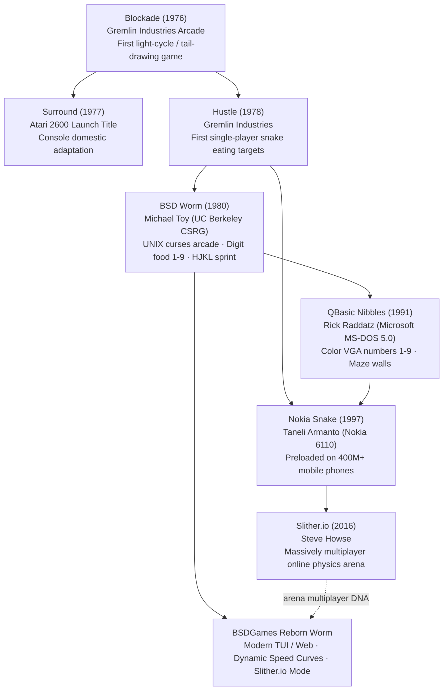

# Worm — Lineage & Heritage

A historical and mechanical genealogy of the growing snake genre, tracing its path from 1970s
arcade coin-ops to Michael Toy's BSD implementation, MS-DOS Nibbles, Nokia mobile phones, and modern web arenas.

---

## 1. The Growing Snake Evolutionary Tree

---

## 2. Comparative Evolution Across Historic Eras

| Era / Title | Food Mechanics | Growth Behavior | Sprint / Dash | Speed Scaling | Platform |
|---|---|---|---|---|---|
| **Blockade (1976)** | None (Survival) | Continuous tail behind head | None | Constant arcade clock | Monochrome arcade cabinet |
| **Hustle (1978)** | Static targets | Fixed $+1$ length | None | Constant | Arcade cabinet |
| **BSD Worm (1980)** | **Digits `1` through `9`** | Variable $+d$ segments | **Yes (`HJKL` dash)** | Fixed 1.0s (`alarm(1)`) | UNIX terminal curses |
| **QBasic Nibbles (1991)** | Numbers `1` through `9` | Variable $+d$ segments | None | Escalates per round | MS-DOS PC (QBasic) |
| **Nokia Snake (1997)** | Dots / Bugs | Fixed $+1$ length | None | 9 selectable speed tiers | Nokia 6110 / 3310 mobile |
| **Slither.io (2016)** | Glowing multi-size orbs | Continuous mass scale | Boost (burns mass) | Smooth analogue acceleration | Web / Mobile browser |

---

## 3. Cultural & Genre Significance

- **The QBasic Nibbles Connection:** Many 1990s programmers learned coding from Microsoft's pack-in
  game `NIBBLES.BAS` on MS-DOS 5.0. Notably, *Nibbles* inherited its core mechanic—eating numbers `1`
  through `9` for proportional growth—directly from Michael Toy's 1980 BSD `worm`.
- **The Ubiquitous Mobile Game:** Taneli Armanto's port of Snake for the Nokia 6110 in 1997 became
  one of the most widely played video games in human history, demonstrating that simple spatial
  avoidance mechanics transcend display resolution and computing power.
