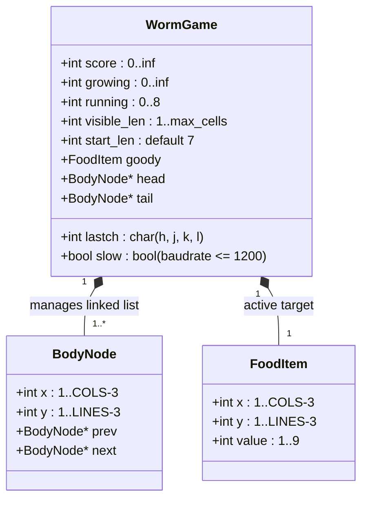

# Worm — Reverse Specification

Formal mechanical specification, state variables, entity inventory, doubly-linked list invariants,
and collision logic reverse-engineered from BSD `worm` (Michael Toy, 1980).

---

## 1. Mathematical Objective

Maximize cumulative score $S$:
$$\max S = \sum_{k=1}^{M} \Delta S_k$$
where $M$ is the number of food prizes eaten before a fatal collision occurs.
The game is an open-ended survival game; termination occurs if and only if the worm collides
with a perimeter wall or with its own body.

---

## 2. Formal State Variables

| Variable | Type / Domain | Meaning | Upstream C Identifier |
|---|---|---|---|
| `head` | `struct body *` | Pointer to the leading head node (`@`) | `head` (`worm.c:73`) |
| `tail` | `struct body *` | Pointer to the trailing tail node (`o`) | `tail` (`worm.c:73`) |
| `goody` | `struct body` | Coordinates $(x, y)$ of the active food digit | `goody` (`worm.c:73`) |
| `growing` | `int` $\ge 0$ | Number of segments remaining to expand | `growing` (`worm.c:74`) |
| `running` | `int` $\in [0, 8]$ | Sprint step countdown timer | `running` (`worm.c:75`) |
| `score` | `int` $\ge 0$ | Cumulative player score | `score` (`worm.c:77`) |
| `start_len` | `int` $\ge 1$ | Initial body length configured at launch | `start_len` (`worm.c:78`) |
| `visible_len`| `int` $\ge 1$ | Current total segment count on screen | `visible_len` (`worm.c:79`) |
| `lastch` | `int` | Last direction character executed | `lastch` (`worm.c:80`) |
| `slow` | `int` $\in \{0, 1\}$ | Flag indicating baudrate $\le 1200$ | `slow` (`worm.c:76`) |

---

## 3. Complete Entity Inventory

The game world consists of five distinct character entities rendered in curses windows:

| Entity Symbol | Name | Category | Cardinality | Functional & Collision Rules |
|:---:|---|:---:|:---:|---|
| **`@`** | **Head** | Player Avatar | Exactly 1 | Drives movement direction. Coordinates $(x, y)$ test target cell contents via `winch()`. |
| **`o`** | **Body Segment** | Player Body | $N \ge 0$ | Forms the trailing tail queue. Contacting an `o` causes instant collision death. |
| **`1`..`9`** | **Food Digit** | Target Prize | Exactly 1 | Spawns randomly in open space. Eating digit $d$ triggers growth: $\Delta \text{growing} = d$. |
| **`*`** | **Perimeter Wall** | Boundary Obstacle | Border ring | Encloses arena in window `tv`. Contacting a `*` causes instant collision death. |
| **`' '`** | **Empty Floor** | Space | Variable | Traversable floor cell. Valid target for worm movement and food placement. |

---

## 4. Formal Movement & Growth Invariants

Let $(x_h, y_h)$ be current head coordinates.
Let $(x', y')$ be candidate destination coordinates based on direction vector $\vec{v} \in \{(-1, 0), (1, 0), (0, -1), (0, 1)\}$.
Let $C = \text{winch}(\text{tv}, y', x')$ be the character occupying the destination cell.

### 1. Collision Invariant
$$\text{If } C \notin \{' ', '1', '2', '3', '4', '5', '6', '7', '8', '9'\} \implies \textbf{CRASH (Game Over).}$$

### 2. Tail Dequeue vs. Growth Invariant
When the worm moves:
$$\text{Tail Action} = \begin{cases}
\text{Erase } \text{tail}, \quad \text{free}(\text{tail}), \quad \text{tail} \leftarrow \text{tail.next} & \text{if } \text{growing} = 0 \\
\text{Retain } \text{tail}, \quad \text{growing} \leftarrow \text{growing} - 1 & \text{if } \text{growing} > 0
\end{cases}$$

### 3. Digit Consumption Invariant
$$\text{If } C \in \{'1' \dots '9'\} \implies \begin{cases}
d = C - \text{'0'} \\
\text{growing} \leftarrow \text{growing} + d \\
\text{score} \leftarrow \text{score} + \text{growing} \\
\text{running} \leftarrow 0 \\
\text{Spawn new random prize digit at open } (x_g, y_g)
\end{cases}$$

### 4. Sprint Dash Step Invariant
When a capital direction key is pressed:
$$\text{running} = \begin{cases}
8 & \text{for } 'H' \text{ (Left)} \lor 'L' \text{ (Right)} \\
4 & \text{for } 'J' \text{ (Down)} \lor 'K' \text{ (Up)}
\end{cases}$$
During each step of the sprint, `running` decrements by 1. If a digit is consumed, `running` is
immediately zeroed to halt the dash.

---

## 5. Setup & Dimension Bounds

1. **Minimum Terminal Requirement:**
   $$\text{COLS} \ge 18 \land \text{LINES} \ge 5$$
   If terminal size falls below this bound, program aborts with `errx(1, "screen too small")`.
2. **Starting Length Clamping:**
   $$\text{Max Allowed Length} = \left\lfloor \frac{(\text{LINES} - 3) \times (\text{COLS} - 2)}{3} \right\rfloor$$
   If requested starting length $L \le 0$ or $L > \text{Max Allowed Length}$, $L$ collapses to default `LENGTH = 7`.
