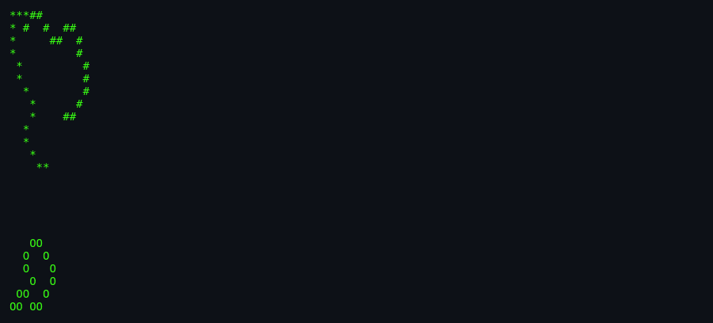
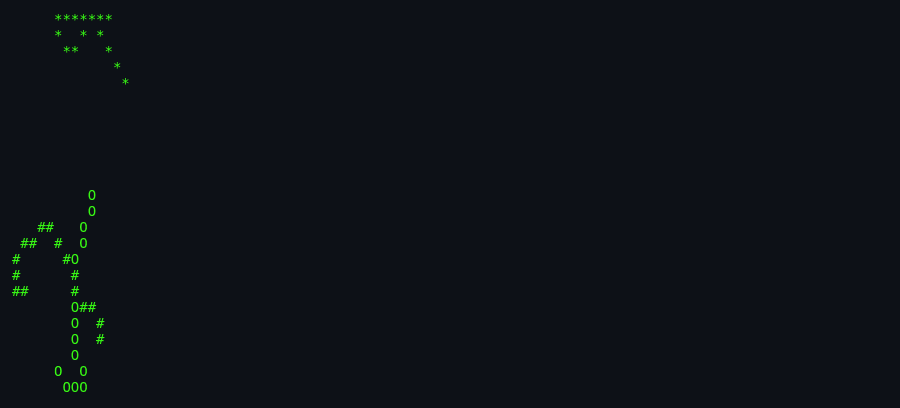
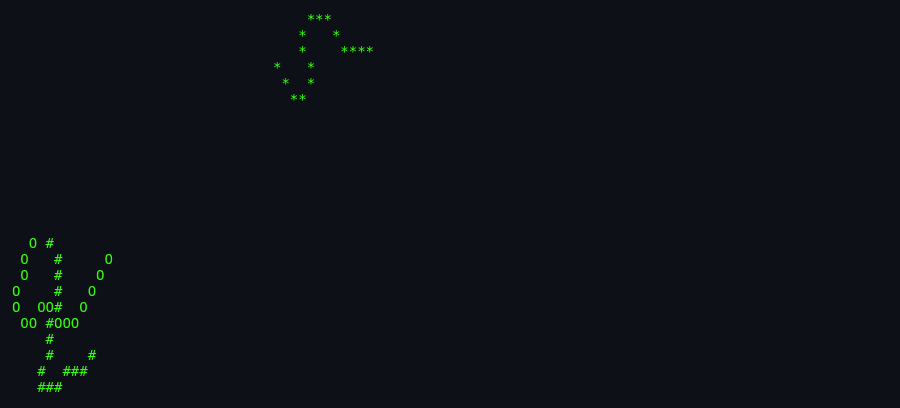

# About `worms`

> **Watch ASCII worms wander, wrap, and nibble across your terminal.**

---

## What Is `worms`?

`worms` is a curses screensaver that animates one or more segmented "worms" crawling around the terminal screen. Each worm is a chain of characters that moves one step per frame, turning randomly while respecting screen edges. The `-f` flag even fills the background with the word "WORM" for the worms to "eat."

## Screenshots

*Screenshots captured via [`docs/scripts/capture-screenshots.sh`](../../../docs/scripts/capture-screenshots.sh).*

*Several worms beginning to crawl from the lower-left corner.*

*Worms weaving around the screen, leaving trails or spaces behind.*

*A late frame showing worms spread across the screen.*

## Authors & Publisher

- **Author(s):** Eric P. Scott (Caltech High Energy Physics).
- **Publisher / distributor:** University of California, Berkeley; later NetBSD.
- **Release year:** 1980 (shipped in 3BSD).
- **Language:** C.

## The Era

`worms` was created in the early 1980s alongside `rain`, during the same wave of curses-based terminal demos. The source header includes a large ASCII-art signature spelling "WORMS" — a playful author mark typical of the era.

## Why It's Interesting

- **Animated agents:** Unlike `rain`, `worms` has persistent moving entities with position history.
- **Edge logic:** Nine orientation tables handle boundary conditions smoothly.
- **Configurable density:** You can spawn many short worms or a few long ones.
- **Field mode:** The `-f` option turns the screen into a "WORM" text field for the worms to erase.

## Difficulty & Progression

There is no difficulty or progression. The animation runs indefinitely until interrupted.

## Making-Of / Anecdotes

The source begins with an ASCII-art rendering of the word "WORMS" and credits "Eric P. Scott / Caltech High Energy Physics / October, 1980." This header doubles as the texture used by the `-f` flag.

## Cultural Impact

`worms` is part of the canon of ASCII screensavers that includes `rain` and `xscreensaver` modules. It influenced later screensavers that simulate snakes, bacteria, and other crawling particles. It is also a common programming exercise for teaching circular buffers and curses.

## Known Bugs (Historical)

- **No explicit seed:** `random()` is used without `srandom()`. On glibc that means seed 1, so every run in a terminal of the same size shows exactly the same animation.
- **Abort on impossible orientation:** If a worm reaches a state with zero valid options, the program calls `abort()` (`worms.c:325-328`). This should be unreachable with correct boundary tables.
- **Memory on huge worms:** Each worm allocates two `short` arrays of `length` elements; with `-n` and `-l` very large this can exhaust memory.

## See Also

- [`how-to-play.md`](./how-to-play.md) — for running the screensaver.
- [`architecture.md`](./architecture.md) — for the code side.
- [`lineage.md`](./lineage.md) — for descendants.
- [`references.md`](./references.md) — for source citations.
