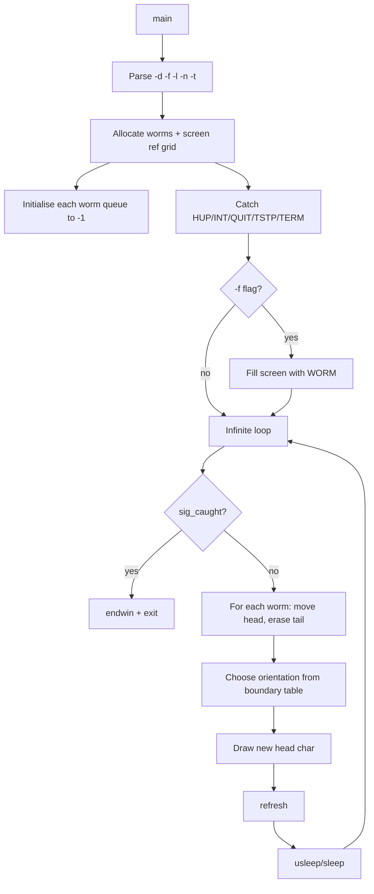

# `worms` — Original Architecture

> Deep analysis of the original C source. What did the programmer build, and how?

Cite upstream file:line references only (never local paths). Upstream tree: <https://github.com/vattam/BSDGames/tree/master/worms>.

---

## Files & Roles

| File | Purpose | Approx. LoC |
|---|---|---:|
| `worms.c` | Curses setup, worm state, animation loop, boundary tables | 355 |
| `worms.6` | Man page | — |

## High-Level Flow



## Game Loop Detail

The main loop (`worms.c:291-341`) iterates forever:

1. `refresh()`.
2. Check `sig_caught`; if set, `endwin()` and exit.
3. Sleep for the configured delay.
4. For each worm:
   - If the head position is unset (`<0`), place it at `(0, bottom)`.
   - Advance the circular head index.
   - Erase the old tail cell if its reference count reaches zero.
   - Choose a new orientation using the boundary table for the current screen edge.
   - Draw the new head and increment the reference grid.

## Data Structures

```c
// worms.c:175-178
static struct worm {
    int orientation, head;
    short *xpos, *ypos;
} *worm;
```

Each worm stores:
- `orientation` — current heading (0–7, clockwise from up-right).
- `head` — index into circular position buffers.
- `xpos`, `ypos` — circular arrays of `length` positions.

A 2D reference grid (`ref[LI][CO]`) tracks how many worms occupy each cell, so the tail is only erased when no worm is using it.

## AI Logic

Not applicable — movement is random, constrained only by screen edges.

## Random Events

RNG source: `random()` from libc. Like `rain`, the program does not explicitly seed it.

| Trigger site | Distribution | Outcome |
|---|---|---|
| `worms.c:333-334` | `random() % op->nopts` | Choose next orientation from boundary table |

### Consequence Flow


## Difficulty Progression Logic

There is no difficulty system. The visual complexity scales with user-configurable parameters:

- More worms (`-n`) increase screen activity.
- Longer worms (`-l`) create denser trails.
- Trail mode (`-t`) and field mode (`-f`) change the visual style.

## What Was Clever for Its Era

- **Reference grid for erasing tails:** `ref[y][x]` counts how many worms cover a cell, preventing a worm from erasing another worm's body.
- **Boundary orientation tables:** Nine tables (`normal`, `upper`, `lower`, `left`, `right`, `upleft`, `upright`, `lowleft`, `lowright`) encode valid turns for each screen edge.
- **Circular position queues:** Reusing fixed-length arrays for each worm's body avoids repeated allocation.

## Constraints the Original Had To Handle

- **Memory:** Allocates `CO * LI` short integers for the reference grid plus two `length`-short arrays per worm.
- **Terminal size:** Uses curses `COLS` and `LINES`; maps 8 compass orientations to `(xinc, yinc)`.
- **CPU:** One random draw and several curses updates per worm per frame.
- **Persistence:** None.

## What This Code Would Look Like Today

A modern port might use a particle system with smooth interpolation, collision detection, and colour gradients. A web version could render worms as SVG paths. See [`port-ideas.md`](./port-ideas.md) for more.

## See Also

- [`lessons.md`](./lessons.md) — beginner-friendly extraction of techniques.
- [`spec.md`](./spec.md) — implementation-independent specification.
- [`references.md`](./references.md) — sources & citations.
