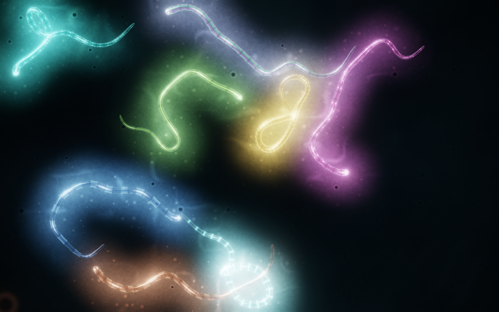
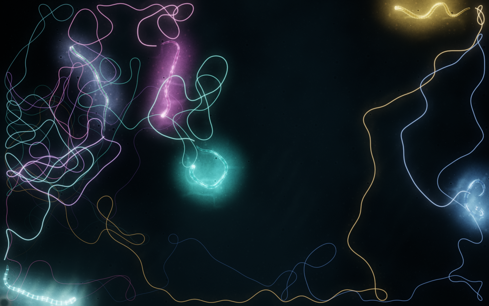
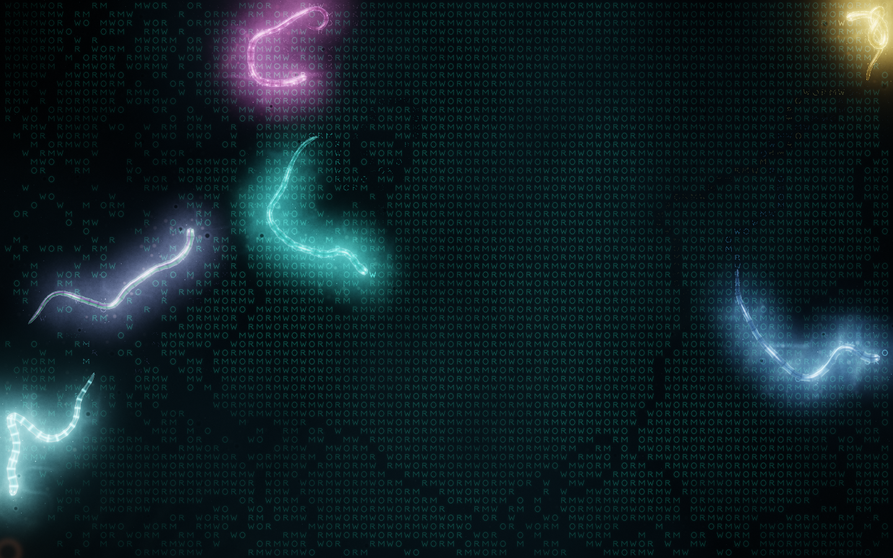
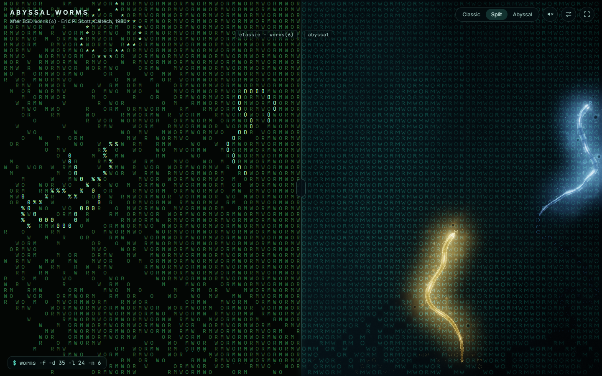
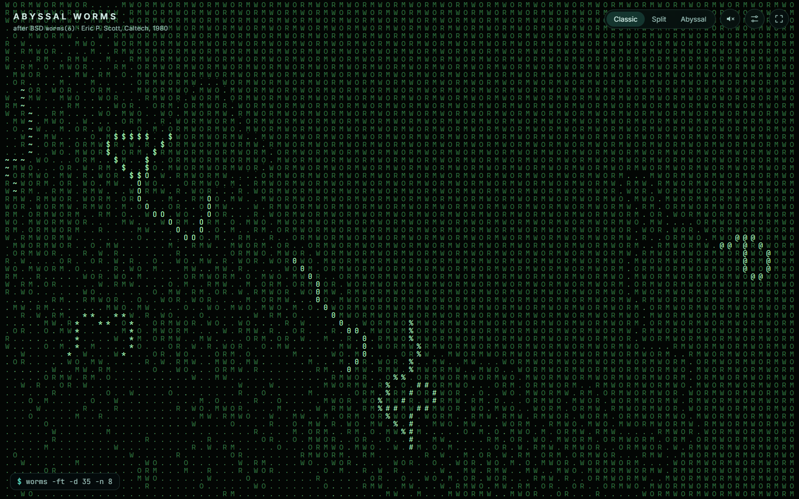
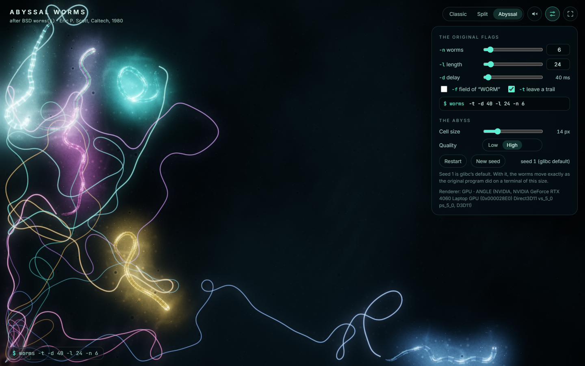
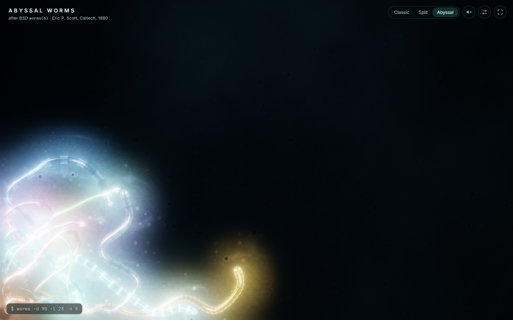
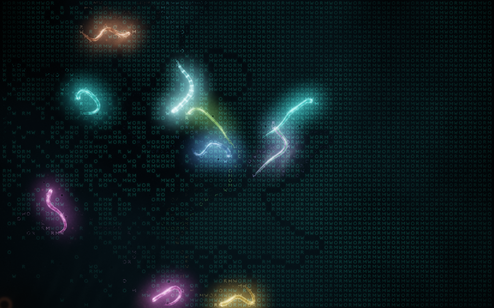
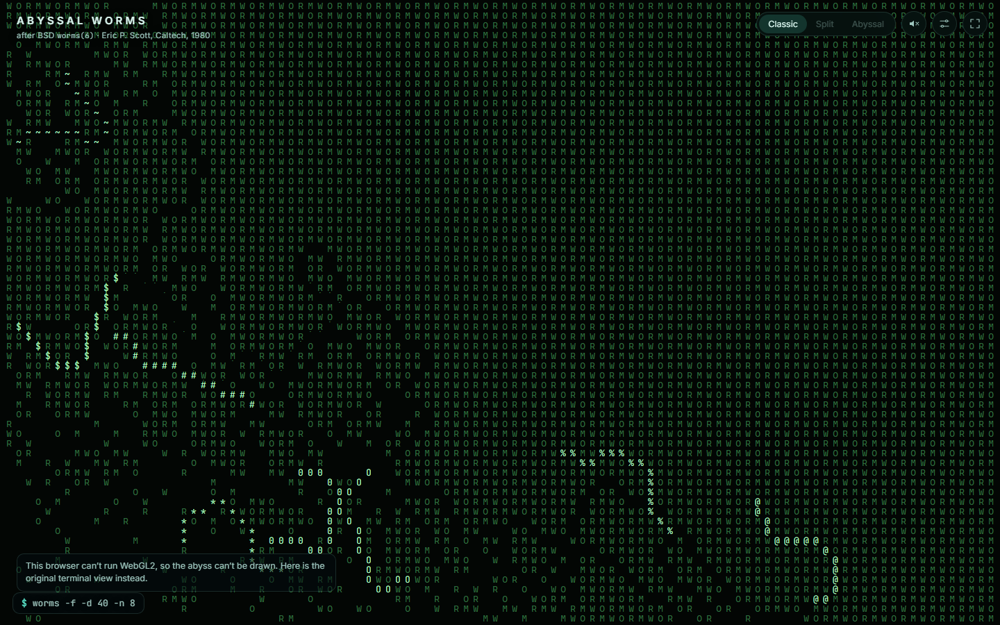

# worms · fancy-web — *Abyssal Worms*

> BSD `worms(6)` (Eric P. Scott, 1980) as a hypnotic bioluminescent
> screensaver on the deep-sea floor at night. Everything is drawn and
> heard **from code**, and the engine reproduces the original program
> **cell for cell**.

[](../../../../docs/progress.md)
[](../../../../docs/decisions/006-multi-port-architecture.md)
[](./docs/decisions/002-zero-raster-assets.md)
[](../../../../LICENSE)


*`worms -n 8 -l 28`. Each of the original flavor characters
`O * # $ % 0 @ ~` is a species with its own colours, markings and pulse.
The light they cast is what lights the sediment.*

## What it is

The 1980 original animates worms on a terminal: every worm is a ring
buffer of screen cells that moves one character per step, turns at
random, and is kept on screen by nine boundary tables. *Abyssal Worms*
keeps **that exact engine**. It is a faithful port of `worms.c`,
checked against screens captured from a binary built from the original
source. What changes is the view:

- **The worms** are translucent, segmented, glowing bodies. They glide
  smoothly between grid steps, but the drawing is exactly the grid
  state at every step boundary ([ADR-003](./docs/decisions/003-time-grid-and-live-flags.md)).
- **The sea floor** is lit only by the worms: sediment ripples, lumpy
  ooze, burrows, pebbles, drifting marine snow and a faint caustic
  shimmer near light.
- **Where worms cross** (a cell with ref count ≥ 2 in the engine), they
  flare and light each other, and a soft glass chime sounds if sound is
  on.
- **`-t`** leaves a luminous slime trail that fades, instead of dots.
- **`-f`** covers the floor in faint, breathing “WORM” plankton writing
  that the worms stir, then eat, letter by letter, as in the original.
- **Classic** shows the terminal exactly as `worms` drew it. **Split**
  puts classic and modern side by side on the *same* worms, with a
  draggable divider.

## Gallery

| | |
|---|---|
|  |  |
| *`-t`: luminous trails that cool from white to the species colour and fade.* | *`-f`: the WORM field. Dark channels are where worms have eaten the letters.* |
|  |  |
| *Split: the original terminal on the left, the abyss on the right, the same engine state.* | *Classic: the screen buffer exactly as curses drew it.* |
|  |  |
| *Settings expose the original flags, live, plus a command line parsed by a faithful `getopt`.* | *All worms enter at the bottom-left corner, as in `worms.c:304-309`: here, a burrow.* |
|  |  |
| *No GPU (CPU WebGL): automatic Low quality, still the abyss.* | *No WebGL2 at all: the classic terminal view, with a notice.* |

## Run

ES modules can’t load from `file://`, so serve the folder (the
included server has no dependencies):

```bash
cd bsdgames/worms/ports/fancy-web
npm start            # → http://localhost:5393/
```

The original command line works as a URL parameter, through a faithful
port of the original `getopt` / `strtoul` / `atoi` parsing, errors
included:

```
?args=-n 20 -l 64 -t          # many long worms with trails
?args=-f -d 50                # the WORM field, 50 ms per step
?args=-d 2000                 # → "worms: invalid delay (1-1000)"
```

Other parameters: `?view=classic|split|modern`, `?q=low|high`,
`?cell=8..36` (cell size in px), `?seed=N` (default 1 = the original’s
glibc sequence), `?warm=N` (steps to run before the first frame),
`?motion=0`.

### Controls

The UI fades away after a few seconds, like a screensaver should. Move
the mouse to bring it back.

| Input | Action |
|---|---|
| **Classic / Split / Abyssal** | View mode (`C` toggles classic, `V` toggles split) |
| Drag the divider | Compare classic and modern |
| **Settings** (`S`) | `-n`, `-l`, `-d`, `-f`, `-t` live; command line; cell size; quality; restart; seed |
| **Sound** (`M`) | Procedural drone, bubbles and crossing chimes. **Muted by default** |
| **Fullscreen** (`F`) | Fullscreen |
| `R` | Restart (a fresh launch with the current flags) |
| `Space` | Pause |
| `Esc` | Close settings |

## Faithfulness

- **Movement rules:** transcribed from `worms.c:72-174` and
  `worms.c:303-340`: orientation tables, the `(0, bottom)` start,
  ring-buffer bodies, `--ref == 0` erasure and `random() % nopts`.
- **Randomness:** a port of glibc’s `random()`. The original never
  seeds it, so glibc uses seed 1. With seed 1 and the same grid size
  the port produces **the same screens as the original binary**:
  7 configurations × 4 captures, every one matched cell for cell at
  exactly one step (`tests/engine.test.js`).
- **Command line:** GNU `getopt` behaviour and C conversions,
  byte-identical error messages for 31 argument cases captured from the
  binary (for example `-d 4294967297` is accepted as 1 ms, because
  `strtoul` is cast to `unsigned int`).
- **What’s reinterpreted:** time (smooth glide, and a terminal-speed
  default when there is no `-d`), screen size (from the viewport), and
  live flag changes. See [ADR-003](./docs/decisions/003-time-grid-and-live-flags.md).

## Tests

```bash
npm test     # 33 tests, no dependencies
```

- `engine.test.js`: golden screens and CLI from the original binary,
  canonical scenarios, invariants (bounds, exact ref counts, `abort()`
  unreachable), glibc `random()`, live flag changes.
- `geometry.test.js`: the smooth glide shows exactly the grid state at
  step boundaries; spline and smoothing; species mapping.
- `zero-raster.test.js`: no raster images or audio files in `src/` or
  `index.html` ([ADR-002](./docs/decisions/002-zero-raster-assets.md)).

## Tech stack & requirements

- **Vanilla ES modules, raw WebGL2, zero build**
  ([ADR-001](./docs/decisions/001-rendering-stack.md)). The pass graph
  is: light map (¼ res) → sea floor → trails → worms → marine snow →
  bloom (dual filter) → ACES composite.
- **Canvas 2D** for the classic view, which is also the fallback.
- **Web Audio** synthesis for sound: oscillators, generated noise,
  generated reverb.
- **Machines without a GPU:** CPU-only WebGL is detected and runs at Low
  quality; without WebGL2 the classic terminal view is shown. On weak
  GPUs, slow frames switch High to Low once, with a notice.
- **Measured** (RTX 4060 Laptop): `-n 20 -l 64 -t -f` holds 60 fps at
  1440×900 (DPR 1 and 2) and at 2560×1440. With a CPU renderer it is
  ready in ~0.3 s.

Details: [`docs/architecture.md`](./docs/architecture.md).

## Status

**Released**, 2026-09-24. Live URL: *(not deployed yet)*.

## Documentation

| Doc | Contents |
|---|---|
| [`docs/diff-log.md`](./docs/diff-log.md) | What was kept, changed and added, and the art-direction critique loop |
| [`docs/architecture.md`](./docs/architecture.md) | Engine, renderer pass graph, audio, UI |
| [`docs/test-scenarios.md`](./docs/test-scenarios.md) | Canonical sign-off plus port scenarios |
| [`docs/notes.md`](./docs/notes.md) | Golden fixtures, legacy layout, limitations |
| [`docs/decisions/`](./docs/decisions/) | ADR-001 stack · ADR-002 zero raster/audio assets · ADR-003 time, grid & live flags |

## Author & license

Port by **Agun Wijaya** with Claude (Anthropic). MIT, as the root
[`LICENSE`](../../../../LICENSE).

## Attribution

Based on **`worms`** by **Eric P. Scott**, Caltech High Energy Physics,
October 1980, a Unix version of the DEC-2136 program *worms*, as shipped
in BSDGames. Copyright © 1980, 1993 The Regents of the University of
California. Upstream: <https://github.com/vattam/BSDGames/tree/master/worms>.
See [`ATTRIBUTION.md`](../../../../ATTRIBUTION.md).
