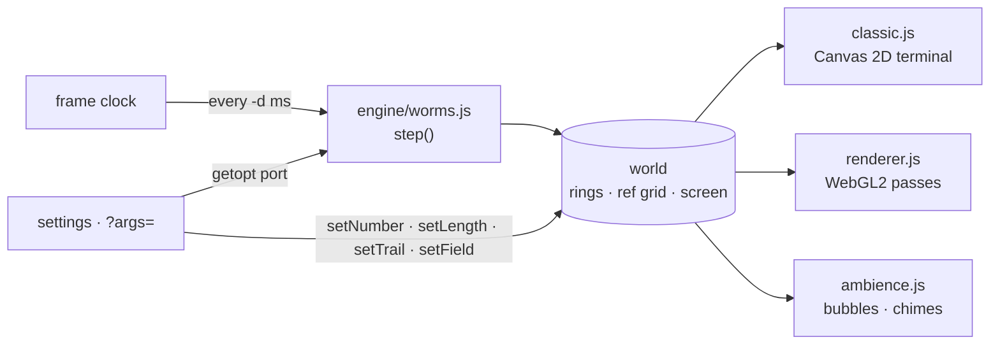
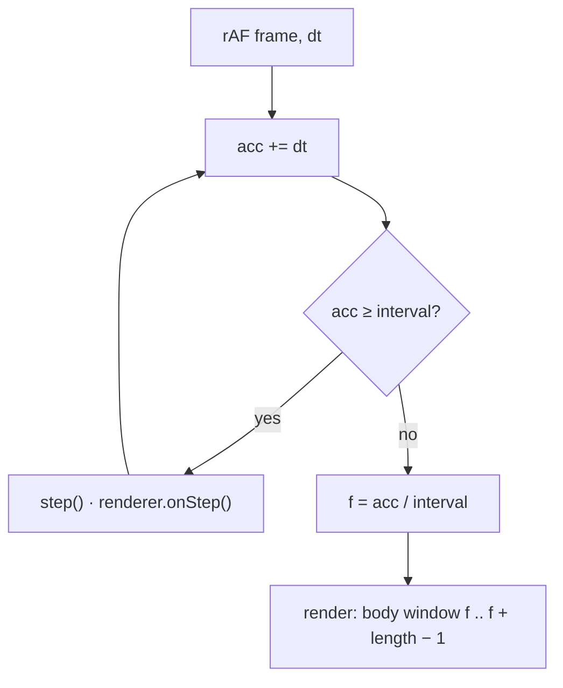
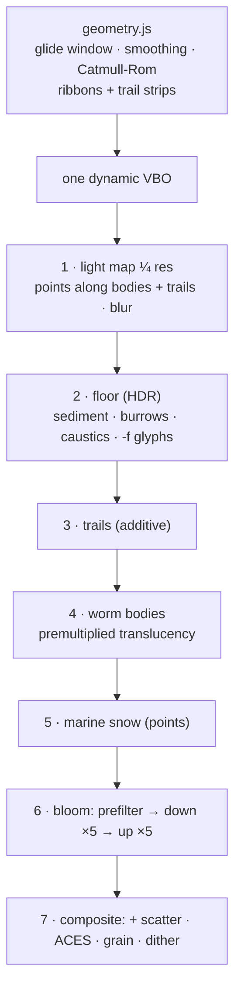

# Architecture — `worms / fancy-web` (*Abyssal Worms*)

---

## Overview

The engine is the only thing that changes the world. Renderers and
audio only read it.

## Engine (`src/engine/`)

- `worms.js`: `createWorld`, `step`, and the live edits. It keeps
  exactly the C program’s state (`worms[]` with `orientation`, `head`,
  `xpos`, `ypos`; `ref`; the `screen` bytes curses would show), plus a
  per-step event log for renderers (`erased`/`erasedBy`, `placed`,
  `ate`/`ateBy`). The log is bookkeeping only; it never influences
  movement.
- `random.js`: glibc `random()`; seed 1 = the original.
- `args.js`: `parseArgs` (GNU getopt + C conversions + original
  messages), `formatArgs`, `splitArgs`.

## Time

`interval` = `-d` ms, or `max(33, 12.5·n)` ms without `-d`
(terminal emulation), and at least 150 ms under reduced motion.
At most 12 steps are caught up per frame.

## Rendering (`src/render/`)

- **Glide** (`geometry.js`, [ADR-003](./decisions/003-time-grid-and-live-flags.md)):
  path = previous tail + current body. The window `[f, f + L − 1]`
  equals the grid state at `f = 0` and `f = 1` (tested).
- **Cell textures:** `RGBA8UI` (ref count, field glyph, trail dot) and
  `RGBA32F` (trail time, eaten time, species), uploaded once per step.
- **Worm shader:** fake-cylinder normal across the ribbon; Fresnel rim;
  gut pulse; grooves; per-species markings (`uPattern`); head light
  organs; flare where `ref ≥ 2`; a specular sheen tinted by the light
  map (worms lighting worms).
- **Floor shader:** sediment height and albedo, light-direction shading
  from the light map’s gradient, caustics ∝ local light, the procedural
  stroke glyphs W/O/R/M, the home burrow at `(0, bottom)`.
- **Classic view** (`classic.js`): repaints only cells whose character
  or occupancy changed.

## Audio (`src/audio/ambience.js`)

A master gain feeds a compressor. The dry bus goes to a procedurally
generated convolution reverb. Sources are a drone (four detuned
oscillators, a breathing low-pass), brown noise, bubbles (rising sine
chirps panned to a worm’s column) and crossing chimes (rate-limited).
The AudioContext is created on the first unmute.

## Degradation

| Situation | Behaviour |
|---|---|
| No WebGL2 | Classic view only; the other views are disabled; a notice |
| CPU WebGL (SwiftShader, llvmpipe…) | Low quality automatically |
| Slow frames on High | One automatic switch to Low, with a notice (unless the user chose) |
| Shader compile in progress | The veil stays up; the page stays responsive (parallel compile) |
| Reduced motion | Frozen twinkle, sway, drift and caustics; ≥ 150 ms per step |

## Performance (RTX 4060 Laptop, ANGLE/D3D11, `-n 20 -l 64 -t -f`)

| Viewport | Render (incl. GPU sync) | Frame |
|---|---|---|
| 1440×900 @1, High | ≈ 9.4 ms | 16.6 ms (60 fps) |
| 1440×900 @2, High | ≈ 12.9 ms | 16.8 ms |
| 1440×900, Low | ≈ 8.6 ms | 16.6 ms |
| 2560×1440 @1, High | ≈ 9.8 ms | 16.7 ms |

CPU geometry (bodies and trails) is about 2.3 ms per frame.
