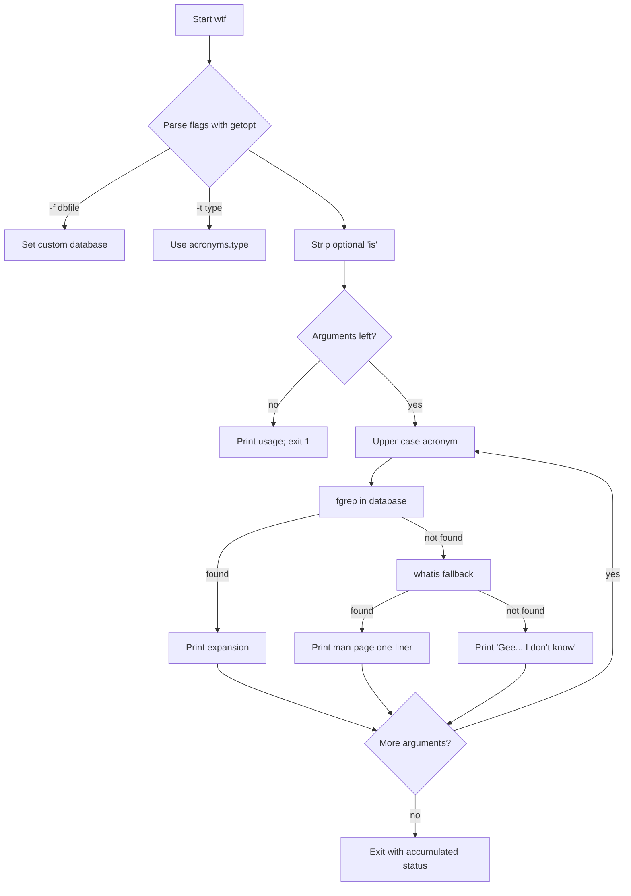

# `wtf` — Architecture

`wtf` is a POSIX shell script that parses flags, normalises input, and
looks up acronyms in a plain-text database.

---

## Control Flow



## Game Loop / Control Flow

There is no interactive loop. The script processes each command-line
argument in order and exits with `0` only if every acronym was resolved.

## AI Logic

None. `wtf` is a lookup table with a single deterministic fallback.

## Random-Event System

None. No randomness is used.

## Difficulty Progression & Runtime Setup

Not applicable for a utility. The only "setup knobs" are the `-f` and
`-t` flags and the `ACRONYMDB` environment variable. These select which
text file is opened; the format is always the same.

## Key Code Excerpts

### Flag parsing (`wtf.in:15-33`)

```sh
args=`getopt f:t: $*`
if [ $? -ne 0 ]; then
    usage
fi
set -- $args
while [ $# -gt 0 ]; do
    case "$1" in
        -f) acronyms=$2; shift ;;
        -t) acronyms=@wtf_acronymfile@.$2; shift ;;
        --) shift; break ;;
    esac
    shift
done
```

### Natural-language handling (`wtf.in:35-37`)

```sh
if [ X"$1" = X"is" ] ; then
    shift
fi
```

### Lookup and fallback (`wtf.in:49-65`)

```sh
while [ $# -gt 0 ] ; do
    target=`echo $1 | tr '[a-z]' '[A-Z]'`
    ans=`fgrep $target < $acronyms 2>/dev/null \
         | sed -ne "\|^$target[[:space:]]|s|^$target[[:space:]]*||p"`
    if [ "$ans" != "" ] ; then
        echo "$target: $ans"
    else
        ans=`whatis $1 2> /dev/null | egrep "^$1[, ]" 2> /dev/null`
        if [ $? -eq 0 ] ; then
            echo "$1: $ans"
        else
            echo "Gee...  I don't know what $1 means..." 1>&2
            rv=1
        fi
    fi
    shift
done
exit $rv
```

## Data Format

The database files are plain text:

```
ACRONYM<TAB>expansion
```

Example from `acronyms`:

```
AFAIK	as far as I know
RTFM	read the fuckin' manual
```

## See Also

- [`spec.md`](./spec.md) — formal behaviour specification.
- [`lessons.md`](./lessons.md) — teaching points from the code.
- [`references.md`](./references.md) — source citations.
