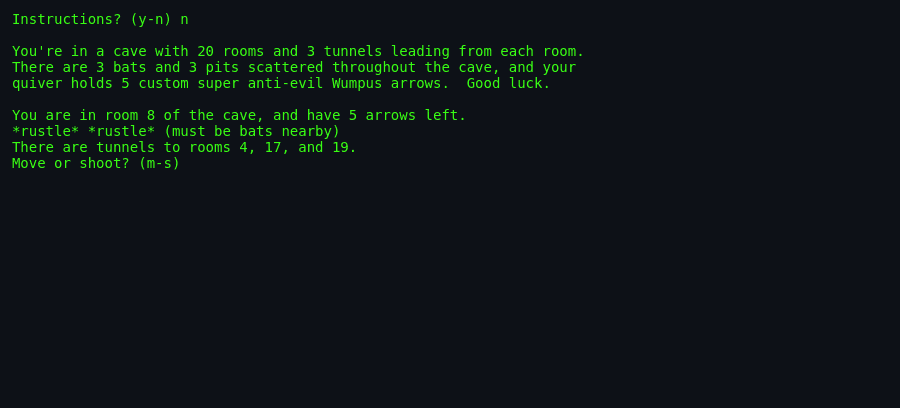
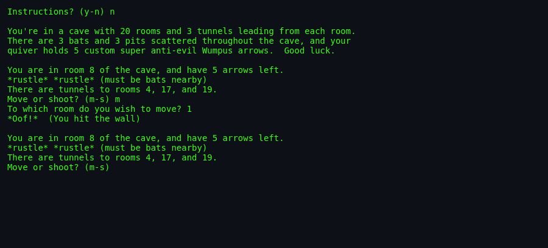

# About `wump`

> **Brochure**. The definitive guide to the history, origin story, cultural legacy,
> and quirks of *Hunt the Wumpus* in the BSD distribution.

---

## What Is `wump`?

Deep within an underground labyrinth of darkened caverns, an ancient, foul-smelling beast slumbers. You step cautiously from stone threshold to stone threshold, armed only with a bow and five custom magic arrows. You cannot see the beast in the pitch blackness—you must rely entirely on your senses: the telltale whiff of rotting carrion, the ghostly draft of a bottomless pit, or the fluttering wings of giant bats eager to carry you away into the dark.

`wump` is the BSD Unix incarnation of **Hunt the Wumpus**, one of the earliest and most influential computer games ever written. Part spatial puzzle, part deduction game, and part survival horror, it challenges players to map an unseen topological maze and strike down the monster before falling into the abyss.

---

## Screenshots

*Launch: the game asks the traditional `Instructions? (y-n)` question
before dropping you into the cave.*

*You wake in room 8 of the 20-room cave with 5 arrows. `*rustle*
*rustle*` warns that bats are nearby. Tunnels lead to rooms 4, 17,
and 19.*

*Trying to move to room 1 — but it isn't adjacent to room 8. The game
answers with `*Oof!* (You hit the wall)` and returns you to the same
room, still with 5 arrows.*

---

## Authors & Publisher

- **Original Concept & Design (1973):** **Gregory Yob** (1945–2005). Yob created the game while visiting the People's Computer Company (PCC) in Menlo Park, California, writing the original version in Dartmouth BASIC.
- **BSD Unix C Re-implementation (1989/1993):** **Dave Taylor**, founder of Intuitive Systems and author of the landmark Elm mail user agent. Taylor contributed this completely rewritten C version to the Computer Systems Research Group (CSRG) at the University of California, Berkeley.
- **Publisher / Distributor:** University of California, Berkeley (4.3BSD-Reno, 4.4BSD-Lite), NetBSD, and Debian `bsdgames`.
- **Language:** C (originally Dartmouth BASIC).

---

## The Era

In 1973, computer gaming was dominated by teletype terminals (like the Teletype Model 33 ASR) operating over 110-baud acoustic couplers. Almost all early tactical games—such as *Hurkle*, *Mugwump*, and Mike Mayfield's *Star Trek*—were played on rigid $10 \times 10$ Cartesian grids. Players simply guessed coordinates $(X, Y)$ and were told whether they were "too high" or "too low".

Gregory Yob found these Cartesian guessing games intensely monotonous. He envisioned a game that broke free from Euclidean geometry: a game set inside the vertices of a regular dodecahedron, where movement was topological rather than coordinate-based. When Dave Taylor brought the game to BSD Unix in the late 1980s, he modernized Yob's concept by introducing procedural graph generation, customizable room parameters, and dynamic difficulty scaling.

---

## Why It's Interesting

- **The Death of the Cartesian Grid:** *Hunt the Wumpus* was the first mainstream computer game where the game world was modeled as a **mathematical graph** ($V, E$) rather than a coordinate array.
- **Indirect Information & Deduction:** Unlike games with direct visibility, information in `wump` is conveyed exclusively through proximity cues (stench, draft, sound). Players must maintain a mental or paper map and triangulate hazard locations using deductive logic.
- **Curved Projectile Trajectories:** Magic arrows do not travel in straight lines; they navigate topological tunnels across multiple rooms. If a player aims improperly, the arrow rebounds through available corridors and can strike the archer!
- **AI Academic Benchmark:** The Wumpus World became the canonical illustrative environment in Stuart Russell and Peter Norvig's seminal textbook *Artificial Intelligence: A Modern Approach*, used globally to teach knowledge-based agents, propositional logic, and inference engines.

---

## Making-Of Anecdotes

### Gregory Yob and the People's Computer Company
In 1973, Gregory Yob was hanging out at the People's Computer Company, a radical non-profit computer center in Menlo Park that championed personal computing before personal computers existed. As Yob recounted in *Creative Computing* (1975):

> *"I became annoyed with the number of games that were basically 'guess a number from 1 to 100'. Even games with grids, like Hurkle or Mugwump, were just two simultaneous guess-the-number games. I wondered if a game could be based on a non-Euclidean space. A dodecahedron has 20 vertices and 3 edges meeting at each vertex. That became the cave."*

### Dave Taylor's BSD Contribution
In 1989, Dave Taylor, who had already gained Unix fame by writing the `elm` email client, wrote a clean-room C version for BSD. Taylor realized that while the classic 20-vertex dodecahedron was iconic, experienced players could memorize the fixed vertex transitions. Taylor introduced the `-r` (rooms) and `-t` (tunnels) flags and designed the coprime $\gcd$ generator so that every game session offered a fresh, procedurally synthesized cave topology.

---

## Cultural Impact

- **Foundational Genre Precursor:** *Hunt the Wumpus* bridged the gap between mainframe number games and text adventures like Will Crowther's *Colossal Cave Adventure* (1976) and *Zork* (1977).
- **Academic Lore:** Decades of computer science undergraduates learned first-order logic by writing automated theorem provers to navigate the "Wumpus World".
- **Discord Wumpus:** The modern voice and chat platform Discord adopted the "Wumpus" as their mascot and loading screen character, paying direct homage to this retro beast.

## Difficulty & Progression

Unlike arcade games that advance across sequential stages, `wump` has **no explicit linear progression** (no Level 1 $\rightarrow$ Level 2). Instead, the game's challenge operates along two dimensions:

1. **Parametric Setup & Difficulty Modes:**
   - **`EASY` Mode:** Standard 20-room cavern with 3 pits and 3 bat colonies. The Wumpus awakens slowly, and the player can spawn anywhere except inside the monster's lair.
   - **`HARD` Mode (`-h`):** The game randomly injects up to $\lfloor R/2 \rfloor$ extra pits and extra bats, sets a much hair-trigger awakening threshold for the beast on missed arrows, and forbids the player from spawning within 2 hops of the monster.
   - **Custom Geometries:** Players can scale the cave from a claustrophobic 10-room death trap up to a massive 250-room mega-labyrinth with custom tunnel density (`-r`, `-t`, `-a`, `-b`, `-p`).
2. **Implicit In-Game Tension Scaling:**
   Progression within a single match is measured by tension and risk. As arrows are shot and miss, the internal alertness state (`lastchance`) steadily increases, making Wumpus counter-attacks progressively more inevitable.
3. **Session Replay Progression:**
   Upon game over, players can choose to play "in the same cave," preserving the discovered graph topology while randomizing creature placements—transforming subsequent runs into mastery of that specific cave layout.

---

## Known Historical Quirks & Bugs

1. **The 25-Room Man Page Drift:** The original troff man page `wump.6` states that the default cave has 25 rooms, while `wump.c` hardcodes `#define ROOMS_IN_CAVE 20`.
2. **Double "and" Typo:** Line 437 of `wump.c` contains a classic programmer typo in the arrow degradation message: `"The arrow wavers in its flight and and can go no further!"`.
3. **One-Way Trap Tunnels:** Because Taylor's chord generator allows asymmetric links, the cave can sometimes generate a directional tunnel where entering Room $B$ from Room $A$ offers no return tunnel back to $A$. While documented as a feature in the man page, it can occasionally baffle purists accustomed to Gregory Yob's symmetric dodecahedron.

---

## See Also

- [`how-to-play.md`](./how-to-play.md) — Player manual and tactical survival guide.
- [`architecture.md`](./architecture.md) — Technical breakdown of the procedural graph engine.
- [`world-map.md`](./world-map.md) — Visualization of topological cave layouts.
- [`lineage.md`](./lineage.md) — Genre family and modern descendants.
- [`references.md`](./references.md) — Historical documents and source citations.
