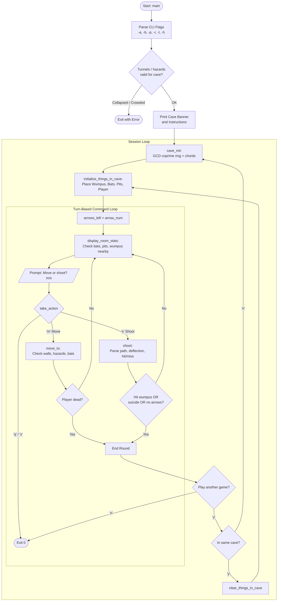
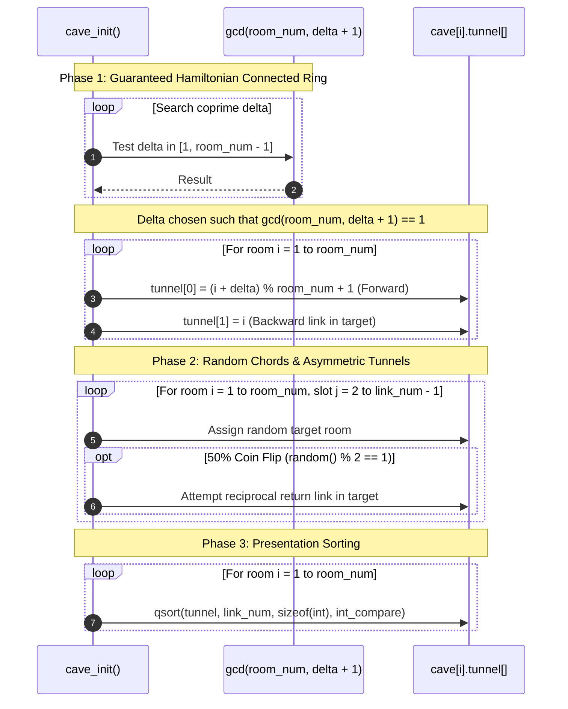
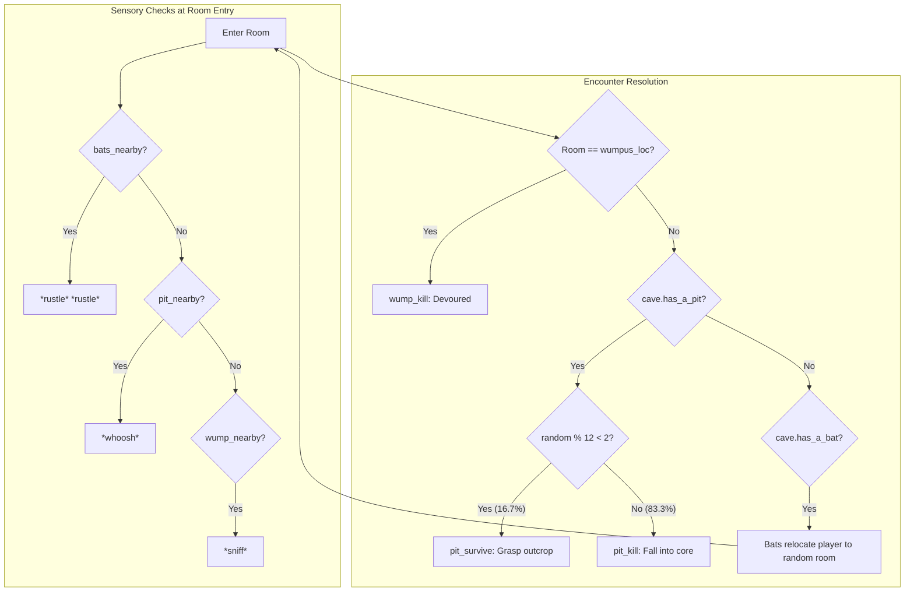

# `wump` — Original Architecture

> Deep architectural analysis of the BSD C implementation of *Hunt the Wumpus* (`wump.c`).
>
> Source reference: Upstream BSDGames repository (`wump/wump.c`)  
> Upstream tree: <https://github.com/vattam/BSDGames/tree/master/wump>

---

## Files & Roles

| File | Role / Purpose | Approx. LoC |
|---|---|---:|
| `wump.c` | Monolithic implementation: cave graph generator, turn engine, parser, event handlers, victory/death messages | 874 |
| `pathnames.h.in` | Pre-build pathname definitions for `/usr/share/games/wump.info` and pager | 48 |
| `wump.info` | Extended instructions text displayed via external pager | 75 |
| `wump.6` | Troff/groff manual page | 111 |
| `Makefrag` / `Makefile.bsd` | Build automation and compiler flag configuration | ~60 |

---

## High-Level Architecture & Game Loop

The entire game operates on a turn-based prompt loop wrapped inside an outer session loop that handles round restarts.



---

## Key Data Structures

The cave is represented as a static 1-indexed array of fixed-size records (`wump.c:89-93`):

```c
/* simple cave data structure; +1 so we can index from '1' not '0' */
struct room_record {
    int tunnel[MAX_LINKS_IN_ROOM];
    int has_a_pit, has_a_bat;
} cave[MAX_ROOMS_IN_CAVE + 1];
```

### Static vs. Dynamic Allocation
- `MAX_ROOMS_IN_CAVE` is clamped to `250`.
- `MAX_LINKS_IN_ROOM` is clamped to `25`.
- Memory footprint: $251 \times (25 \times 4 + 4 + 4) \approx 27.1\text{ KB}$.
- Because memory was statically reserved in the BSS segment, `wump` executed with zero dynamic heap allocation (`malloc`/`free`), ensuring rock-solid stability even on memory-constrained PDP-11 or VAX-11/780 nodes.

---

## Cave Generation Algorithm (`cave_init`)

Dave Taylor replaced Gregory Yob's fixed 20-vertex dodecahedron with an on-the-fly graph synthesis algorithm (`wump.c:533-610`):



### Mathematical Guarantee of Connectivity
In modular arithmetic, if $S = \delta + 1$ is coprime to $R = \text{room\_num}$ (i.e. $\gcd(R, S) = 1$), the map $i \mapsto (i + S - 1) \pmod R + 1$ generates a permutation with a single cycle of length $R$. This guarantees every room is reachable, preventing disconnected sub-caves.

---

## AI Logic & Creature Dynamics

While the Wumpus does not have a deep minimax or pathfinding engine, it implements a probabilistic **alertness and disturbance model**:

### 1. The Alertness State (`lastchance`)
Located in `shoot()` (`wump.c:505-516`):
```c
/* each time you shoot, it's more likely the wumpus moves */
static int lastchance = 2;

if (random() % (level == EASY ? 12 : 9) < (lastchance += 2)) {
    move_wump();
    if (wumpus_loc == player_loc)
        wump_kill();
    lastchance = random() % 3;
}
```
- Every missed arrow increases `lastchance` by `2`.
- In `EASY` mode, the roll is against $[0, 11]$; in `HARD`, against $[0, 8]$.
- As more arrows miss, the probability that the creature awakens and relocates approaches $100\%$.
- Once triggered, `lastchance` resets to a random base $[0, 2]$.

### 2. Wall Impact Awakening
When a player attempts to enter an invalid tunnel (`wump.c:360-371`):
```c
if (!tunnel_available) {
    (void)printf("*Oof!*  (You hit the wall)\n");
    if (random() % 6 == 1) {
        (void)printf("Your colorful comments awaken the wumpus!\n");
        move_wump();
        if (wumpus_loc == player_loc) {
            wump_kill();
            return(1);
        }
    }
    return(0);
}
```
A $1/6$ ($16.67\%$) chance exists that banging into a wall awakens the beast.

### 3. Creature Relocation (`move_wump`)
The Wumpus simply picks an adjacent tunnel at random (`wump.c:733-736`):
```c
void move_wump() {
    wumpus_loc = cave[wumpus_loc].tunnel[random() % link_num];
}
```
If that random tunnel lands in `player_loc`, the player is immediately eaten.

---

## Random Event System

Randomness governs every physical danger in the cavern:



### Arrow Flight Degradation
In `shoot()` (`wump.c:473-484`), arrows traversing long distances experience mechanical degradation:
- **Hop 3:** $20\%$ chance (`random() % 10 < 2`) of bowstring snap (`"Your bowstring breaks! *twaaaaaang*"`).
- **Hop 4:** $60\%$ chance (`random() % 10 < 6`) of flight decay (`"The arrow wavers in its flight and can go no further!"`).

---

## Difficulty Progression & Runtime Setup Logic

`wump` does not use traditional episodic levels (e.g. Stage 1, Stage 2). Instead, it implements a dual model: **parametric setup configuration** at launch and **implicit tension progression** within each session.

### 1. Explicit Difficulty Modes (`EASY` vs. `HARD`)
Difficulty is tracked via an internal integer state (`wump.c:81-82, 100`):
```c
#define EASY 1
#define HARD 2
int level = EASY;
```
When passed the `-h` flag (`wump.c:168`), the engine enables `HARD` mode, which fundamentally alters three core gameplay systems:

1. **Hazard Saturation Scaling (`wump.c:206-209`):**
   ```c
   if (level == HARD) {
       bat_num += ((random() % (room_num / 2)) + 1);
       pit_num += ((random() % (room_num / 2)) + 1);
   }
   ```
   In `HARD` mode, extra bats and pits are injected probabilistically up to an additional $\lfloor R/2 \rfloor$ hazards each. In a standard 20-room cave, this increases the hazard density from $3+3=6$ rooms ($30\%$ danger) up to as many as $10+10=20$ theoretical hazard placements, drastically constricting safe navigation corridors.

2. **Wumpus Awakening Sensitivity (`wump.c:509`):**
   ```c
   if (random() % (level == EASY ? 12 : 9) < (lastchance += 2)) {
       move_wump();
   ```
   On missed arrow shots, the agitation threshold in `EASY` mode rolls modulo `12`, whereas in `HARD` mode it rolls modulo `9`. The smaller divisor significantly increases the probability that the Wumpus stirs, relocates, and hunts down the player.

3. **Restricted Player Spawn Proximity (`wump.c:661-663`):**
   ```c
   do {
       player_loc = (random() % room_num) + 1;
   } while (player_loc == wumpus_loc || (level == HARD ?
       (link_num / room_num < 0.4 ? wump_nearby() : 0) : 0));
   ```
   In `EASY` mode, the player simply cannot spawn in `wumpus_loc`. In `HARD` mode (when tunnel density $L/R < 0.4$, true for standard caves), the player is additionally forbidden from spawning within 2 hops of the Wumpus (`wump_nearby() == 0`). This prevents immediate lucky 1-turn kills while ensuring that the high-danger cave forces deliberate deductive exploration.

### 2. Tunable Setup Parameters & Cave Collapse Bounds
The runtime cave generation is dynamically shaped by CLI flags parsed via `getopt` (`wump.c:153-221`):

| Flag | Parameter | Permitted Range | Invariant Check / Rejection Error |
|---|---|:---:|---|
| `-r` | Room Count ($R$) | $10 \le R \le 250$ | $<10$: `"No self-respecting wumpus..."`<br/>$>250$: `"Even wumpii can't furnish caves that large!"` |
| `-t` | Tunnels ($L$) | $2 \le L \le 25$ | $<2$: `"Wumpii like extra doors..."`<br/>$>25$ or $L > R - \lfloor R/4 \rfloor$: `"Too many tunnels! The cave collapsed!"` |
| `-a` | Arrow Inventory | $A \ge 1$ | Default: 5 |
| `-b` | Bat Rooms ($B$) | $0 \le B \le \lfloor R/2 \rfloor$ | $> R/2$: `"The wumpus refused... too crowded!"` |
| `-p` | Pit Rooms ($P$) | $0 \le P \le \lfloor R/2 \rfloor$ | $> R/2$: `"The wumpus refused... too dangerous!"` |

### 3. Session Replay Setup: Same Cave vs. New Cave
When a round concludes, the outer loop prompts the player (`wump.c:247-250`):
```c
if (getans("In the same cave? (y-n) "))
    clear_things_in_cave();
else
    cave_init();
```
- **Same Cave (`clear_things_in_cave()`):** The exact mathematical graph topology (rooms, tunnels, and one-way passages) is **preserved**. Only the dynamic entities (Wumpus, bats, pits, player) are randomly re-seeded. This allows the player to exploit their hard-won knowledge of the cave's layout on a subsequent playthrough.
- **New Cave (`cave_init()`):** Discards the graph and synthesizes a brand-new topological network with a fresh coprime $\delta$ and new random chords.

### 4. Implicit Tension Scaling (The `lastchance` State)
Inside each game, difficulty is dynamically amplified by player actions:
- Every missed arrow increments `lastchance` by `+2`.
- Hitting a wall triggers a $1/6$ roll that immediately wakes the Wumpus.
- As the arrow count decreases, the probability of Wumpus retaliation approaches $1.0$, creating an escalating horror crescendo where early mistakes make late-game survival exponentially harder.

---

## Clever Era Techniques

1. **Coprime Ring Graph Guarantee:** Using Euclid's GCD algorithm to find a coprime hop delta to guarantee connectedness in a pseudo-random directed graph without storing a full adjacency matrix or running Tarjan's strongly connected components algorithm.
2. **Text Parsing via `strtok`:** The arrow flight parser uses `strtok(room_list, " \t\n")` in a loop (`wump.c:427`), which elegantly extracts tokenized room numbers directly from standard input.
3. **Array Offset by +1:** The cave array is declared with `+ 1` so human room numbers (`1` to `N`) map directly to array indices without mentally subtracting `1` across hundreds of lines of code.
