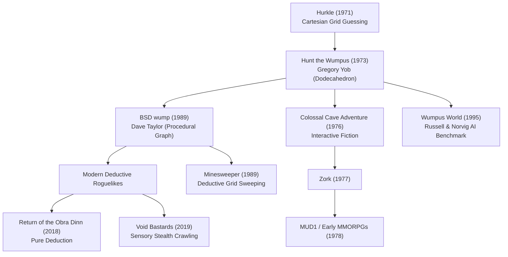

# `wump` — Lineage & Genre Family

> The ancestry, historical siblings, and modern evolutionary descendants of *Hunt the Wumpus*.

---

## Direct Ancestors

- **Hurkle (1971, Bob Albrecht / People's Computer Company):** A simple Cartesian guessing game where the player seeks a creature on a $10 \times 10$ grid using compass directions ("Go North-East"). Gregory Yob specifically created *Wumpus* to rebel against the monotony of Hurkle.
- **Mugwump (1973, Bob Albrecht & Bud Valenti):** Another $10 \times 10$ Cartesian coordinate guessing game.
- **Star Trek (1971, Mike Mayfield):** Classic mainframe tactical simulation played across an $8 \times 8$ quadrant grid of $8 \times 8$ sectors.

---

## Direct Descendants & Legacy

- **Wumpus 2 & Wumpus 3 (1974, Gregory Yob):** Yob's own sequels introducing alternate topologies (Mobius strip, torus), blind caves, and dynamic hazards.
- **Colossal Cave Adventure (1976, Will Crowther & Don Woods):** Expanded non-Euclidean graph traversal from abstract numbers into natural language cave exploration.
- **MUD1 (1978, Roy Trubshaw & Richard Bartle):** Multi-User Dungeons inherited graph-based room navigation directly from the lineage established by *Wumpus* and *Adventure*.
- **Minesweeper (1989, Curt Johnson & Robert Donner):** Inherited the core mechanic of deductive hazard triangulation through numerical adjacency counts.
- **Russell & Norvig's "Wumpus World" (1995, *Artificial Intelligence: A Modern Approach*):** The formal textbook formulation used worldwide to teach knowledge-based logic agents, resolution refutation, and SAT solvers.

---

## Genre Family Tree

---

## If You Like `wump`, Try…

- **Minesweeper:** The purest mathematical descendant of deductive adjacent hazard reasoning.
- **Return of the Obra Dinn (Lucas Pope):** The pinnacle of modern deductive spatial reasoning, where logical elimination replaces brute-force combat.
- **Dungeon Crawl Stone Soup / NetHack:** For deep procedural exploration where sensory awareness (stench, sounds, drafts) frequently signals lethal unseen hazards.
- **Void Bastards:** A tactical procedural shooter where planning routes through ship rooms using noise cues and airlocks mirrors navigating around Wumpus caverns.

---

## Communities & Archives

- **The Interactive Fiction Community (IFDB / IntFiction):** Active discussions of early mainframe text games and Wumpus derivatives.
- **The Classic Computer Games Archive:** Historical scans of *Creative Computing* and *People's Computer Company* newspapers.
- **Discord Developer Community:** Discord's ongoing use of the Wumpus mascot keeps the retro monster alive for modern gamers.
