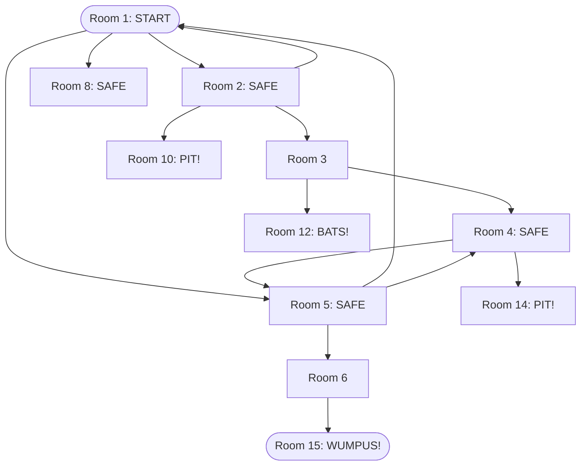
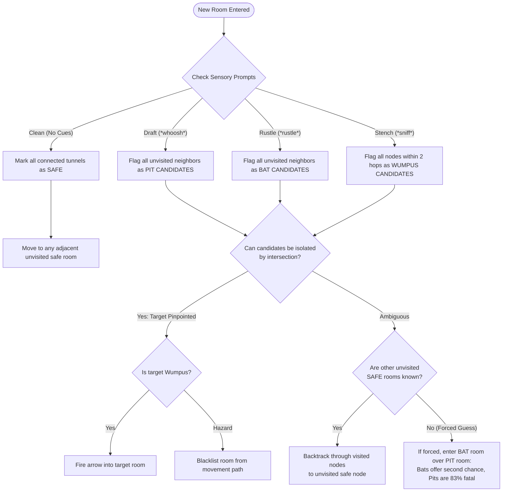

# `wump` — Walkthrough & Deductive Playthrough Guides

> Because `wump` is procedurally generated at runtime, a walkthrough is not a static
> sequence of room numbers. Instead, this document provides two comprehensive guides:
>
> 1. **Walkthrough A: The Classical Dodecahedron Benchmark Playthrough** — A concrete, turn-by-turn annotated transcript demonstrating optimal deductive play on the iconic 20-room symmetric graph.
> 2. **Walkthrough B: The Universal Deductive Solving Protocol** — A formal decision algorithm for systematically exploring, triangulating, and clearing any procedurally generated cave with maximum survival probability.

---

## Walkthrough A — The Classical Dodecahedron Benchmark Playthrough

> ⚠️ **This is an illustrative constructed scenario, not a real
> transcript.** Actual `wump` sessions use randomised cave
> topologies and hazard placements — no two games are the same. The
> map, initial hazard positions, and Wumpus location below are
> pedagogical fixtures chosen to demonstrate the deductive reasoning
> process. Use them to internalise the *pattern of thought*, not to
> memorise specific room numbers.

This scenario models the canonical 20-room dodecahedron layout (described in detail in [`world-map.md`](./world-map.md)).

### Scenario Parameters
- **Cave:** 20 rooms, 3 tunnels per room.
- **Initial Setup:**
  - Player spawns in **Room 1**. Tunnels: `2`, `5`, `8`.
  - Bats are roosting in **Room 7**, **Room 12**, **Room 19**.
  - Bottomless Pits are located in **Room 10**, **Room 14**, **Room 17**.
  - The Wumpus lurks in **Room 15**.



---

### Step-by-Step Annotated Transcript

#### Turn 1: Initial Sensor Evaluation
```text
You are in room 1 of the cave, and have 5 arrows left.
There are tunnels to rooms 2, 5, and 8.
Move or shoot? (m-s)
```
- **Sensory Analysis:** No `*sniff*`, no `*whoosh*`, no `*rustle*`.
- **Deduction:** Rooms `2`, `5`, and `8` are $100\%$ safe from immediate pits, bats, and Wumpus. Furthermore, because Wumpus stench reaches 2 hops, the Wumpus is **not** in rooms `2, 5, 8` nor any of their direct neighbors.
- **Action:** `m 2`

#### Turn 2: Encountering a Draft
```text
You are in room 2 of the cave, and have 5 arrows left.
*whoosh* (I feel a draft from some pits).
There are tunnels to rooms 1, 3, and 10.
Move or shoot? (m-s)
```
- **Sensory Analysis:** Pit draft detected!
- **Deduction:** Either Room `3` or Room `10` contains a bottomless pit (Room `1` is verified safe).
- **Tactical Rule:** Never guess on a 50/50 door if safe unexplored frontiers exist. Backtrack to Room `1` and explore another branch.
- **Action:** `m 1`

#### Turn 3: Exploring the Second Safe Branch
```text
You are in room 1 of the cave, and have 5 arrows left.
There are tunnels to rooms 2, 5, and 8.
Move or shoot? (m-s)
```
- **Action:** `m 5`

#### Turn 4: Expanding the Frontier
```text
You are in room 5 of the cave, and have 5 arrows left.
There are tunnels to rooms 1, 4, and 6.
Move or shoot? (m-s)
```
- **Sensory Analysis:** No sensory cues!
- **Deduction:** Rooms `4` and `6` are guaranteed free of pits and bats. Let us check Room `4`.
- **Action:** `m 4`

#### Turn 5: Cross-Referencing Pit Corridors
```text
You are in room 4 of the cave, and have 5 arrows left.
*whoosh* (I feel a draft from some pits).
There are tunnels to rooms 3, 5, and 14.
Move or shoot? (m-s)
```
- **Sensory Analysis:** Draft detected from Room `4` (tunnels: `3`, `5`, `14`).
- **Triangulation:**
  - In Turn 2 (Room 2), draft indicated a pit in `3` or `10`.
  - In Turn 5 (Room 4), draft indicates a pit in `3` or `14`.
  - If Room `3` had a pit, moving to Room `3` would kill us. But does Room `3` have a pit? We can test Room `6` first!
- **Action:** Backtrack via `m 5`, then explore `m 6`.

#### Turn 6: The Stench Detected!
```text
You are in room 6 of the cave, and have 5 arrows left.
*sniff* (I can smell the evil Wumpus nearby!)
There are tunnels to rooms 5, 7, and 15.
Move or shoot? (m-s)
```
- **Sensory Analysis:** Stench detected!
- **Deduction:** The Wumpus is within 2 hops of Room `6`. Adjacent rooms are `5` (visited, safe), `7`, and `15`.
- **Triangulation:**
  - Back at Room `1`, we did *not* smell Wumpus. Room `7` connects to `8` (neighbor of `1`). If Wumpus was in `7`, we would have smelled it from Room `1`!
  - Therefore, Room `7` cannot contain the Wumpus.
  - The Wumpus must be in **Room 15**!

#### Turn 7: The Kill Shot
```text
Move or shoot? (m-s) s 15
```
- **Result:**
```text
*thwock!* *groan* *crash*

A horrible roar fills the cave, and you realize, with a smile, that you
have slain the evil Wumpus and won the game!
```
- **Outcome:** Clean victory in 7 turns with 4 arrows remaining and zero hazard rolls risked!

---

## Walkthrough B — Universal Deductive Solving Protocol

When tackling randomized caves generated by `wump -r <N> -t <T>`, follow this systematic decision loop:



### Protocol Invariants

1. **The 2-Hop Stench Rule:** Because `wump_nearby()` checks depth 2, the absence of a smell eliminates not just the current room and its direct neighbors, but also all neighbors of those neighbors ($\text{Degree}^2$ rooms eliminated).
2. **Never Shoot More Than 2 Hops:** Bowstrings snap at hop 3 ($20\%$) and fail at hop 4 ($60\%$). Always reposition yourself within 1 or 2 hops before loosing an arrow.
3. **Hazard Prioritization:** If an ambiguous corridor must be tested:
   - **Bats** are preferable to **Pits**: Bats drop you randomly, giving you a survival roll, whereas Pits have an $83.3\%$ fatality rate.
   - Never enter an unverified room that could be the Wumpus ($100\%$ fatality).
