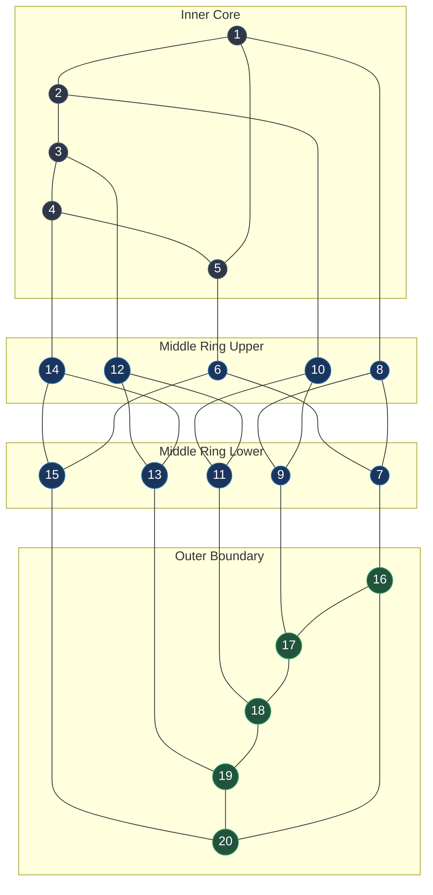
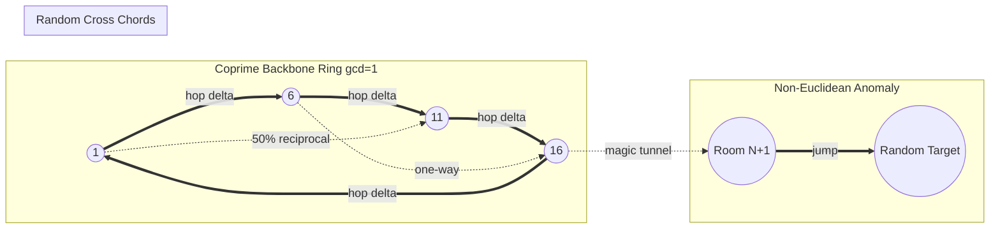
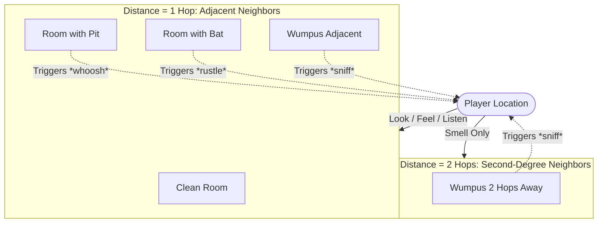

# `wump` — World Map & Topological Graph Modeling

> In *Hunt the Wumpus*, the "world map" is not a 2D tile grid or Cartesian plane.
> It is a **mathematical graph $(V, E)$**.
>
> This document visualizes both:
> 1. **The Classical Dodecahedral Cave** (Gregory Yob's canonical 20-room symmetric graph).
> 2. **The Procedural Coprime Ring & Chord Cave** (Dave Taylor's dynamic BSD graph engine).

---

## 1. Classical Dodecahedral Cave (Gregory Yob, 1973)

In Yob's original version, the cave was the vertex-edge graph of a regular **dodecahedron**:
- **Vertices ($V$):** Exactly 20 rooms ($1 \dots 20$).
- **Edges ($E$):** Exactly 30 bidirectional tunnels.
- **Regularity:** Every room has degree 3 (exactly 3 tunnels).
- **Planar Representation:** Below is the flattened Schlegel projection of the dodecahedron rendered in Mermaid.

### Canonical Adjacency Table

| Room | Connected Neighbors | Room | Connected Neighbors |
|:---:|:---:|:---:|:---:|
| **1** | 2, 5, 8 | **11** | 10, 12, 18 |
| **2** | 1, 3, 10 | **12** | 3, 11, 13 |
| **3** | 2, 4, 12 | **13** | 12, 14, 19 |
| **4** | 3, 5, 14 | **14** | 4, 13, 15 |
| **5** | 1, 4, 6 | **15** | 6, 14, 20 |
| **6** | 5, 7, 15 | **16** | 7, 17, 20 |
| **7** | 6, 8, 16 | **17** | 9, 16, 18 |
| **8** | 1, 7, 9 | **18** | 11, 17, 19 |
| **9** | 8, 10, 17 | **19** | 13, 18, 20 |
| **10** | 2, 9, 11 | **20** | 15, 16, 19 |

---

## 2. The BSD Procedural Cave Model (Dave Taylor, 1989)

The BSD version abandons the static dodecahedron in favor of an algorithmic procedural network.

### Topological Generation Properties

1. **Coprime Backbone:** A random hop $\delta \in [1, R-1]$ is selected where $\gcd(R, \delta + 1) = 1$. This links $i \rightarrow ((i + \delta) \bmod R) + 1$, creating a guaranteed cycle that touches all $R$ nodes.
2. **Asymmetric / Directed Chords:** Remaining tunnel slots are populated with random room choices. There is only a $50\%$ chance that the destination room links back. As a result, the cave is a **directed multigraph**, creating one-way corridors where walking from Room $A$ to Room $B$ does not permit returning to Room $A$!
3. **Magic Tunnels:** Specifying room $R+1$ triggers a teleportation anomaly (`jump()`), immediately hurling the player into a random cavern without requiring a physical tunnel connection.

---

## 3. Hazard Distribution & Topological Reach

---

---

## 4. Master Room & Entity Distribution Model

Because `wump` dynamically instantiates cave networks and entity positions at runtime, the room-to-object mapping follows strict programmatic invariants rather than hardcoded tables:

### Entity Allocation Invariants (`initialize_things_in_cave()`)

| Entity / Object | Quantity | Allocation Rule | Room Constraints | Sensory Aura / Hazard Field |
|---|:---:|---|---|---|
| **The Hunter** | 1 | Uniform random $\in [1, R]$ | Cannot spawn on `wumpus_loc`. If HARD & $L/R < 0.4$, $\text{dist} > 2$. Starts with quiver of arrows. | Detects drafts (pits, 1-hop), rustling (bats, 1-hop), and stench (wumpus, $\le 2$-hop). |
| **The Wumpus** | 1 | Uniform random $\in [1, R]$ | Unconstrained node. May overlap with bats or pits initially. | Emits pungent stench detected up to 2 hops away. Wakes and moves on disturbance. |
| **Super Bats** | $B$ (default 3) | Rejection sampled $\in [1, R]$ | Cannot share a room with another bat or a bottomless pit (`cave[loc].has_a_bat && cave[loc].has_a_pit` prohibited). | Rustling sound heard in all adjacent 1-hop neighbors. Warps entering player to random room. |
| **Bottomless Pits** | $P$ (default 3) | Rejection sampled $\in [1, R]$ | Cannot share a room with another pit or a super bat. Contains rock outcrop. | Chilly air draft felt in all adjacent 1-hop neighbors. Fall death unless $2/12$ save. |
| **Empty / Transit Rooms** | $R - (B + P)$ | Remaining network nodes | No hazards. May contain wandering Wumpus or player. | Safe passage; allows deduction of neighboring hazards. |

### Concrete Canonical Layout (Gregory Yob 20-Room Example Session)

To demonstrate how the topological map translates into runtime room entities, below is a canonical 20-room sample distribution (Seed Configuration: $R=20, B=3, P=3, A=5$):

| Room ID | Topological Neighbors | Initial Entity / Object | Hazard / Feature | Adjacent Sensory Clues Generated |
|:---:|---|---|---|---|
| **1** | 2, 5, 8 | **The Hunter** (Quiver: 5 arrows) | Safe Starting Room | None (all neighbors clean) |
| **2** | 1, 3, 10 | Empty Room | Transit Corridor | None |
| **3** | 2, 4, 12 | **Super Bat #1** | Mobile Creature | Heard from Room 2, 4, 12 ("You hear bats") |
| **4** | 3, 5, 14 | **The Wumpus** | Slumbering Monster | Smelled from 3, 5, 14 (1 hop) and 2, 6, 13 (2 hops) |
| **5** | 1, 4, 6 | Empty Room | Transit Corridor | Smells Wumpus from Room 4 |
| **6** | 5, 7, 15 | **Bottomless Pit #1** | Pit + Rock Outcrop | Draft felt from Room 5, 7, 15 ("You feel a cold draft") |
| **7** | 6, 8, 16 | Empty Room | Transit Corridor | Feels draft from Room 6 |
| **8** | 1, 7, 9 | Empty Room | Transit Corridor | None |
| **9** | 8, 10, 17 | **Super Bat #2** | Mobile Creature | Heard from Room 8, 10, 17 |
| **10** | 2, 9, 11 | Empty Room | Transit Corridor | Hears bats from Room 9 |
| **11** | 10, 12, 18 | **Bottomless Pit #2** | Pit + Rock Outcrop | Draft felt from Room 10, 12, 18 |
| **12** | 3, 11, 13 | Empty Room | Transit Corridor | Hears bats (3), feels draft (11) |
| **13** | 12, 14, 19 | Empty Room | Transit Corridor | Smells Wumpus (4 is 2 hops away via 14) |
| **14** | 4, 13, 15 | Empty Room | Transit Corridor | Smells pungent Wumpus stench from Room 4 |
| **15** | 6, 14, 20 | **Super Bat #3** | Mobile Creature | Heard from Room 6, 14, 20; feels draft from 6 |
| **16** | 7, 17, 20 | Empty Room | Transit Corridor | None |
| **17** | 9, 16, 18 | Empty Room | Transit Corridor | Hears bats from Room 9 |
| **18** | 11, 17, 19 | Empty Room | Transit Corridor | Feels draft from Room 11 |
| **19** | 13, 18, 20 | **Bottomless Pit #3** | Pit + Rock Outcrop | Draft felt from Room 13, 18, 20 |
| **20** | 15, 16, 19 | Empty Room | Transit Corridor | Hears bats (15), feels draft (19) |
| **21 (Special)** | Anywhere (`jump()`) | **Magic Tunnel Portal** | Non-Euclidean Warp Portal | Teleports player randomly on entry |

---

## Traversal Quirks & Rules of Thumb

- **Degree Invariant:** Every room in `wump` always displays exactly `link_num` tunnels.
- **Sorted Presentation:** The tunnels are sorted in ascending numeric order prior to display, masking whether a tunnel was created during the initial Hamiltonian ring or during the random chord phase.
- **Semi-Euclidean Space:** The rooms have no coordinates $(x, y, z)$. Distance is measured purely by **shortest path length in the graph**.

