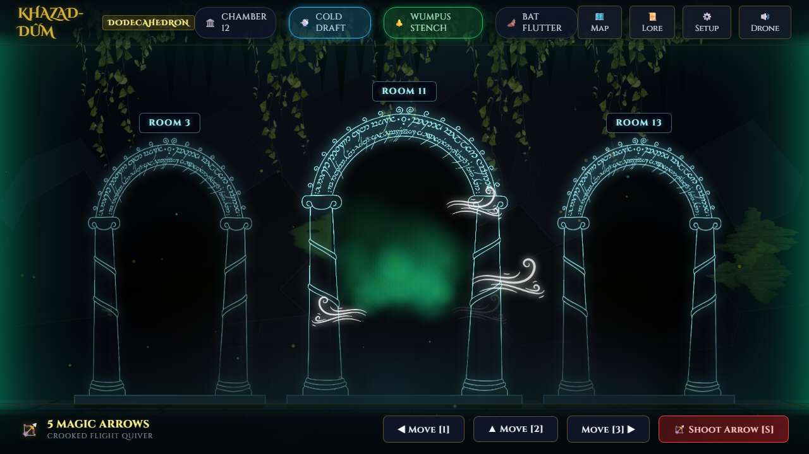
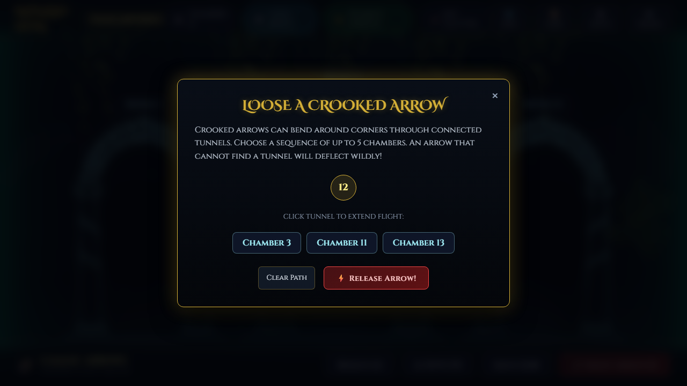
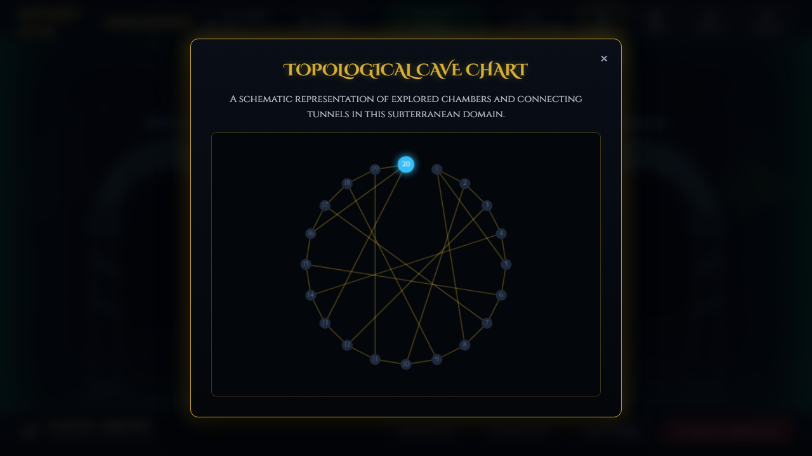
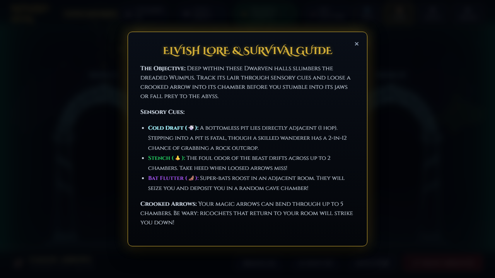
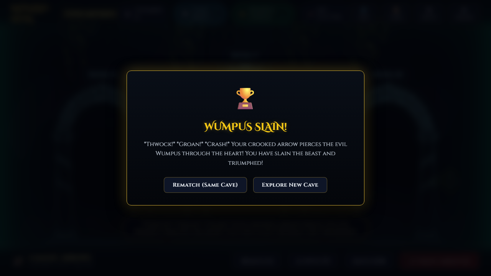

# wump · fancy-web

> A **spiritual successor** to BSD `wump(6)`, reimagining Gregory Yob and Dave Taylor's
> classic cavern puzzle as an atmospheric subterranean expedition into the Mines of Moria (Khazad-dûm).
> Navigate the darkness through sensory cues, heed the cold drafts of the abyss and the stench of the beast,
> and slay the sleeping Wumpus with crooked magic arrows.

[](../../../../docs/progress.md)
[](../../../../docs/decisions/006-multi-port-architecture.md)
[](./tests/)
[](../../../../LICENSE)

---

## Play Now

Open [`index.html`](./index.html) in any modern web browser.

**No build toolchain, no package installation, and no web server required.**  
Simply double-click or drag `index.html` into Chrome, Edge, Firefox, or Safari. The entire game, multi-layer canvas rendering, procedural cave generator, and Web Audio synthesizers run 100% client-side and offline.

---

## Screenshots

| Exploration & Sensory Cues | Crooked Arrow Trajectory Planner |
|:---:|:---:|
| <br>*Chamber exploration: Doors of Durin Ithildin arches, glowing moss, and dynamic sensory warning pills.* | <br>*Interactive crooked arrow path planner bending trajectories through connecting chambers.* |

| Topological Cave Chart | Elvish Lore & Survival Tome |
|:---:|:---:|
| <br>*Interactive real-time minimap tracking explored chambers and cavern connections.* | <br>*Built-in Elvish lore manual replacing the historical Unix `wump.info` pager.* |

| Expedition Triumph (Victory) |
|:---:|
| <br>*Victory modal: The foul beast is slain by a crooked arrow pierced through its heart!* |

---

## Controls & Keybindings

| Action | Mouse / Click | Keyboard Shortcut |
|---|---|---|
| **Move through Left Portal** | Click Left Archway | **`1`** or **`A`** |
| **Move through Center Portal** | Click Center Archway | **`2`** or **`W`** |
| **Move through Right Portal** | Click Right Archway | **`3`** or **`D`** |
| **Shoot Crooked Arrow** | Click `🏹 Shoot Arrow [S]` | **`S`** |
| **Open Minimap** | Click `🗺️ Map` | **`M`** |
| **Read Lore & Rules** | Click `📜 Lore` | **`H`** or **`?`** |
| **Configure Setup** | Click `⚙️ Setup` | — |
| **Toggle Cavern Resonance** | Click `🔊 Drone` | — |
| **Close Open Modal** | Click `&times;` | **`Escape`** |

---

## Features & Modernization Highlights

1. **Faithful Spec Parity:**
   - Strict adherence to the canonical [`spec.md`](../../docs/spec.md): strongly-connected cycle invariant $\gcd(R, \delta + 1) = 1$, hazard placement exclusivity, $2/12$ ($16.67\%$) rock outcrop survival rolls, bat chaining, arrow distance decays (hop 3 bowstring roll $2/10$, hop 4 roll $6/10$), self-ricochets, and Wumpus agitation modulus ($12$ on Easy, $9$ on Hard).
2. **Atmospheric Tolkien Aesthetics:**
   - Cavern bedrock carved with glowing Ithildin runes (`#a5f3fc`) matching the Doors of Durin at Khazad-dûm.
   - Bioluminescent moss patches, hanging cave flora, torchlight flicker, and drifting ground mist.
3. **Organic Progressive Wind Drafts:**
   - When adjacent to bottomless pits, white wind wisps unfurl from the specific gate leading to the chasm.
   - Staggered, sequential start times (750ms–1000ms delay between strands) and asymmetric dual-flow for center gates.
4. **Procedural Web Audio Synthesizer:**
   - Low-frequency subterranean Moria resonance (detuned 43.65Hz and 65.41Hz sine tones).
   - Dynamic sound effects for bowstring releases, wind howls, bat chatter, wumpus roars, and victory fanfares.
5. **Interactive Trajectory Planner:**
   - Replaces error-prone terminal typing with an intuitive room path selector for loose crooked arrows.
6. **Configurable Expedition Modes:**
   - **Classical Dodecahedron:** 20 chambers, 3 mutual tunnels per chamber.
   - **Dave Taylor Procedural Caves:** $10 \le R \le 250$ generated via GCD cycle search.
   - **Easy vs Hard:** Escalated bat colonies and bottomless pits with heightened Wumpus aggressiveness.

---

## Automated Test Suite

The core game logic is isolated in [`src/engine.js`](./src/engine.js) and tested using Node.js's native test runner (`node:test`):

```bash
$ npm test
```

```
TAP version 13
# Subtest: T-01: Dodecahedron Graph Topology Invariants
ok 1 - T-01: Dodecahedron Graph Topology Invariants
# Subtest: T-02: Procedural Cave Generator & Strongly-Connected Component Cycle
ok 2 - T-02: Procedural Cave Generator & Strongly-Connected Component Cycle
# Subtest: T-03: Hazard Placement & Player Spawn Invariants
ok 3 - T-03: Hazard Placement & Player Spawn Invariants
# Subtest: T-04: Sensory Proximity Cues (Draft, Flutter, Stench)
ok 4 - T-04: Sensory Proximity Cues (Draft, Flutter, Stench)
# Subtest: T-05: Movement & Wall Collision
ok 5 - T-05: Movement & Wall Collision
# Subtest: T-06: Bottomless Pit Survival Outcrop vs Death Plunge
ok 6 - T-06: Bottomless Pit Survival Outcrop vs Death Plunge
# Subtest: T-07: Super Bat Relocation & Chaining
ok 7 - T-07: Super Bat Relocation & Chaining
# Subtest: T-08: Crooked Arrow Slaying the Wumpus (Victory)
ok 8 - T-08: Crooked Arrow Slaying the Wumpus (Victory)
# Subtest: T-09: Crooked Arrow Ricochet Self-Hit
ok 9 - T-09: Crooked Arrow Ricochet Self-Hit
# Subtest: T-10: Quiver Depletion Loss
ok 10 - T-10: Quiver Depletion Loss
# Subtest: T-11: Session Rematch Semantics (Same Cave vs New Cave)
ok 11 - T-11: Session Rematch Semantics (Same Cave vs New Cave)
1..11
# tests 11
# pass 11
# fail 0
```

---

## Architecture & Code Organization

```
ports/fancy-web/
├── index.html                   # Multi-layer Canvas 2D + Web Audio client application
├── package.json                 # Project manifest & test script
├── AGENTS.md, CLAUDE.md         # Multi-model instruction thin pointers
├── README.md                    # This document
├── assets/                      # Luminous Durin gate, wind gusts, moss, cave textures
├── src/
│   └── engine.js                # Pure, decoupled WumpGame engine (Node & browser compatible)
├── tests/
│   └── wump.test.js             # Automated unit tests covering all spec invariants
├── docs/
│   ├── diff-log.md              # Feature-by-feature diff log from wump.c to fancy-web
│   └── decisions/
│       └── 001-tech-stack.md    # Architecture decision record on tech stack
└── media/                       # Live port gameplay screenshots
```

---

## Authors & Attribution

- **Port Authors:** Agun Wijaya & AntiGravity (2026).
- **Original BSD C Port:** Dave Taylor (Intuitive Systems, 1989/1993) as shipped in BSDGames.
- **Original Concept & Game Design:** Gregory Yob (1973, *People's Computer Company*).
- **License:** MIT. See [`../../../../LICENSE`](../../../../LICENSE).
