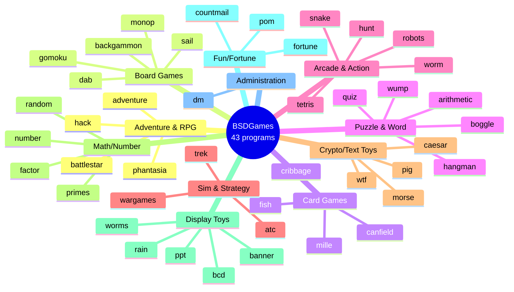

# BSDGames — Game Index by Category

This document lists all games and utilities in the `BSDGames-master`
package, grouped by genre. Binary names here match the folder names in
the repository exactly.

For context on what BSDGames is and why the package is historically
interesting, see [`heritage.md`](./heritage.md).
For an explanation of how multiplayer games could work before the
Internet era, see [`multiplayer.md`](./multiplayer.md).

**Play-mode legend:**
- 🌐 **Network / inter-terminal** — multiple players on separate terminals within a shared machine/network.
- 👥 **Hot-seat** — multiple human players taking turns on the same terminal.
- No marker = single-player, or single-player vs. computer.

See also the [🎮 Multiplayer Summary](#-multiplayer-summary) section below.

## Package Overview

---

## Adventure & RPG (Text-based)

| Game | Description |
|---|---|
| **adventure** | The original *Colossal Cave Adventure* by Will Crowther & Don Woods. Ancestor of the entire *interactive fiction* genre. |
| **battlestar** | A text-based adventure aboard a "battlestar" (space warship). |
| **hack** | Explore the *Dungeons of Doom* — ancestor of the **roguelike** genre (later evolved into NetHack). |
| **phantasia** 🌐 | Multi-user, inter-terminal *fantasy RPG*. Multiple players share the same world; they can meet, chat, and battle *player-vs-player*. |

## Board Games

| Game | Description |
|---|---|
| **backgammon** 👥 | Classic backgammon. Supports both a computer opponent and two-human mode (`-n`). |
| **dab** 👥 | *Dots and Boxes*. Flag `-p hh` selects two human players. |
| **gomoku** 👥 | Gomoku — five-in-a-row. Flag `-u` for *user-vs-user*. |
| **monop** 👥 | Monopoly. Asks how many players at startup — fully *hot-seat multiplayer*. |
| **sail** 🌐 | Napoleonic-era naval combat. Each player runs their own ship process, synchronized by a driver. |

## Card Games

| Game | Description |
|---|---|
| **canfield** | *Canfield* solitaire variant with a `curses` interface. |
| **cribbage** | Cribbage. |
| **fish** | Go Fish. |
| **mille** | *Mille Bornes* vs. computer. |

## Puzzle & Word Games

| Game | Description |
|---|---|
| **arithmetic** | Math quiz / speed test. |
| **boggle** | Boggle — find words in a letter grid. |
| **hangman** | Guess the word before running out of chances. |
| **quiz** | Random knowledge quiz (topics are configurable). |
| **wump** | *Hunt the Wumpus* — one of the first AI logic games. |

## Arcade & Action

| Game | Description |
|---|---|
| **hunt** 🌐 | Real-time multiplayer *maze combat* — players hunt each other in a labyrinth. Uses UDP sockets via the `huntd` daemon. Legendary in the shared-terminal era. |
| **robots** | Avoid the chasing robots; trick them into colliding. |
| **snake** | Grab the cash, avoid the enemy "snake," and race to the exit. |
| **tetris** | Tetris. |
| **worm** | Steer a worm that eats numbers; don't hit yourself. |

## Simulation & Strategy

| Game | Description |
|---|---|
| **atc** | *Air Traffic Control* — route planes on and off runways without collisions. |
| **trek** | Star Trek simulation: galaxy exploration, Klingon combat, ship energy management. |
| **wargames** | A reference to the 1983 film *WarGames*: *"Would you like to play a game?"* |

## Cryptography & Text-Transform Toys

| Utility | Description |
|---|---|
| **caesar** | Caesar cipher / ROT13. Also reads *fortune* files. |
| **morse** | Converts text to Morse code. |
| **pig** | Converts text to *Pig Latin*. |
| **wtf** | Expands acronyms (e.g. `wtf is WTF`). |

## Math & Number Utilities

| Utility | Description |
|---|---|
| **factor** | Factorize an integer. |
| **number** | Convert digits into English words (e.g. `1234` → "one thousand two hundred..."). |
| **primes** | Generate prime numbers within a range. |
| **random** | Pick random lines from a file / generate random numbers. |

## Display Toys & Screensavers

| Toy | Description |
|---|---|
| **banner** | Print text in large ASCII letters. |
| **bcd** | Print text in the old IBM *punch card* format. |
| **ppt** | Print text in the old *paper tape* format. |
| **rain** | Rain-drop effect on the screen (tuned for 9600-baud terminals). |
| **worms** | Small worms randomly running across the screen. |

## Fun / Fortune / Info

| Utility | Description |
|---|---|
| **fortune** | Displays a random quote / joke / proverb — a Unix cultural icon. |
| **countmail** | Counts new email in your mailbox. |
| **pom** | Displays the current phase of the moon. |

## Administration (not a game)

| Program | Description |
|---|---|
| **dm** | *Dungeon Master* — sysadmin utility that controls when users may run games (e.g. banning games during business hours). |

---

## Summary

| Category | Count |
|---|---:|
| Adventure & RPG | 4 |
| Board Games | 5 |
| Card Games | 4 |
| Puzzle & Word Games | 5 |
| Arcade & Action | 5 |
| Simulation & Strategy | 3 |
| Cryptography / Text Toys | 4 |
| Math / Number Utilities | 4 |
| Display Toys | 5 |
| Fun / Fortune / Info | 3 |
| Administration | 1 |
| **Total** | **43** |

## 🎮 Multiplayer Summary

Of the 43 programs in this package, **7 support multi-human gameplay**.
They fall into two groups:

### 🌐 Network / Inter-terminal Multiplayer

Multiple human players on separate terminals or machines, connected via
network or shared files on the same BSD host.

| Game | Mode | How It Works |
|---|---|---|
| **hunt** | Real-time maze *deathmatch* | A `huntd` daemon runs on a server; `hunt` clients connect over UDP. |
| **phantasia** | Persistent *massively-multi-user* RPG | All state lives in a shared file; players can locate each other, chat, and engage in *player-vs-player* combat. |
| **sail** | Real-time naval combat (~7-second turns) | Each player runs their own ship process; a *driver process* synchronizes them via a shared temp file. |

### 👥 Hot-seat Multiplayer

Multiple human players taking turns on the **same** terminal.

| Game | Flag / Mode | Notes |
|---|---|---|
| **monop** | Interactive — game asks "How many players?" | 2–9 hot-seat players. Classic. |
| **backgammon** | `-n` | Two human players; without `-n`, plays vs. computer. |
| **gomoku** | `-u` (user-vs-user) | Without the flag: vs. computer. `-c` for computer-vs-computer. |
| **dab** | `-p hh` | Format `-p <c\|h><c\|h>` — pick each player as `c` (computer) or `h` (human). |

### What Is **Not** Multiplayer

All other games in the package are strictly single-player or
single-player-vs-computer, including some that might sound multiplayer:

- **cribbage**, **fish** (Go Fish), **mille** — card games, but only vs. computer.
- **hack**, **adventure**, **battlestar** — single-player adventures.
- **atc**, **trek** — single-player simulations with many AI entities.
- **tetris**, **snake**, **robots**, **worm** — single-player arcade.

> 💡 **Curious how the multiplayer games above could work without the
> Internet?** See [`multiplayer.md`](./multiplayer.md) — a general
> overview of *multi-player* architecture in the BSD *time-sharing*
> era.

---

## A Few Highlights Worth Trying First

- **tetris** — still addictive after 40+ years.
- **hack** — ancestor of the entire roguelike genre.
- **adventure** — experience the first-ever text game in the world.
- **trek** — a *starship command* simulation with surprising depth.
- **hunt** — if you have a few terminals available, this is the best multiplayer game in the package.
- **atc** — surprisingly stressful; a serious ATC simulator in ASCII form.
- **fortune** — run it occasionally for a bit of Unix cultural flavor.
