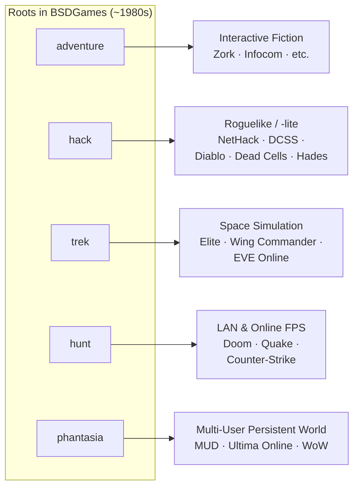

# About BSDGames

## What Is BSDGames?

**BSDGames** is a collection of games and small utilities historically
bundled with the **BSD** (*Berkeley Software Distribution*) family of
operating systems — a Unix variant developed at the University of
California, Berkeley starting in the late 1970s and peaking in the
1980s.

The [`BSDGames-master`](https://github.com/vattam/BSDGames) source
tree specifically is a **port of NetBSD to Linux** (and GNU Hurd)
maintained by Joseph S. Myers. This port takes the games from
NetBSD-current, fixes bugs, and makes them buildable on modern Linux
systems.

The package contains **~43 programs**: most are complete games, the
rest are small entertainment utilities (fortune, banner, pom, etc.) or
administrative tools (dm).

All programs run **in a text-based terminal**. There are no raster
graphics, no mouse, no sound — only ASCII characters, `curses` colors
(if you're lucky), and a keyboard. For a full list of games by
category, see [`catalog.md`](./catalog.md).

---

## Historical Context

From the 1970s through the mid-1990s, computers were not yet PCs on
every desk. Universities and companies accessed a single
*mainframe*/*minicomputer* (VAX, PDP-11, Sun workstation) through many
text terminals. One of the most popular OSes in academic settings was
**BSD Unix**, born at Berkeley in 1977.

Because BSD was developed in an open — and slightly "mischievous" —
academic culture, students and systems hackers wrote these games as:

- Entertainment for long lab nights.
- Practice with C, `curses`, `termcap`, and `signal`.
- Experiments with simple AI, simulation, and multi-user gameplay.
- Cultural *easter eggs* officially shipped with the OS.

As BSD spread to many universities — and later to its descendants
(FreeBSD, NetBSD, OpenBSD, and even macOS via Darwin) — these games
came along for the ride. For a whole generation of CS students, typing
`tetris` or `hack` at a terminal prompt is a characteristic college
memory.

---

## Why Is BSDGames Interesting?

### 1. Ancestor of Many Modern Genres

Several games in this package are **direct ancestors** of genres we
still play today:

- **`hack`** — ancestor of the entire **roguelike** genre. From here
  came NetHack, and through indirect influence, many elements of
  Diablo, Dwarf Fortress, Dead Cells, Hades, and the modern
  *roguelite* wave.
- **`adventure`** — a re-implementation of *Colossal Cave Adventure*
  by Crowther & Woods (1976), the first text game in the world to
  popularize the "you are in a room…" concept. From here came Zork,
  Infocom, and the entire *interactive fiction* tradition.
- **`hunt`** — one of the earliest **real-time multiplayer** games on
  time-sharing computers. Players on different terminals hunt each
  other in the same ASCII maze. In the pre-LAN-gaming era, this was
  revolutionary.
- **`trek`** — one of the earliest *starship combat* simulations,
  predating Elite and the entire *space sim* genre.

Depicted as a genealogy:



### 2. Elegant Because Forced to Be Compact

Each game is typically only a few hundred to a few thousand lines of C.
CPUs of that era were slow, RAM was scarce, disk was expensive.
Programmers had to be efficient; there was no room for *bloat*. The
result is a design lesson that still applies today: **fun gameplay
comes from mechanics, not visuals**.

Reading the source code of `tetris` or `robots` in this package is a
good case study in how to build a clean *game loop* in plain C, with
`ncurses` as the only "engine".

### 3. Run by Simply Typing the Name

No launcher, no Steam, no GPU driver required, no account needed. Just
type:

```
$ tetris
$ hack
$ trek
```

…and the game runs in the terminal. The "*small tools, do one thing
well, ready in a keystroke*" philosophy is a Unix legacy that still
inspires.

### 4. Simple but Effective AI

Games like `backgammon`, `cribbage`, `monop`, `mille`, `gomoku`, and
`sail` include **computer opponents** coded with simple heuristics —
all fitting in a handful of C files. This is an instructive example of
how simple algorithms (shallow minimax, weighted tables, *rule-based
scoring*) can produce challenging opponents without *machine learning*
or *deep search*.

### 5. Multiplayer Before the Internet

This is one of the most interesting aspects of BSDGames: the package
has **seven** games supporting multi-human play — something rarely
found in bundled game packages then or now.

They fall into two major groups:

**🌐 Network / inter-terminal multiplayer** — leveraging the fact that
many users log in to the same BSD machine (or the same local network)
concurrently:

- **`hunt`** — a real-time *deathmatch* arena in an ASCII maze. Uses
  **UDP sockets** via the `huntd` daemon. One of the earliest
  real-time *networked* multiplayer games on time-sharing computers.
  In the pre-LAN-gaming era, twenty students in the same lab could
  shoot each other — genuinely revolutionary for its time.
- **`phantasia`** — a persistent *massively-multi-user* RPG. Its world
  state lives in a shared file; players on different terminals can
  find each other's coordinates, chat via `talk`, and battle
  *player-vs-player* (which the manual itself calls *"inter-terminal
  battle"*). This is an **MMO** in its purest form, nearly two
  decades before Ultima Online.
- **`sail`** — Napoleonic-era naval combat. Each player runs their own
  ship process on their terminal; a *driver process* synchronizes all
  ships via a *shared temp file* on a ~7-second turn cycle. An exotic
  mix of hot-seat and networked: you can have human ships and computer
  ships in the same battle.

**👥 Hot-seat multiplayer** — multiple humans taking turns on the same
terminal:

- **`monop`** (Monopoly) — the game asks how many players at startup,
  supporting 2–9 classic human players.
- **`backgammon`** — flag `-n` enables two-human mode (without `-n`,
  plays vs. computer).
- **`gomoku`** — flag `-u` for *user-vs-user*; flag `-c` for
  *computer-vs-computer*.
- **`dab`** (Dots and Boxes) — the flag `-p <c|h><c|h>` is elegant:
  choose each player as `c` (computer) or `h` (human), making it easy
  to arrange CPU-CPU rounds for training or H-H hot-seat.

All of this happened **long before the concepts of "matchmaking,"
"lobby," or a commercial "game server" existed**. The BSD computing
model (many users, one machine, shared filesystem) naturally enabled
multi-user games with extremely minimal implementations — sometimes
just a file lock and a data structure on disk.

> 📖 For a deeper explanation of **how** multiplayer could happen
> without the Internet — what OS techniques were used (shared files,
> UDP sockets, `curses`, `talk`, etc.) and the architectural patterns
> involved — see [`multiplayer.md`](./multiplayer.md).

### 6. Hacker Cultural Heritage

Many games contain in-jokes from 1980s Unix culture:

- `wargames` references the 1983 film (*"Shall we play a game?"*).
- `trek` is a *homage* to the Star Trek series.
- `fortune` displays random quotes ranging from programmer jokes and
  philosophers' quotes to *Zippy the Pinhead*. Fortune itself became
  a Unix cultural icon.
- `wtf` is an "acronym dictionary" with a comedic tone.
- `bcd` and `ppt` print text in *punch card* and *paper tape*
  formats — already *retro* even in 1985!

These aren't just games; they're **cultural artifacts** of the
American pre-Internet academic hacker community.

### 7. Genre Richness in a Single Package

In one small package (< 10 MB source code) you have: *roguelike*,
*interactive fiction*, *board game*, *card game*, *puzzle*, *arcade*,
*simulation*, *RPG*, *quiz*, and various *toys*. Nearly the entire
game genre spectrum is represented — something even modern commercial
packages rarely rival in genre-per-byte density.

---

## Why This Package Is Still Interesting Today

- **Learning C & Unix systems**: the source code is a "living museum"
  of 1980s C programming techniques — great for understanding
  `curses`, `signal` handling, `fork`, `termcap`, and UCB coding
  style.
- **Computing nostalgia**: experience computing before the GUI.
- **Digital preservation**: preserving computing cultural heritage
  from disappearing as old machines retire.
- **Fast & lightweight**: play Tetris over an SSH server without
  opening a browser.
- **Design study**: a lesson in how *constraints* fuel creativity.

---

## Package Structure

The `BSDGames-master/` directory isn't just a collection of games; it's
also a complete build system:

- `Makefile.bsd`, `Makeconfig.in`, `configure` — *build* and
  configuration system.
- `include/`, `lib/` — shared libraries used by several games (e.g.
  for *high-score files*, `curses` support).
- `hide-game.in`, `install-score.in` — installation and cross-user
  score-management infrastructure.
- `dm/` — *Dungeon Master*, admin utility that controls when users may
  run games (in the old days, admins weren't always happy about
  students playing games during peak hours).
- `wtf`, `banner`, `bcd`, `ppt`, `pom`, `fortune`, `morse`, `pig`,
  `caesar`, `factor`, `primes`, `number`, `random`, `countmail` —
  small non-game utilities that traditionally shipped with the
  package.
- `tests/` — a few automated tests.
- `debian/` — Debian packaging configuration.
- `AUTHORS`, `THANKS`, `COPYING`, `SECURITY`, `YEAR2000` — legal and
  historical documentation (`YEAR2000` itself is now a fun artifact).

For a per-category game list, see [`catalog.md`](./catalog.md).
