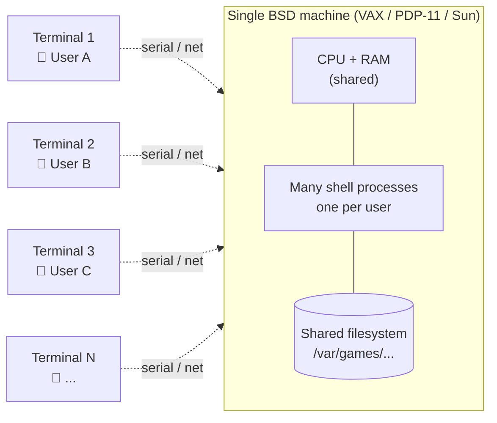
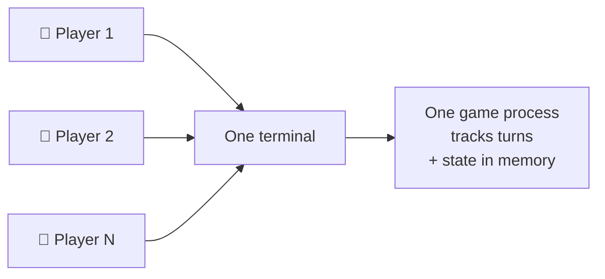
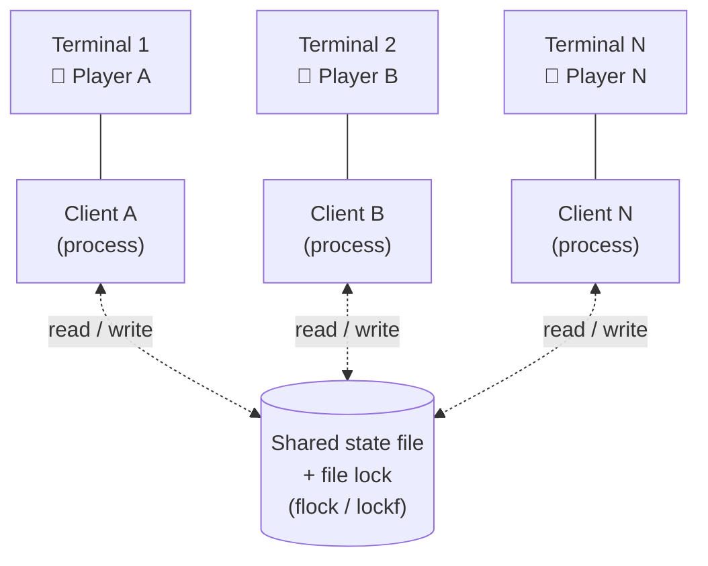
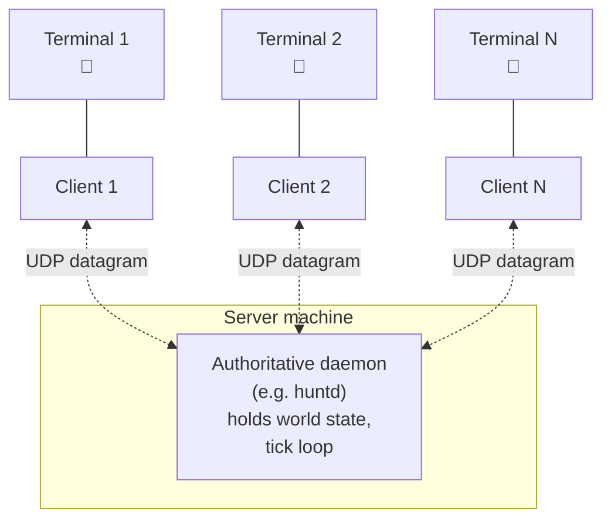
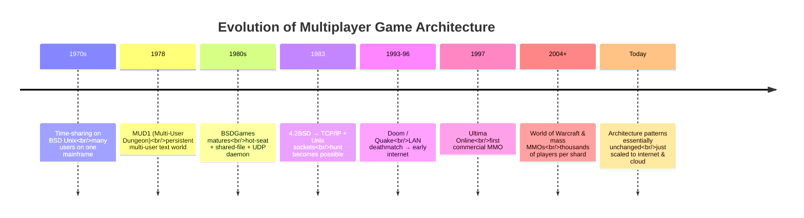

# Multiplayer Architecture in the Pre-Internet Era

Several games in the BSDGames package support multi-human play — even
before "online gaming" became commonplace. This document does not
cover the games one by one (see [`catalog.md`](./catalog.md) for the
list); it explains the **general concepts** of how multiplayer could
exist without the Internet, and why its architecture differs so much
from modern online games.

---

## Context: The Time-Sharing Model

To understand multiplayer in BSDGames, we need to remember how
computers were used in the early Unix era (1970s to mid-1990s):

- A single **mainframe** or **minicomputer** (VAX, PDP-11, Sun
  workstation) in a lab, office, or university.
- Dozens of **dumb terminals** — keyboards + text monitors only —
  connected to the main machine over serial cable or local network.
- Many users logged in **simultaneously**, each getting their own
  *shell process*, but **sharing** CPU, RAM, and filesystem.

In this model, "multiplayer" was **relatively easy**: all the "players"
were really just processes on **the same machine** with **the same
filesystem**. There was no need to speak TCP/IP across continents;
just talk between processes in one box.

When LANs became common (Ethernet, early-to-mid 1980s), this model was
*extended* with Unix-domain sockets and UDP for multiple BSD machines
on the same network. But the fundamental idea remained the same: **a
group of physically-close users sharing the same infrastructure**.

Visually, the typical topology of a BSD lab of that era:

All players were already "gathered" on one machine before the game
even began — that's why multiplayer could be implemented so
minimalistically.

---

## Building Blocks Available in the OS

What's most distinctive about BSDGames is that **not one of them** uses
a "game engine," "networking library," or custom protocol. All the
tools for multiplayer were already available as part of the Unix
operating system itself:

### 1. Shared Filesystem (IPC via File)

The simplest approach: one process writes to a file, another process
reads it. The Unix filesystem allows many processes to read and write
the same file.

- All game state (map, player positions, scores) is stored in a
  *shared file* in a directory like `/var/games/`.
- Each player runs their own client process that reads and updates
  that file.
- *File locks* (`flock`, `lockf`) prevent two processes from writing
  simultaneously.

**Pros:** simple, no protocol needed, free *persistence* (state
survives crashes/logouts).
**Cons:** slow due to disk I/O, prone to *race conditions*, not truly
*real-time*.

### 2. Signals, Pipes, & Unix-Domain Sockets

Unix provides `signal()`, `pipe()`, and (from 4.2BSD onwards)
**Unix-domain sockets** as inter-process communication channels on a
single machine. Suitable for a local *client-server* architecture: one
"driver" process maintains authoritative state; client processes send
actions and receive updates.

Conceptually, this is a *localhost* version of the modern game server.

### 3. UDP Sockets (For Multi-Machine LAN)

Once BSD had a *TCP/IP stack* (4.2BSD, 1983), games could start
communicating across LAN machines. The most commonly used protocol was
**UDP** (connectionless datagrams).

*Why UDP, not TCP?*

- Real-time games need low *latency*; a bit of *packet loss* is
  acceptable.
- Smaller overhead.
- Easier to implement.

The architecture is pure *client-server*: one machine runs a **daemon**
started via `inetd` or `/etc/rc.local`. Clients on other machines send
datagrams to a *well-known port*. The server processes input, updates
state, and *broadcasts* updates to all clients.

This structure is conceptually **identical** to modern game servers —
just implemented in only a few hundred lines of C.

### 4. `curses` for Per-Terminal Rendering

All game display is ASCII characters on an 80×24 terminal. The
**`curses`** library (later `ncurses` on Linux) handles cursor
positioning, limited colors, and non-blocking keyboard input.

For multiplayer, the challenge is: each player has *their own screen*
that must stay in sync with a *global state* that changes because of
other players' actions. Common solution: each client runs its own
*game loop* that periodically reads global state (from a file or
socket) and *repaints* its local screen.

### 5. `utmp`, `who`, `talk`, `write`

BSD has a *built-in* social layer at the OS level:

- `who` / `w` — list of currently logged-in users.
- `utmp` — the system file containing active login session info.
- `talk` — real-time terminal-to-terminal chat (split-screen).
- `write` — send a one-line message to another user.

Games could use this info to find other players, show online-player
lists, or integrate in-game chat. Multiplayer felt **ambient** — you
could see your lab friend playing the same game without needing to
"join a lobby."

---

## Three Architectural Patterns

Across all BSDGames multiplayer games, three main architectural
patterns emerge:

### A. Hot-Seat (One Terminal, Many Players Take Turns)

The simplest: one program, one process, one terminal, many players
alternating. **No IPC at all** — everything is inside one process that
tracks whose turn it is.

Suitable for turn-based *board games* and *card games*. Requires
players to be physically close, but provides the most direct *social
experience* — you're literally sitting next to your opponent.

### B. Persistent Async (Shared State via File)

Each player runs a separate client process, all reading from and
writing to a *shared file* on disk. **Not real-time**: other players'
actions become visible when the game polls/refreshes state.

Suitable for **persistent worlds** — players can log in and out at any
time, and the world remains on disk. This is the conceptual ancestor
of **MUDs** and (much later) **MMOs**.

### C. Real-Time Client-Server (Socket + Daemon)

An authoritative **server** process (a daemon) runs continuously. Each
client connects via socket (UDP for speed, or Unix-domain for local
use). The server maintains the *world tick* and *broadcasts* state to
all clients.

This pattern is **structurally identical** to modern game servers
(Quake, Counter-Strike, etc.) — just scaled for dozens of players on a
LAN rather than hundreds of thousands on the internet.

---

## Why This Is Historically Interesting

1. **Multiplayer wasn't an add-on feature.** In the *time-sharing* era,
   "many users sharing one machine" was the *default* state.
   Multiplayer games just used what was already there.

2. **Built from OS primitives, not game libraries.** No Unity, no
   Photon, no RakNet. Everything was built from `fork`, `pipe`,
   `socket`, `flock`, `signal` — APIs that **still exist in modern
   Unix/Linux**.

3. **Latency = the speed of light on a LAN cable.** Head-to-head
   players were typically in the same lab, meters apart. Sub-millisecond
   *ping*. Connection quality was never a problem.

4. **VAX-scale scalability.** The `hunt` README notes: *"A VAX 750
   supports about 3 users before the system is impacted; 8–10 on a VAX
   8650"*. Compare that to modern servers running thousands of players.
   Simple, but enough for its time.

5. **A free social layer from the OS.** You already knew who was
   logged in (`who`), could chat directly (`talk`), could send messages
   (`write`) — all **before** entering the game. Multiplayer felt
   organic, not like entering a foreign "server" on the internet.

6. **Everything in ~1000 lines of C.** The most complex multiplayer
   server in BSDGames fits in less code than a single screen in a
   modern IDE. Proof that much of modern game-engine complexity is
   about scale and platform, not the essence of *multiplayer* itself.

---

## Conceptual Legacy

Many patterns born in this era became *direct ancestors* of:

- **MUDs** (*Multi-User Dungeon*, 1978) — *persistent multi-user text
  worlds*; direct descendants of BSD *shared-file* games.
- **Modern MMOs** — *persistent worlds* with *shared state*; the same
  pattern, just scaled to the internet with databases and *server
  clusters*.
- **LAN party games** (Doom, Quake, early Counter-Strike) — the UDP
  *client-server* model whose lineage traces directly back to `hunt`.
- **Modern turn-based network board games** — *shared state* via a
  database over the web is a reincarnation of the *shared file* on
  the BSD disk.

Reading BSDGames multiplayer source code today feels *surprisingly
modern* — not because the code is pretty (sometimes it isn't), but
because its *decision patterns* closely resemble today's game servers.
Not much is truly new in *distributed systems*; most of it has just
been *scaled up*.

Depicted as a timeline:

---

## See Also

- [`catalog.md`](./catalog.md) — game list by category, with 🌐/👥
  markers for multiplayer modes.
- [`heritage.md`](./heritage.md) — general context on what BSDGames is
  and why the package is interesting.
