# Porting Guide

This is the **standard workflow** for porting one program from the
BSDGames package to a modern implementation. Under
[ADR-006](./decisions/006-multi-port-architecture.md) the workflow
splits into two phases:

- **Canonical phase** — write the game-level docs and capture the
  original binary. Done once per game, then read by every port.
- **Port phase** — instantiate one port implementation
  (`bsdgames/<game>/ports/<port>/`) and build it. Multiple
  contributors may run this phase in parallel for different port
  styles of the same game.

Both phases share this same guide. Steps 1–9 are canonical; steps
10–14 are per-port. Consistency across 43 games (canonical) and
across N ports per game matters more than speed on any single one.

Read the root [`AGENTS.md`](../AGENTS.md) first if you haven't.

---

## Prerequisites

- The original BSDGames source, obtained from
  <https://github.com/vattam/BSDGames> and stored **locally** (not
  in this repo). Do not commit local paths into documentation —
  always cite upstream URLs / relative file:line references.
- A claimed slot in [`progress.md`](./progress.md):
  - **Canonical phase:** claim the game row.
  - **Port phase:** claim the specific port (game + port-name); if
    the port doesn't exist yet, add it under the game's port list.
- Have read: root [`AGENTS.md`](../AGENTS.md),
  [ADR-002 (porting philosophy)](./decisions/002-porting-philosophy.md),
  [ADR-004 (doc taxonomy, revised)](./decisions/004-per-game-doc-taxonomy.md),
  [ADR-006 (multi-port architecture)](./decisions/006-multi-port-architecture.md),
  and — for `classic-web` ports —
  [ADR-005 (reference language/UI stack)](./decisions/005-target-language-and-ui-stack.md).

## Workflow Overview

```mermaid
flowchart LR
    A[1. Claim<br/>+ read source] --> B[2. Man page<br/>manpage.md]
    B --> C[3. Reverse-spec<br/>spec.md]
    C --> D[4. Architecture<br/>architecture.md]
    D --> E[5. Lessons<br/>lessons.md]
    E --> F[6. Brochure<br/>about.md]
    F --> G[7. Port design<br/>port-ideas.md]
    G --> H[8. ADRs<br/>if overriding]
    H --> I[9. Test scenarios<br/>test-scenarios.md]
    I --> J[10. Implement<br/>src/ + tests/]
    J --> K[11. Diff log<br/>diff-log.md]
    K --> L[12. Media<br/>media/]
    L --> M[13. How-to-play<br/>walkthrough<br/>world-map]
    M --> N[14. README<br/>+ progress update]
```



## Step-by-Step

### 1. Claim & Understand (canonical phase)

- Update [`progress.md`](./progress.md): mark this game (or its
  first port) as **In Progress** by you.
- Instantiate the game folder from the game-level templates in
  [`templates/game/`](./templates/game/): copy the entire subtree
  into `bsdgames/<GAME>/`, preserving structure. Replace `<GAME>`
  with the actual game name in each file, and delete conditional
  docs that do not apply (see
  [ADR-004](./decisions/004-per-game-doc-taxonomy.md) §6.1
  matrix — e.g. `walkthrough.md` on a non-adventure game).
- Read the original C source in the local BSDGames tree.
  **Understand it well enough to describe the game verbally
  without referring to the code.** Do not proceed until you can.

### 2. Mirror the Man Page — `docs/manpage.md`

Every game has a `.6` man page (e.g. `hack/hack.6`). Copy the content
into `docs/manpage.md`, cleaned up in Markdown, with:

- Retained BSD copyright / attribution header at top.
- Sections rewritten as Markdown but preserving semantics.
- Add a "Historical Notes" section at bottom noting anything the man
  page implies about era, hardware, or authorship style.

### 3. Reverse Specification — `docs/spec.md`

Write a formal-ish specification of the game's mechanics from the C
source, **not** from your memory of similar games. Include:

- **Objective** — what winning means, what losing means.
- **State variables** — score, HP, position, inventory, whatever the
  game tracks.
- **Actions / commands** — enumerate every accepted input and effect.
- **Rules / invariants** — what state transitions are legal.
- **Difficulty levels & setup configuration** — CLI flags, runtime knobs,
  arena/board/cave dimensions, validation invariants/collapse bounds,
  and session replay semantics (e.g. same-map vs new-map).
- **Complete Object & Entity Inventory** — all portable items, tools,
  treasures, and stationary obstacles/creatures with IDs, initial
  rooms, property flags, and puzzle interaction roles.
- **RNG use** — every place the game uses random. Distributions.
- **Termination conditions** — when the game ends and why.

This becomes the source of truth for testing and porting. It should be
implementation-independent (no C-isms).

### 4. Architecture Analysis — `docs/architecture.md`

Analyze the original code:

- **Program structure** — files, entry point, main loop, key data
  structures.
- **Game loop** — turn-based? real-time? tick rate? Draw a Mermaid
  flowchart.
- **AI (if any)** — heuristic scoring? minimax? rule-based? Explain
  the algorithm, extract code excerpts, add Mermaid where helpful.
- **Difficulty progression & runtime setup logic** — this section is
  **mandatory**. Explain how "level" or difficulty is represented in
  code, what changes per level, how setup knobs and CLI flags affect
  runtime generation (e.g. grid/cave size, hazard density, stability
  limits), and session replay mechanisms, citing `file:line`. If no
  explicit progression, explain the constant-difficulty design and any
  implicit scaling (tension ramps, move-number AI depth). Use code
  excerpts + Mermaid.
- **Random event system (if any)** — this section is **mandatory** for
  any game with randomness. Describe: what is random, probability
  distributions, how random events connect to state changes and
  consequences (score, death, item drops, encounters). Use a
  Mermaid flowchart: `Trigger → roll dice → outcome A / outcome B`.
- **What was clever for its era** — memory tricks, screen tricks,
  algorithm choices, portability techniques.
- **Constraints handled** — how the programmer worked around era
  limitations (RAM, CPU, terminal capabilities).

Include code excerpts (short, cited by file:line). All diagrams
Mermaid.

### 5. "Textbook" Lessons — `docs/lessons.md`

Companion to architecture.md but pedagogical. For each technique of
interest, produce a lesson entry:

- **What it teaches** — the technique/concept a beginner can learn.
- **Where it is** — `path/to/file.c:LINE(-LINE)`, function name if
  applicable.
- **Short excerpt** — 5–20 lines of the code.
- **Why it matters** — how the same technique appears in modern code.

Target audience: junior programmers. Explain jargon.

### 6. Brochure — `docs/about.md`

Historical / cultural context. Written as a **brochure to attract
players / users**. Cover:

- Game name + one-line pitch.
- Author(s) — full names, brief bio, other work.
- Publisher (if any).
- Release year, era context.
- What makes it fun to play (this is the pitch).
- Making-of anecdotes / cultural notes.
- Known bugs (historical curiosities).
- Its cultural or technical impact.

Should read like the back of a game box — inviting.

### 7. Port Design — `docs/port-ideas.md`

Brainstorm modernization. Cover **all** of the following even briefly:

- **Gameplay modernization** — AI improvements, new mechanics,
  difficulty tuning.
- **UI/UX design** — visual style, interaction paradigm, accessibility
  (colorblind, screen reader), keyboard/mouse/touch, layout.
- **Multiplayer / networking** — internet play, matchmaking, spectator
  mode.
- **Persistence** — save/load, cloud sync, cross-device.
- **Other angles** — telemetry, config, i18n, mods.

For games where a category doesn't apply, write "N/A" with a one-line
reason.

### 8. Per-Game ADRs — `docs/decisions/`

If any modernization choice requires overriding a root-level default
(mostly: target platform or language), create the ADR here. Otherwise
leave `docs/decisions/` empty. Follow
[`../decisions/000-adr-template.md`](./decisions/000-adr-template.md).

### 9. Test Scenarios — `docs/test-scenarios.md`

Manual playthrough scripts to verify behaviour, especially for
things unit-tests can't easily cover (curses UI, real-time, RNG,
multiplayer). Each scenario: setup → inputs → expected observation.

Automated tests live under `tests/` — this file is for the human eye.

---

## PORT PHASE

Steps 10–14 happen inside a specific port folder:
`bsdgames/<GAME>/ports/<PORT-NAME>/`. Choose a port name following
the convention in
[ADR-006 §Port Naming Conventions](./decisions/006-multi-port-architecture.md).
Style-first (`classic-web`, `fancy-web`, `retro-terminal`,
`mobile-gimmicks`, `native-desktop`, `game-engine`) with tech suffix
if needed. Multiple contributors may run the port phase for
different port styles of the same game in parallel.

Instantiate the port folder by copying
[`templates/port/`](./templates/port/) into
`bsdgames/<GAME>/ports/<PORT-NAME>/`. Replace `<GAME>` and
`<PORT-NAME>` throughout. Add your build manifest
(`package.json` / `Cargo.toml` / `pyproject.toml` / `go.mod` /
etc.) chosen freely — see the Universal Port Contract in ADR-006.

### 10. Implement — `bsdgames/<GAME>/ports/<PORT-NAME>/src/` and `tests/`

Now (and only now) implement. The canonical
`../../docs/spec.md` and `../../docs/test-scenarios.md` are your
contract. If reality contradicts them, open a PR to fix the
canonical docs — do not silently work around them at the port
level (this is the Universal Port Contract, item 1).

For **`classic-web`** ports, the reference stack is TypeScript +
Vite + PWA (+ optional Capacitor Android) per
[ADR-005](./decisions/005-target-language-and-ui-stack.md). For
other port styles, any stack that satisfies the Universal Port
Contract is welcome.

### 11. Diff Log — `bsdgames/<GAME>/ports/<PORT-NAME>/docs/diff-log.md`

While implementing, keep a running log of feature-by-feature
choices: what was kept from the spec, what was changed, what was
added, what was removed, and why. This is the *story of this
specific port* and is often more read than any other port doc.
Each port has its own diff-log — sibling ports won't share one.

### 12. Media

Two locations, two purposes:

**Canonical (game-level) media** — screenshots of the
**original BSDGames binary**, captured once per game:

```bash
bash docs/scripts/capture-screenshots.sh <game>
```

Prerequisites (Linux / WSL2): `sudo apt install bsdgames tmux
imagemagick`. The script drives the game inside a headless
`tmux` session and renders the captured pane as PNG. See
[`docs/scripts/README.md`](./scripts/README.md) for details.

Minimum output (see root [`AGENTS.md`](../AGENTS.md) §6.5):
- **≥ 2 PNG screenshots** in `bsdgames/<GAME>/media/`, each with
  a sibling `.txt` capture.
- Screenshots must be **embedded in `bsdgames/<GAME>/docs/about.md`**
  with one-line captions.

This is done once during the canonical phase; every port reuses
these game-level shots.

**Port-level media** — screenshots / GIF / asciicast of **this
port** running, captured once the port has a working src/:

- Placed in `bsdgames/<GAME>/ports/<PORT-NAME>/media/`.
- Minimum: 2 PNG, or one short GIF, or one `.cast` recording.
- Embedded in the port's `README.md`.

### 13. Player-Facing Guides (canonical, if not already done)

These live at the canonical (game-level) location — they describe
universal rules that apply to every port:

- `bsdgames/<GAME>/docs/how-to-play.md` — the actual manual for
  players: controls, strategy, tips, scoring, easter eggs.
- `bsdgames/<GAME>/docs/walkthrough.md` — **adventure games
  only.** Include TWO walkthroughs: shortest path to win, and
  maximum-score path.
- `bsdgames/<GAME>/docs/world-map.md` — **games with fixed
  rooms/scenes or spatial graphs only.** Mermaid map. Nodes =
  rooms, edges = navigation, annotations = items / hazards /
  random encounters. **Must include a Master Room & Object /
  Entity Directory** detailing which items, tools, treasures,
  hazards, and creatures reside in each room and their mechanical
  purpose.

If these were completed during the canonical phase, they are
finalized (not rewritten) here — a port never overrides the
universal how-to-play. A port that changes the UI *maps* controls
in its own README, but the underlying rules stay canonical.

### 14. Wrap Up

- Fill in the port's `README.md` completely: pitch, tech stack,
  target, live URL, install/build, author, license, status.
- Update the game's landing `bsdgames/<GAME>/README.md` — the port
  index should list this port with a one-line description.
- Mark the port **Released** in
  [`progress.md`](./progress.md) once it meets the baseline
  (README + AGENTS + CLAUDE + docs/diff-log.md + working src +
  tests + port-specific media + passes canonical
  test-scenarios).
- Open a PR (or commit if solo). The maintainer will review
  against the Universal Port Contract only — not against concept
  or tech choice (see ADR-006).

## Anti-Patterns

- ❌ Implementing before writing `spec.md`.
- ❌ Copying the C source verbatim.
- ❌ Adding features that aren't in `port-ideas.md`.
- ❌ Skipping `diff-log.md` and reconstructing it at the end.
- ❌ Merging without at least one `about.md` and one `how-to-play.md`
  — the game must be *usable* by a stranger from the docs alone.

## Estimated Effort

Rough estimate per game (varies wildly by complexity):

| Game class | Documentation | Implementation | Total |
|---|---|---|---|
| Tiny utility (`primes`, `factor`) | 4–8 h | 2–4 h | 1 day |
| Simple game (`tetris`, `snake`) | 8–16 h | 8–16 h | 2–4 days |
| AI game (`gomoku`, `mille`) | 12–20 h | 12–24 h | 3–6 days |
| Adventure (`adventure`, `battlestar`) | 20–40 h | 20–40 h | 1–2 weeks |
| Roguelike (`hack`) | 40–80 h | 60–120 h | 3–6 weeks |
| Multiplayer (`hunt`, `phantasia`) | 20–40 h | 60–120 h | 3–6 weeks |

Documentation and implementation are roughly equal in effort — that
is deliberate.
