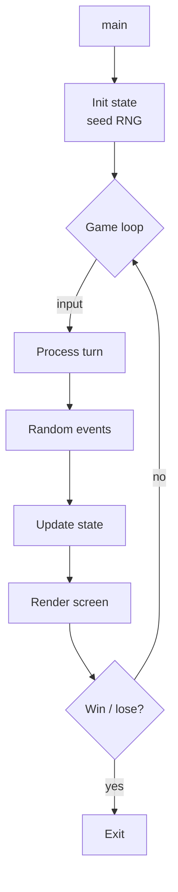
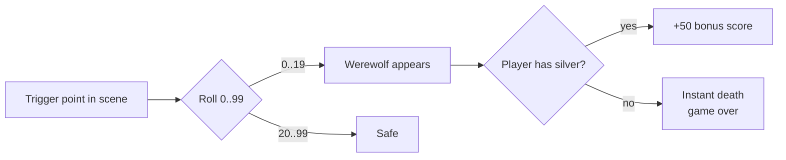

# `<GAME>` — Original Architecture

> Deep analysis of the original C source. What did the programmer
> build, and how? Focus on what is *clever*, *era-specific*, or
> *transferable*. Include AI, random event system, and consequence
> hooks explicitly.

Cite upstream file:line references only (never local paths). Upstream
tree: <https://github.com/vattam/BSDGames/tree/master/<GAME>>.

---

## Files & Roles

| File | Purpose | Approx. LoC |
|---|---|---:|
| `<GAME>.c` | Entry point + main loop | ... |
| `<other>.c` | ... | ... |
| `<GAME>.h` | Shared declarations | ... |
| `<GAME>.6` | Man page | — |

## High-Level Flow



## Game Loop Detail

[Turn-based? Real-time with tick? Frame-driven? Explain the loop's
structure. Cite `main.c:LINE(-LINE)`.]

## Data Structures

[Key structs / arrays. Show them (short excerpt) and explain their
purpose.]

```c
// <GAME>.h:LINE
struct player {
    int x, y;
    int hp;
    // ...
};
```

## AI Logic

*Fill this section only if the game has computer opponents.*

- **Algorithm:** [Heuristic scoring? Minimax? Rule-based? Random?]
- **Depth of lookahead:** [n plies / N/A]
- **Key code:** `<file>.c:LINE(-LINE)` in function `<name>()`.

```c
// short excerpt of the decision function
```

**Mermaid flow (if useful):**


## Random Events

*Fill this section if the game uses randomness beyond trivial
initial seeding. **Mandatory** for any game with encounters, loot,
map generation, damage rolls, or event triggers.*

- **RNG source:** `rand()` / `random()` / custom
- **Seed strategy:** [fresh per run / reproducible / from clock]
- **Where randomness is used:** enumerate every `rand()` call site.

### Random Event Table

| Trigger site | Distribution | Outcome A (prob.) | Outcome B (prob.) |
|---|---|---|---|
| `scene_forest()` in `<file>.c:LINE` | uniform 0..99 | werewolf appears (20%) → instant death | nothing (80%) → continue |
| ... | ... | ... | ... |

### Consequence Flow



## Difficulty Progression Logic

*How is level or difficulty represented in code? What changes as
levels advance — enemy count, AI depth, timing, scoring, content?
Cite `file:line`. If there is no explicit level system, explain the
constant-difficulty design and any implicit scaling (e.g., AI depth
grows with move number; enemies cap at some threshold; scoring
scales with screen size).*

## What Was Clever for Its Era

- ...
- ...

## Constraints the Original Had To Handle

- **Memory:** [how much? how did the program conserve?]
- **Terminal size:** [80×24? handled with `curses` how?]
- **CPU:** [any noticeable per-frame budget?]
- **Persistence:** [how were saves / high scores handled?]

## What This Code Would Look Like Today

[Brief speculation — what a modern implementation would do
differently. Feeds into [`port-ideas.md`](./port-ideas.md).]

## See Also

- [`lessons.md`](./lessons.md) — beginner-friendly extraction of
  techniques from this architecture.
- [`spec.md`](./spec.md) — implementation-independent specification.
- [`references.md`](./references.md) — sources & citations.
