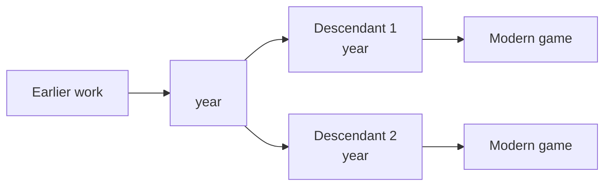

# `<GAME>` — Lineage

> Genre siblings and modern descendants. Where does `<GAME>` sit in
> the wider history of games in its style?
>
> This is the "if you like this, try …" doc.

---

## Direct Ancestors

*What did this game descend from? What earlier games / concepts /
academic ideas fed into it?*

- **[Game / concept name] ([year])** — [1-line relationship]
- ...

## Direct Descendants

*What did this game inspire directly?*

- **[Game name] ([year])** — [1-line relationship]
- ...

## Genre Family

*The wider family of games in this genre.*

## If You Like `<GAME>`, Try…

*Recommendations for modern players. Free and paid.*

- **[Modern game]** — [what's similar / different]
- **[Modern game]** — ...
- **[Modern game]** — ...

## Communities

*Active communities around this game or its genre.*

- [Discord / subreddit / forum links]

## References

*Historical timelines, academic papers, videos, or archives that
document this lineage. Add entries to [`references.md`](./references.md).*
