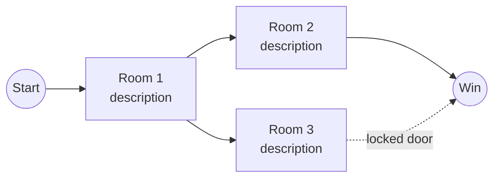

# `<GAME>` — World Map

> **Conditional document.** Only applies to games with fixed rooms
> or scenes (e.g. `adventure`, `battlestar`). Procedurally-generated
> maps (`hack`, `wump`) should either omit this file or document
> the *generation algorithm* instead.

> ⚠️ **Mermaid diagrams must follow the syntax rules in root
> [`AGENTS.md`](../../AGENTS.md) §8 — Mermaid Syntax Rules.** In
> particular: **no double quotes inside edge labels** (use
> `-.magic word.->` not `-. "magic word" .->`); **use `·` instead
> of `,`** in multi-item node labels; **quote node labels
> containing `(`, `!`, `?`, `/`, `:`**. Violations often silently
> break rendering.

---

## Full Map

*Replace with actual map. Use `flowchart` (directed) unless the map
is truly bidirectional in every edge.*

## Room / Scene Legend

| ID | Name | Description | Notable items / hazards |
|---|---|---|---|
| 1 | Room 1 | ... | ... |
| 2 | Room 2 | ... | ... |
| ... | ... | ... | ... |

## Random Encounters

*If some rooms have random events (e.g. "20% chance a werewolf
appears here"), list them.*

| Room | Trigger probability | Event | Consequence |
|---|---:|---|---|
| ... | 20% | Werewolf appears | Instant death unless silver item held |
| ... | ... | ... | ... |

## Master Room & Object / Entity Directory

*For adventure, dungeon, or room-based games with movable items, stationary fixtures, or non-player entities, provide an explicit room-by-room mapping of all initial entities and items.*

| Room ID | Room Name | Sector / Zone | Initial Items & Stationary Fixtures | Initial Hazards & NPCs | Notes & Clues |
|---|---|---|---|---|---|
| 1 | Room 1 | Entrance Zone | Keys, Brass Lantern | None | Grate leads down |
| 2 | Room 2 | Cave Sector | Food, Bottle of Water | Little Bird | Bird retreats if rod held |
| ... | ... | ... | ... | ... | ... |

## Traversal Notes

- Any one-way passages
- Any doors requiring specific items
- Any "traps" that reset the player elsewhere
- Any hidden paths not obvious from a first playthrough

## See Also

- [`walkthrough.md`](./walkthrough.md) — solved paths using this map.
- [`architecture.md`](./architecture.md) — how the map is stored in
  the original source.
