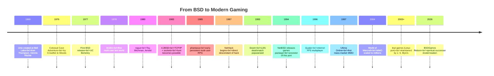

# Timeline — BSD, BSDGames, and the Wider Influence

A single-page timeline placing BSDGames in the broader arc of Unix,
gaming, and multiplayer history. For a game-by-game evolution, see
individual `bsdgames/<game>/docs/lineage.md`.

---

## Big Picture

## Selected Key Moments

### 1969–1977 — Unix and BSD Are Born

Unix at Bell Labs (Ken Thompson, Dennis Ritchie). Berkeley receives
a copy in 1974 and develops it into BSD. First BSD release in 1977.

Small games and utilities are written by students and staff as
practice with C and the terminal. Many are shipped with the OS from
day one.

### 1976 — Colossal Cave Adventure

Will Crowther writes the first computer text adventure, based on his
caving expeditions. Don Woods extends it into a fantasy game at
Stanford. The BSD port ships as `adventure`.

### 1978 — MUD1

Roy Trubshaw and Richard Bartle at Essex University write the first
Multi-User Dungeon. Its persistent-shared-world model is what
`phantasia` (and eventually all MMOs) will refine.

### 1980 — rogue

Michael Toy and Glenn Wichman at UC Santa Cruz write `rogue`. Ken
Arnold ports it to `curses` at Berkeley. Procedurally-generated
dungeons, permadeath, turn-based combat — a new genre. The BSDGames
`hack` is written as a direct descendant.

### 1983 — 4.2BSD

The seminal BSD release adds a full TCP/IP stack and the socket API.
Everything network in Unix history builds on it, including `hunt`'s
UDP-based multiplayer.

### 1985 — phantasia

At UC Berkeley, `phantasia` demonstrates a persistent multi-user
fantasy world implemented purely with shared files and coordination
over local `utmp` / login state. Structurally an MMO.

### 1993–1997 — The Internet Games Era

Doom (1993) popularises LAN deathmatch. Quake (1996) brings it to the
internet. Ultima Online (1997) commercialises the MMO. Each of these
uses fundamentally the same architectural patterns pioneered in
`hunt` and `phantasia`, scaled up.

### 1994–2003 — The Games Package Coalesces

NetBSD packages its inherited BSD games into a coherent `games`
subtree. Joseph S. Myers ports this subtree to Linux under the name
`bsd-games`, fixing bugs and making it buildable on modern systems.

### 2026 — BSDGames Reborn

This repository. Spiritual-successor modernisation of all 43
programs with modern UI/UX, internet multiplayer, and improved AI —
plus a living textbook of what the originals taught.

## See Also

- [`heritage.md`](./heritage.md) — cultural context on BSDGames.
- [`multiplayer.md`](./multiplayer.md) — deep-dive on pre-Internet
  multiplayer.
- [`catalog.md`](./catalog.md) — the 43-program list by category.
